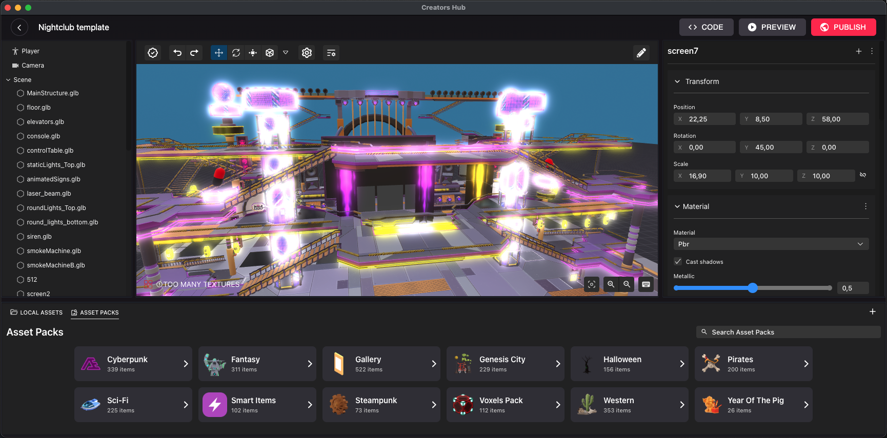
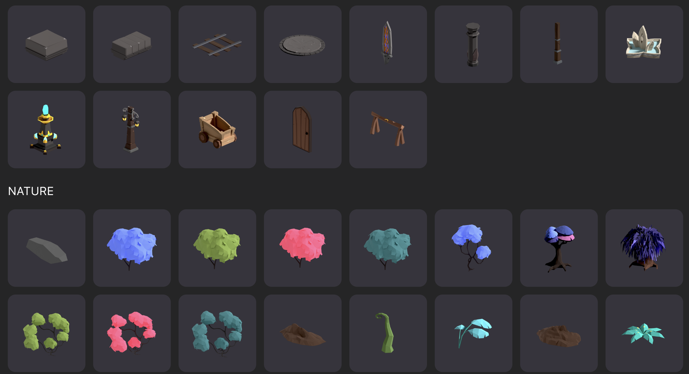
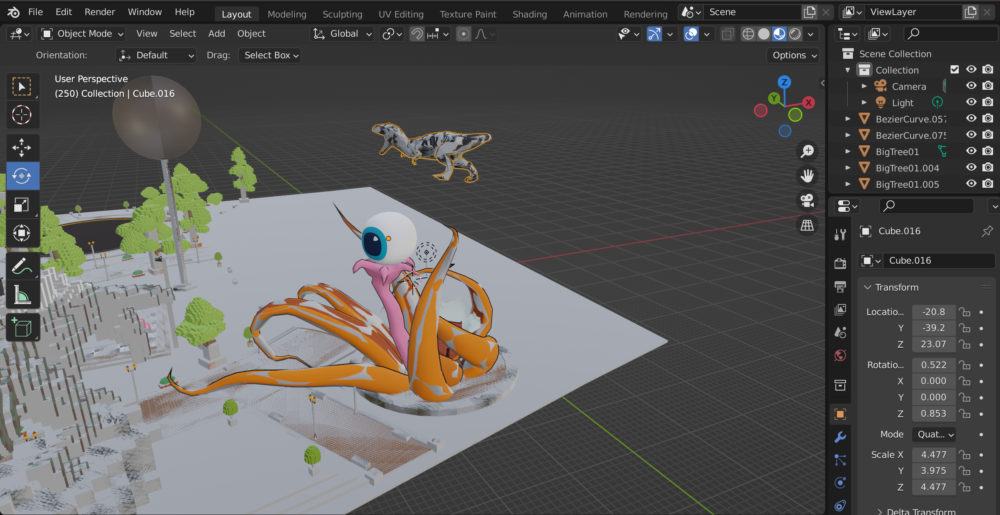
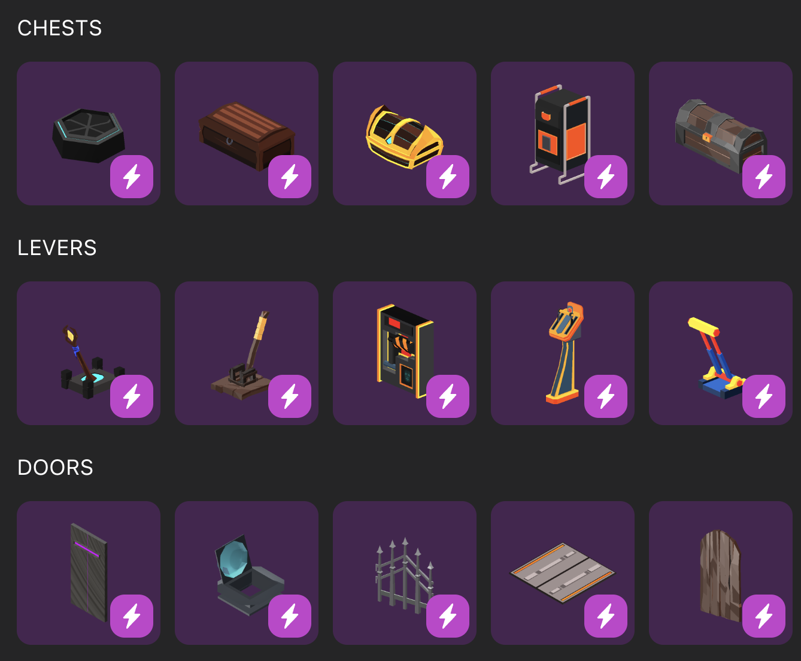
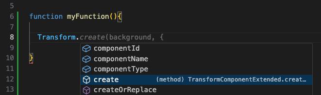

# Welcome Creator

Let's build Decentraland together!

All creators are welcome! In Decentraland you have a wide range of Creative possibilities, for people of different talents and skill levels!

Decentraland is available on desktop (Windows and macOS) and on mobile devices (iOS and Android). Players move seamlessly between clients with the same account, avatar, and inventory — which means your scenes need to work well for everyone, regardless of the device they're playing on. Throughout this guide you'll find recommendations on how to design, build, and test your scenes so they work great on every supported platform. For mobile-specific guidance, see [Building for Mobile](build-for-mobile/mobile-client/overview.md).

## The Creator Hub

The Creator Hub is the recommended tool for creators of all knowledge levels. It's a desktop application that lets you create:

- [Wearables & Smart Wearables](./#wearables)
- [Emotes](./#emotes)
- [Scenes](./#scenes)

Download the Creator Hub [here](https://decentraland.org/download/creator-hub).

## Wearables

Wearables are items of clothing that player avatars can wear. These are sold as NFTs and purchased in the [Marketplace](https://decentraland.org/marketplace/browse?section=wearables&vendor=decentraland&page=1&sortBy=newest&status=on_sale).

Learn everything about [Creating wearables](wearables-and-emotes/wearables/creating-wearables.md).

You can also combine a wearable with code from the SDK to create a [smart wearable](sdk7/projects/smart-wearables.md). This turns on a global scene whenever the player puts on the wearable. See [Kinds of project](sdk7/projects/kinds-of-project.md) to better understand the different options.

## Emotes

Emotes are animations that a player's avatar can do. These are sold as NFTs and purchased in the [Marketplace](https://decentraland.org/marketplace/browse?assetType=item&section=emotes&vendor=decentraland&page=1&sortBy=newest&status=on_sale).

Learn everything about [Creating emotes](wearables-and-emotes/emotes/creating-emotes.md).

## Scenes

3D content in Decentraland is made up of scenes, each scene occupies a finite amount of space and is displayed one next to the other for players to freely walk through them.

The Creator Hub lets you create scenes with an easy drag-and-drop interface, and also edit code to have full control over the interactions. You can run previews, debug, edit code, and publish.

[Learn more](scene-editor/get-started/about-editor.md)

### How do I create a Decentraland scene?

1. **Install the [Creator Hub](https://decentraland.org/download/creator-hub)**, the official desktop app for creating, previewing, and publishing scenes. It's the recommended tool for creators of all skill levels.
2. **If you use an AI coding assistant** (like Claude Code, Cursor, or Copilot), install the official [Decentraland SDK Skills](sdk7/getting-started/vibe-coding.md) so it knows verified SDK7 patterns: `npx skills add decentraland/sdk-skills`
3. **The [CLI](sdk7/getting-started/using-the-cli.md)** is an alternative for advanced users and automated workflows.

### 3D Art

Decentraland scenes are made up of 3D models.

- Chose from the wide catalog of default assets in the Scene Editor. These are ready to go and optimized for using in Decentraland

  

- Craft your own 3D models using Blender or your preferred 3D tools. Then import them into the Scene Editor.

  


**📔 Note**: Content in Decentraland should stay within certain [size limitations](sdk7/optimizing/scene-limitations.md) to ensure your scene runs smoothly.

See [3D modeling](3d-modeling/3d-models.md) for tips and tricks for optimizing, and information about supported features and formats for 3D models.


### Interactivity

To make your scene interactive:

- **No Code**: Use the UI of the Scene Editor to drop [Smart Items](scene-editor/interactivity/smart-items.md) into your scene. These are models that come pre-built with their own behavior, and are highly customizable. You can also assign the same behaviors to your own custom models (no code required).

  

- **Code**: For developers that want to incorporate custom logic, use the SDK to write code and do anything you can imagine. Learn to use the SDK:

  - [SDK Quick start](sdk7/getting-started/sdk-101.md): follow this mini tutorial for a quick crash course.
  - [Development workflow](sdk7/getting-started/dev-workflow.md): read this to understand scene creation from end to end.
  - [Vibe Coding with AI](sdk7/getting-started/vibe-coding.md): build scenes by describing what you want in plain language, and let an AI coding assistant write the code for you.
  - [Examples](https://studios.decentraland.org/resources?sdk_version=SDK7): dive right into working example scenes.

    


**📔 Note**: You will also need to have [Visual Studio Code](https://code.visualstudio.com/) installed.


### Publishing scenes

You don't need to own any tokens to start building your scene with the Scene Editor. To publish your scene, you can chose from the following options:

- **LAND in Genesis City**: This is the main open world in Decentraland, which is split up in 16x16 meter parcels. Buy one or several adjacent parcels in the [Marketplace](https://decentraland.org/marketplace/lands), and deploy your scene there.
- **Decentraland Worlds**: [Worlds](sdk7/publishing/publishing-options.md#decentraland-worlds) are your own spaces in the metaverse. All you need is to own a [Decentraland name](https://decentraland.org/marketplace/names/claim), and you can publish a scene as big as you want!

See [Kinds of project](sdk7/projects/kinds-of-project.md) to better understand the different options.

See [publishing](sdk7/publishing/publishing.md) for details and special options when publishing a scene, to either Genesis City or Worlds.

## Useful Resources

Check out [Useful Resources](sdk7/getting-started/useful-resources.md) for a curated list of tools, add-ons, asset libraries, and example projects that can speed up your creation workflow.
