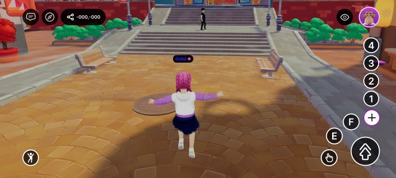

# Input on Mobile

Decentraland's input system is designed to be device-agnostic. The same `InputAction` enum that the SDK exposes on desktop is also routed from the on-screen controls on mobile, so most scenes work without any changes. There are, however, a few rules and gotchas worth knowing when you're building for touch.

For the full input model, see [Click events](../../sdk7/interactivity/button-events/click-events.md). This page focuses on what is mobile-specific.

<figure><figcaption>
The on-screen controls with the "+" menu expanded — every input action visible
</figcaption></figure>

## What touch maps to

Every `InputAction` that exists on desktop is also available on the mobile client — the on-screen controls simply route touch to the same SDK inputs. This means any scene that relies on the standard `InputAction` values will work on mobile out of the box.

The on-screen controls map as follows:

* **On-screen joystick** — drives `IA_FORWARD` / `IA_BACKWARD` / `IA_LEFT` / `IA_RIGHT` and avatar movement.
* **Interaction button (bottom right)** — fires `IA_POINTER` (the left mouse button on desktop) against whatever the player is aiming at.
* **E button** — fires `IA_PRIMARY` (the `E` key on desktop).
* **F button** — fires `IA_SECONDARY` (the `F` key on desktop).
* **Jump button** — fires `IA_JUMP` (the `Space` key on desktop). This is the largest button on the HUD and is always easy to reach.
* **1 / 2 / 3 / 4 buttons** — fire `IA_ACTION_3` / `IA_ACTION_4` / `IA_ACTION_5` / `IA_ACTION_6` respectively. These live behind a secondary menu (see below).
* **Camera drag** — rotates the camera; not exposed as an `InputAction`.

## Controls Customization

Scenes can reconfigure the on-screen controls — hide the joystick or crosshair, hide any button (including jump), change what the central button does, swap button icons, or replace the native controls entirely with custom UI. See [On-screen Controls](../../sdk7/interactivity/touch-screen-controls.md) and [UI Input Binding](../../sdk7/2d-ui/ui_input_binding.md).

<figure><figcaption>
A customized HUD: a re-iconed central button mapped to a different action
</figcaption></figure>

## Inputs to avoid for key actions on mobile

All `InputAction` values are reachable on mobile, but `IA_ACTION_3`–`IA_ACTION_6` (the `1`/`2`/`3`/`4` buttons) are tucked away behind a secondary menu and are **not easily reachable during gameplay**. If your scene uses them as primary actions, mobile players will not be able to trigger them comfortably.

Avoid binding key actions to:

* `IA_ACTION_3` — the `1` key on desktop / `1` button on mobile
* `IA_ACTION_4` — the `2` key on desktop / `2` button on mobile
* `IA_ACTION_5` — the `3` key on desktop / `3` button on mobile
* `IA_ACTION_6` — the `4` key on desktop / `4` button on mobile

Prefer instead:

* `IA_POINTER` for the main tap / interaction button
* `IA_PRIMARY` for the E button action
* `IA_SECONDARY` for the F button action
* `IA_JUMP` when an action maps naturally to jumping (it's the largest and most reachable button on the mobile HUD)
* Proximity-based triggers (see [Proximity Events](../../sdk7/interactivity/button-events/proximity-events.md)) when an action should fire automatically as the player approaches an entity

## Cursor lock

The [`PointerLock` component](../../sdk7/interactivity/button-events/click-events.md#lock-or-unlock-the-cursor) is a desktop-client concept (locked vs. unlocked mouse cursor). It does not apply to touch on mobile and is safe to leave in your scene — it has no effect there.

## Related

* [On-screen Controls](../../sdk7/interactivity/touch-screen-controls.md)
* [UI Input Binding](../../sdk7/2d-ui/ui_input_binding.md)
* [Click events](../../sdk7/interactivity/button-events/click-events.md)
* [Proximity Events](../../sdk7/interactivity/button-events/proximity-events.md)
* [Detect the platform from code](detect-platform.md)
* [UI best practices for mobile](ui-best-practices.md)
