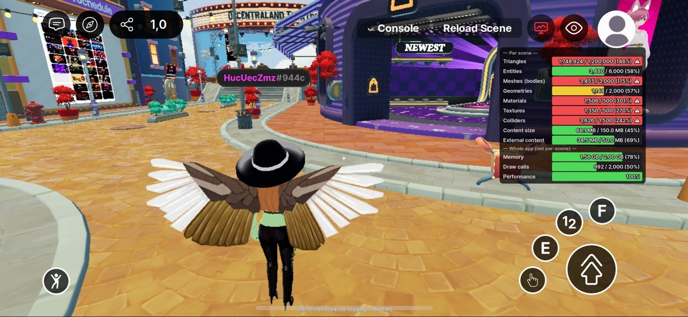

# Optimize Performance

Mobile devices have tighter resource constraints than desktop or web. Understanding the mobile scene limits and how to preview them helps you ship a scene that runs smoothly for the widest audience.

## Mobile Scene Limits

The table below shows the limits enforced when running on mobile. Reaching a **soft limit** triggers a warning in the performance panel; reaching a **hard limit** blocks the scene from loading.

| Metric | Soft Limit | Hard Limit |
| --- | --- | --- |
| Triangles | 1,000,000 | 1,200,000 |
| Entities | 4,800 | 6,000 |
| Meshes (bodies) | 2,400 | 3,000 |
| Geometries | 1,000 | 2,000 |
| Materials | 400 | 500 |
| Textures | 400 | 500 |
| Colliders | 1,200 | 1,500 |
| Content size | 120 MB | 150 MB |
| External content | 40 MB | 50 MB |
| Memory (process RSS) | 1,638 MB | 2,048 MB |
| Draw calls | 1,000 | 2,000 |
| Performance (higher is better) | 90% | 85% |

## Preview Mobile Performance

You can check your scene’s mobile performance directly from **Creator Hub** without deploying to a physical device.

1. Open your scene in **Creator Hub**.
2. Select Preview > Show QR Code for Mobile
3. Open the **Scene Limits Preview** from the top right icon in your phone (monitor with statistics in red).


**Keep Performance above 90% on High Graphics**

The **Performance** value is a percentage of the FPS budget set by the active graphic profile. A score of **100%** means the scene is hitting the full FPS target.

Always test on a mid-spec device like the **Samsung Galaxy A54** and aim for a **Performance score above 90% on the High graphic profile**. This ensures a smooth experience for the majority of mobile players. See [Hardware Requirements](../mobile-client/hardware-requirements.md) for reference devices.

You can change the graphic profile from **In-Game Menu → Settings → Graphics → set Dynamic Graphics to Off → switch Profiles**.

