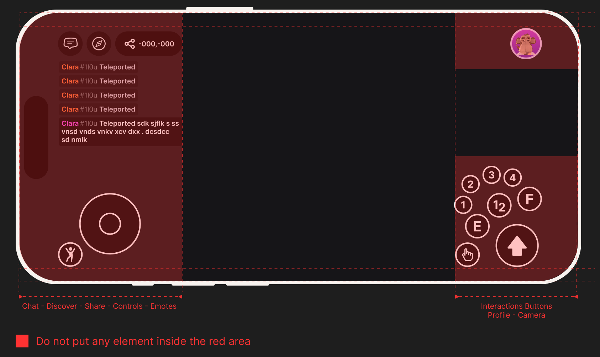
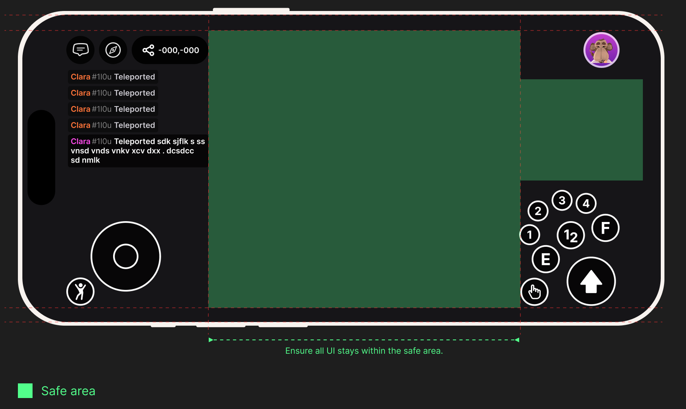

# Mobile Safe Area

On a phone, two things eat into the screen space your UI can safely use:

* **The Decentraland system HUD** — the app overlays its own controls (joystick, chat, profile, camera controls, the interaction button). Scene UI placed under them clashes visually and competes for taps. These regions are mapped out in [Reserved margins](#reserved-margins) below.
* **The device's hardware-reserved margins** — the notch or camera cutout, status bar, home indicator, and rounded corners. The SDK keeps UI clear of these automatically, with no work on your side — see [Device hardware insets](#device-hardware-insets-screeninsetarea).

The **mobile safe area** is what's left over — where scene UI can live without clashing with either.


All values below use normalized coordinates `[0.0 – 1.0]` based on a **1600 × 720 px landscape** reference resolution — the same resolution the SDK uses as the [default virtual screen on mobile](../../sdk7/2d-ui/onscreen-ui.md#default-virtual-size), so the pixel figures below map 1:1 to your UI's pixel values there. Always use normalized values so your layout adapts to any screen size. Always verify on a real device using the [preview QR code](preview-on-mobile.md).


## Reserved margins

The system HUD occupies the outer edges on all four sides. Do not place scene UI inside these regions:

| Edge | Reserved for | Size |
|---|---|---|
| **Left** | Chat, joystick, emotes | 480 px — 30% of width |
| **Right** | Profile, action buttons | 400 px — 25% of width |
| **Top** | System bar | 58 px — 8% of height |
| **Bottom** | System bar | 58 px — 8% of height |

```
// Minimum safe insets (normalized)
margin: { left: 0.30, right: 0.25, top: 0.08, bottom: 0.08 }
```

<figure><figcaption><p>Reserved regions on the mobile client: left side, top-right, and bottom-right are owned by system controls.</p></figcaption></figure>

## Center safe zone

The recommended area for all scene UI is the center band of the screen. It gives you **720 × 605 px** of usable space:

| | Pixels | Normalized |
|---|---|---|
| **x start** | 480 px | 0.30 |
| **x end** | 1200 px | 0.75 |
| **y start** | 58 px | 0.08 |
| **y end** | 662 px | 0.92 |

```
// Center safe zone (normalized)
safeArea: {
  x: [ 0.30, 0.75 ],  // 480 – 1200 px  →  45% of screen width
  y: [ 0.08, 0.92 ]   // 58 – 662 px    →  84% of screen height
}
```

<figure><figcaption><p>The center safe zone: 720 × 605 px, from x 30%–75% and y 8%–92%.</p></figcaption></figure>

## Right-side gap (small elements only)

Between the Profile avatar (top-right) and the action button cluster (bottom-right) there is a narrow gap where small UI elements — icons, counters, status indicators — can live. Keep elements here to a maximum of **48 × 48 px** to avoid crowding the controls.

| | Pixels | Normalized |
|---|---|---|
| **x range** | 1200 – 1600 px | 0.75 – 1.0 |
| **y range** | 158 – 360 px | 0.22 – 0.50 |

```
// Right-side gap (normalized)
rightGap: {
  x: [ 0.75, 1.0  ],  // 1200 – 1600 px
  y: [ 0.22, 0.50 ]   // 158 – 360 px
}
```

## Where to put scene UI

* **Center of screen** — actionable dialogs, anything the player needs to read and respond to.
* **Top-center** — non-actionable messages, status, and notifications.
* **Center-bottom (above the interaction button)** — context-sensitive hints.
* **Right-side gap** — small icons or counters only (max 48 × 48 px).

## Why it matters

Scene UI that overlaps the reserved regions will:

* Be partially hidden behind the joystick, interaction button, or camera controls.
* Compete for taps with the system controls — players will accidentally trigger one or the other.
* Make your scene feel broken on mobile, which hurts featuring and retention.

## Device hardware insets (`ScreenInsetArea`)

The reserved margins above belong to the Decentraland **system HUD**. Separately, the **device hardware** reserves screen space for the notch or camera cutout, the status bar, the home indicator, and rounded corners. UI drawn underneath these is partly hidden or hard to tap.

**You get this for free.** Every UI renderer is positioned inside the device safe area by default, so you don't need to do anything to keep your UI clear of these hardware margins. That default is the `screenInset: 'device'` renderer option — see [Screen inset area](../../sdk7/2d-ui/onscreen-ui.md#screen-inset-area):

```ts
// Both of these keep the UI inside the device safe area
ReactEcsRenderer.setUiRenderer(uiComponent, { virtualWidth: 1920, virtualHeight: 1080 })
ReactEcsRenderer.setUiRenderer(uiComponent, { screenInset: 'device' })

// This one does not — the UI covers the whole screen, notch included
ReactEcsRenderer.setUiRenderer(uiComponent, { screenInset: 'none' })
```

If you opted out with `screenInset: 'none'` and want to protect only part of your UI, use the `ScreenInsetArea` component. It reads the same insets and applies them to its children. Import it from `@dcl/sdk/react-ecs` and wrap the UI you want to protect:

```tsx
import ReactEcs, { ReactEcsRenderer, UiEntity, ScreenInsetArea } from '@dcl/sdk/react-ecs'
import { Color4 } from '@dcl/sdk/math'

export function setupUi() {
  ReactEcsRenderer.setUiRenderer(() => (
    <ScreenInsetArea>
      {/* A child sized 100% × 100% fills the safe inset area exactly */}
      <UiEntity
        uiTransform={{ width: '100%', height: '100%' }}
        uiBackground={{ color: Color4.create(0, 0, 0, 0.5) }}
      />
    </ScreenInsetArea>
  ), { screenInset: 'none' })
}
```

`ScreenInsetArea` positions itself absolutely using the inset values the device reports, so the `positionType` and `position` fields of its `uiTransform` are reserved — any value you set for them is ignored. All other `uiTransform` properties (`padding`, `flexDirection`, `alignItems`, …) and UI components (`uiBackground`, `onMouseDown`, …) work as usual. The component reacts automatically when the insets change, for example on rotation or when system bars appear or hide.


**📔 Don't apply the insets twice:** the `screenInset: 'none'` in the snippet above matters. Wrapping your UI in `ScreenInsetArea` while the renderer is also using its default `'device'` inset applies the margin twice, pushing your UI inwards by double the amount. Pick one or the other.



**📱 Mobile only:** device insets only have real values on the **mobile client**. On the **desktop client** they are `(0, 0, 0, 0)`, so both the `'device'` renderer option and the `ScreenInsetArea` component have no effect there and your UI renders exactly as it would without them. Both are safe to leave in cross-platform UI code.


## Related

* [UI best practices for mobile](ui-best-practices.md)
* [Detect the platform from code](detect-platform.md) — use `isMobile()` to swap layouts.
* [On-screen UI](../../sdk7/2d-ui/onscreen-ui.md)
* [UX & UI Guide](../../sdk7/design-experience/ux-ui-guide.md)
