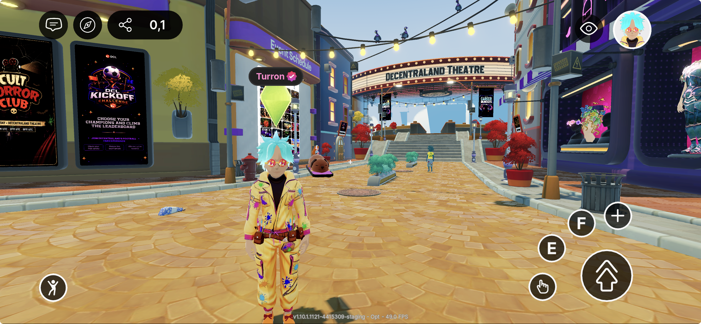

# Overview

Decentraland is now available on mobile. Players can explore your scenes from iOS and Android devices, in addition to the desktop client and the web. As a creator, you can adapt your scenes so they look great and play well on touch-based devices.

This section covers how to detect mobile clients from your scene code, how to preview and test your scene on a real device from the Creator Hub or the CLI, the safe-area rules for placing UI on small screens, and how to get your scene featured in the mobile Discover section.

## Get the mobile app

* [Download for iOS (App Store)](https://apps.apple.com/app/decentraland/id6478403840?utm_source=docs&utm_medium=internal&utm_content=ios)
* [Download for Android (Google Play)](https://play.google.com/store/apps/details?id=org.decentraland.godotexplorer&pcampaignid=web_share&utm_source=docs&utm_medium=internal&utm_content=android)

## Building for Mobile

### Reference

* [Sample Scenes](sample-scenes.md) — open-source scenes built by the Decentraland team and optimized for mobile play.
* [Missing Features](missing-features.md) — features available on the desktop client that are not yet supported in the mobile app.
* [Hardware Requirements](hardware-requirements.md) — minimum and recommended hardware specs for running Decentraland on mobile.

### Develop

* [Detect the platform from code](../develop/detect-platform.md) — use `isMobile()` to branch your scene's logic and UI per platform.
* [Preview your scene on mobile](../develop/preview-on-mobile.md) — preview directly on a phone via the Creator Hub or the CLI.
* [Mobile safe area](../develop/safe-area.md) — the screen regions reserved for system controls and the device's hardware margins (notch, home indicator); keep scene UI clear of them, with the `ScreenInsetArea` component or by hand.
* [UI best practices for mobile](../develop/ui-best-practices.md) — DOs and DON'Ts, sizing recommendations, and current limitations.
* [Input on mobile](../develop/input-on-mobile.md) — touch-friendly input mappings and which `InputAction`s to avoid.
* [Optimize Performance](../develop/optimize-performance.md) — mobile scene limits, how to preview them in Creator Hub, and performance targets.

### Publish

* [Get featured on mobile Discover](../publish/get-featured.md) — submission requirements for the mobile Discover section.
* [iOS curation](../publish/ios-curation.md) — how iOS content curation works and how to submit your scene or world for review.

## Quick checklist

Before publishing a scene that should work well on mobile, make sure that:

* [ ] You have previewed the scene on a real device — see [Preview your scene on mobile](../develop/preview-on-mobile.md).
* [ ] All critical UI elements stay inside the [mobile safe area](../develop/safe-area.md).
* [ ] Your UI is sized large enough for touch — follow the [UI best practices](../develop/ui-best-practices.md).
* [ ] Key actions are not bound to `IA_ACTION_3`–`IA_ACTION_6` (the `1`/`2`/`3`/`4` keys), which are not easily reachable on mobile — see [Input on mobile](../develop/input-on-mobile.md).
* [ ] Your scene's [Performance](../develop/optimize-performance.md) score is above 80% across all graphic profiles on a mid-range phone — see [Hardware Requirements](hardware-requirements.md) for reference devices.
