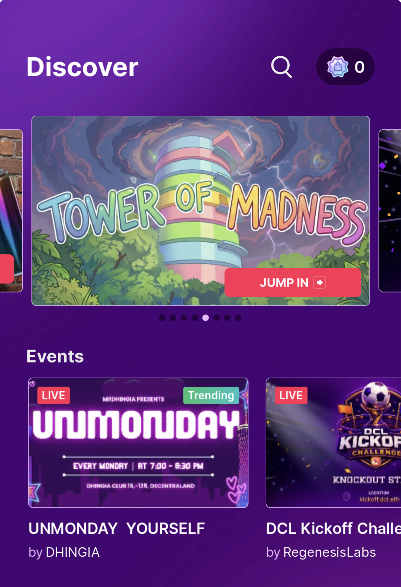

# Get Featured on Mobile Discover

The mobile Discover section is the highest-traffic surface on the Decentraland mobile app and the best way to get your scene in front of mobile players. Featured scenes are curated — there is no automatic ranking.

## How to apply

Submit your scene through the [rl-mobile-featuring](https://discord.com/channels/417796904760639509/1471564023131537590) channel on the Decentraland Discord.

## Requirements

To be considered, your scene or world should:

* **Propose an engaging or novel mechanic for mobile players** — something that feels worth opening the app for, designed with touch in mind.
* **Have UI placement that does not conflict with the mobile controls** — follow the [mobile safe area](../develop/safe-area.md).
* **Work as expected on mobile** — preview and test on a real device first; see [Preview on mobile](../develop/preview-on-mobile.md).

## What to include in your submission

Provide the following with your application:

* **Scene / World title**
* **Scene / World description**
* **Gameplay description** — what the player does and why it's interesting on mobile.
* **A short gameplay video of your scene running on mobile** — this is the most important piece. Capture from a real device, ideally showing the on-screen controls in action.

## Tips for a strong submission

* Get the basics right first. Validate the [UI best practices](../develop/ui-best-practices.md) and [safe area](../develop/safe-area.md) before submitting — UI that clashes with controls is the most common reason a scene is held back.
* Show the mobile-specific moment. If your scene has a mechanic that is especially fun on touch (drawing, swiping, drag-to-aim, tap rhythms), make sure your video highlights it.
* Keep the video short and focused — 30–60 seconds is plenty.

## Related

* [Mobile safe area](../develop/safe-area.md)
* [UI best practices for mobile](../develop/ui-best-practices.md)
* [Preview on mobile](../develop/preview-on-mobile.md)
* [Make Discoverable](../../sdk7/publishing/make-discoverable.md)
