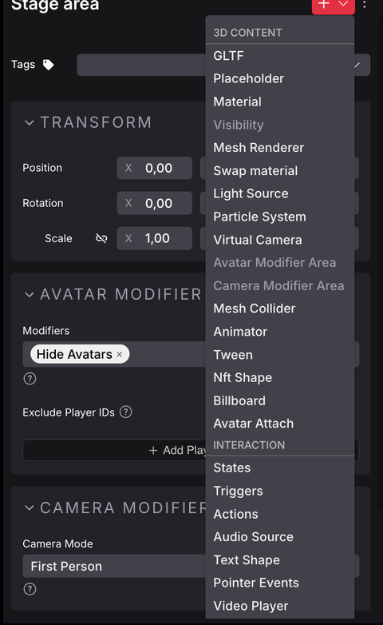

# Components

Select an item by clicking on it on the canvas or on the entity tree. You'll then see its components displayed on the properties panel, on the right of the screen. Different items have different components that each display specific settings.

Most non-interactive items have the following components:

- **Transform**: Sets the position, rotation, and scale of the item. If the item is a child of another item on the [Entity Tree](../get-started/scene-editor-essentials.md#the-entity-tree), these values are relative to those of the parent's.
- **GLTF**: What 3D model to load. It includes the local path to the file for this 3D model. It also includes some properties for configuring [colliders](../../sdk7/3d-essentials/colliders.md#colliders-on-3d-models) on the model.

The items in your scene are all **Entities**. Everything in a scene is an Entity, they are the basic building blocks of scenes. Items are Entities that have at least a position and a visible shape.

## Add components

To add Components to any Entity, click the **+** sign at the top of the properties tab and select the Component from the list. See [Make any item smart](../interactivity/make-any-item-smart.md)

You can delete any Component from an Entity by clicking the three dots icon on its right, and selecting **Delete Component**.

## Create an entity from scratch

To create a fresh new Entity, right click on the root **Scene** Entity in the Entity tree, or on any other Entity, and select **Add Child**

This creates an empty Entity with just a **Transform** Component. The new entity is a child of the parent entity you clicked on. You can then add any other Components you want to it to shape it into anything you desire.

## Available components

The following Components can be added to any Entity via the Scene Editor UI:

- **Mesh Renderer**: Gives the Entity a visible shape based on a primitive shape (cube, plane, cylinder, or sphere).
- **Mesh Collider**: Gives the Entity an invisible collider geometry. This can block the player from walking through the item, and/or can make it clickable. See [collider](../../sdk7/3d-essentials/colliders.md).
- **Material**: Defines the color, texture, and other properties of an Entity that has a **Mesh Renderer** Component. See [materials](../../sdk7/3d-essentials/materials.md).

   **📔 Note**: The item Must have a **Mesh Renderer** Component. It doesn't affect items with a **GLTF** visible shape. 

- **Visibility**: Defines if an Entity is invisible.
- **Light Source**: Adds a light to the Entity.

- **Swap Material**: Swaps the material of an Entity that has a **GLTF** component. If the 3D model has multiple meshes, you can swap the material of each mesh individually.

- **Audio Source**: Plays a sound from a sound file at the location of the Entity. See [Sounds](../../sdk7/3d-essentials/sounds.md).
- **Text Shape**: Displays text in the 3D space. See [Text](../../sdk7/3d-essentials/text.md).
- **Pointer Events**: Marks an Entity as clickable, displaying a hover-hint.


**📔 Note**: The **Pointer Events** Component only provides feedback. To perform actions when an Entity is interacted with, see [Make any item smart](../interactivity/make-any-item-smart.md)


- **Multiplayer**: Shares any changes that happen to the Entity so that all players in the scene see it too. It can be configured to only share changes on certain components. See [Serverless Multiplayer](../../sdk7/networking/serverless-multiplayer.md#mark-an-entity-as-synced) for more details.
- **Animator**: Controls the playback of animations on an Entity with a **GLTF** 3D model. See [3D model animations](../../sdk7/3d-essentials/3d-model-animations.md).
- **Tween**: Makes the Entity gradually move, rotate, or scale over a period of time. See [Move entities](../../sdk7/3d-essentials/move-entities.md).
- **Billboard**: Makes the Entity always rotate to face the player. See [Face the user](../../sdk7/3d-essentials/entity-positioning.md#face-the-user).
- **Avatar Attach**: Attaches the Entity to the player's avatar, so it follows them around. See [Attach an entity to an avatar](../../sdk7/3d-essentials/entity-positioning.md#attach-an-entity-to-an-avatar).
- **Video Player**: Plays a video inside the scene, that can be displayed on the Entity via its **Material**. See [Video playing](../../sdk7/media/video-playing.md).
- **NFT Shape**: Displays the image of an NFT inside a frame. See [Display an NFT](nfts.md).
- **Particle System**: Emits particles from the Entity's location, for effects like smoke, fire or sparkles. See [Particle systems](../../sdk7/3d-essentials/particle-system.md).
- **Virtual Camera**: Defines a custom camera angle that the scene can switch the player's view to. See [Camera](../../sdk7/3d-essentials/camera.md).
- **Avatar Modifier Area**: Changes how avatars behave or appear for players inside a region centered on this entity. The entity's scale sets the size of the region. See [Modifier Areas](../interactivity/modifier-areas.md).
- **Camera Modifier Area**: Forces the player's camera into first or third person inside a region centered on this entity. The entity's scale sets the size of the region. See [Modifier Areas](../interactivity/modifier-areas.md).
- **Script**: Attaches a custom code module to the Entity, with parameters you can configure from the UI. See [Script component](../code/script-component.md).


**📔 Note**: Other components exist on the SDK that are currently only usable via code. You can also create your own [Custom components](../../sdk7/architecture/custom-components.md) via code, these won't have a UI representation, but can be added and edited via code.

See [Combine with code](../code/overview.md) for how to edit the code of your scene.

Also note that an Entity can only hold **one** of each Component. It's not possible to assign a second instance of a Component that already exists in the entity. For example, you can't add two **Actions** components to a same Entity.


## Settings worth knowing

Most component fields map one to one onto the SDK page linked above. A few are easy to miss, or behave in a way that isn't obvious from the field name.

### Audio Source

**Pitch** multiplies the playback speed and shifts the pitch with it. `1` plays the original sound, `2` plays it twice as fast (one octave up), `0.5` half as fast (one octave down). It must be greater than 0, and defaults to `1`.

### Video Player

* **Playback Rate**: same idea as Pitch, for video. `1` is normal speed. Leave it empty for the default.
* **Start Position (seconds)**: where playback begins when the video starts. Leave it empty to start from the beginning.
* **Spatial Audio**: turn on **Spatial** to make the video's sound positional, so it fades as the player walks away. **Spatial Distance** then sets the range: the audio plays at full volume up to **Min** meters and fades to silence at **Max** meters. The defaults are 0 and 60.

With **Spatial** off, the audio plays at the same volume everywhere in the scene.

### Text Shape

* **Size**: the width (**W**) and height (**H**) of the text box, in meters. Alignment and padding are measured against this box.
* **Text Wrapping**: breaks the text into new lines when it reaches the width set in **Size**. With it off, the text stays on one line.

### Material

* **Color Alpha**: the opacity of the main **Color**, from 0 to 1. It has no effect while **Transparency Mode** is **Opaque**.
* **Alpha test**: the cutoff where a pixel becomes invisible. It only appears when **Transparency Mode** is **Alpha test** or **Alpha test & blend**, since those are the only modes that use it.
* **None**: color dropdowns now offer a **None** entry that clears the color, and the texture **Type** dropdown offers **None** to remove a texture.

### Particle System

The **Rotation** section controls how particles are oriented and how they spin:

* **Billboard**: each particle always faces the camera. On by default. Turn it off for particles that should tumble freely in 3D.
* **Face Travel Direction**: each particle starts out pointing the way it's moving, like an arrow.
* **Initial Rotation (deg)**: how each particle is rotated when it's born, per axis.
* **Rotation Over Time (deg/sec)**: how fast it spins, per axis. Values are capped at 180 per axis.

When **Use Texture** is on, two more dropdowns appear:

* **Wrap Mode**: how the texture behaves past its edges. **Clamp** (the default) stretches the edge pixels, **Repeat** tiles it, **Mirror** tiles it with alternating flips.
* **Filter Mode**: how the texture is sampled. **Bilinear** (the default) is smooth, **Point** is pixelated and good for pixel art, **Trilinear** smooths across mipmap levels.

### Tween

**Tween Type** offers five modes:

| Mode | What it does |
| --- | --- |
| **Move Item**, **Rotate Item**, **Scale Item** | Animate from a start value to an end value over the **Duration**. |
| **Move Continuous** | Keep moving in a fixed direction, forever, at a constant speed. |
| **Rotate Continuous** | Keep spinning around a fixed axis, forever, at a constant speed. |

The two continuous modes have no end value, so **Start**, **End**, **Duration**, **Easing Function** and **Loop** are hidden for them. Instead you get:

* **Move Continuous**: a **Direction** vector and a **Speed (meters/sec)**. Use a direction of length 1 so the speed is exactly meters per second. A negative speed moves the opposite way.
* **Rotate Continuous**: a **Rotation Axis (degrees)** and a **Speed (degrees/sec)**. Only the direction of the axis matters, not how large the angles are.

Switching **Tween Type** resets these values to sensible defaults for the new mode, because the numbers mean different things in each one.

The **Playing** checkbox (previously called "Auto start") decides whether the tween runs as soon as the scene loads. With it off, the tween is created paused at its start value and only runs once your code sets it to play.


**💡 Tip**: Some component properties can only be set from code. Editing an entity in the inspector no longer discards them, so you can set a value in your scene's code, then keep using the editor on that entity without losing it.


## Smart items

[Smart items](../interactivity/smart-items.md) can also include special components that Control the Entity's interactivity. These are typically:

- **Actions**: Lists all the possible actions the item can carry out.
- **Triggers**: Determines when the actions from the Actions component are carried out.
- **States**: Keeps track of the item's current state. The state can be used for conditional logic, to only trigger certain actions if the item is on certain state.
- **Counter**: Keeps track of a counter. The counter can be used for conditional logic, to only trigger certain actions if the counter's value is equal/greater/lower than a given value.

See [Smart items advanced](../interactivity/smart-items-advanced.md) for more details.

## About entities and components

Everything in a scene is an Entity. All the items and smart items in the scene are Entities.

All the traits of an Entity are determined by its components. They define what the Entity is, where it is, how it sounds, and how it behaves. For example, a **Transform** component stores the Entity's coordinates, rotation and scale. A **MeshRenderer** component gives the Entity a visible shape (like a cube or a sphere), and a **Material** component gives the Entity a color or texture.

The values on components can change over time. In the Scene Editor you configure the initial values for these components. But once your scene is running, the player's actions or the passage of time can change those values.

For example, a moving platform Smart Item has an initial position that you set via its **Transform** component, but after the actions of this item make it move, its **Transform** will hold different values.

See [Entities and components](../../sdk7/architecture/entities-components.md) for an in-depth look at this concept and how they're used by Decentraland scenes.
