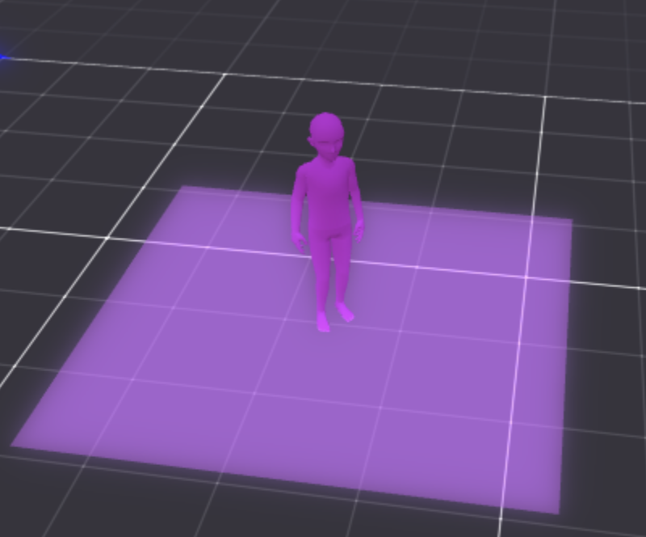
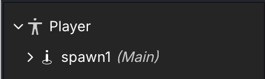
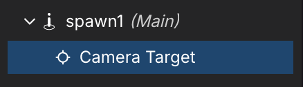
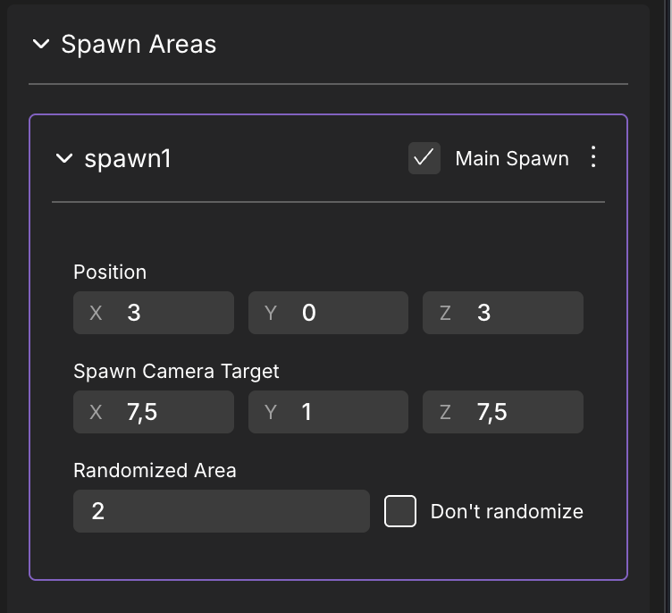
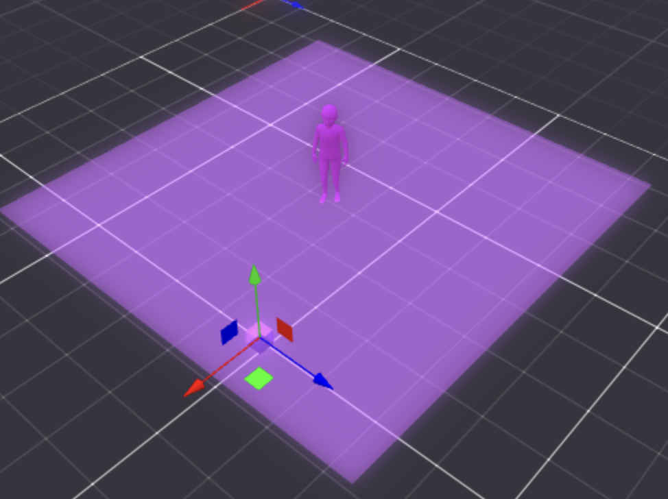
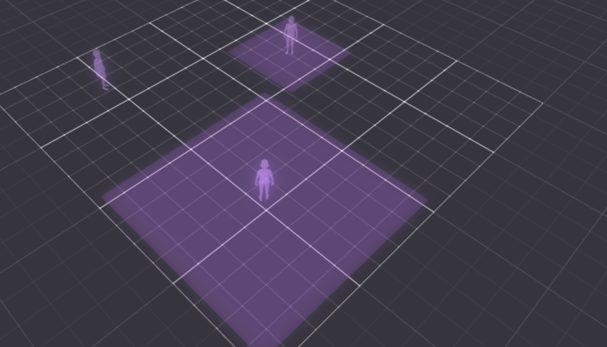
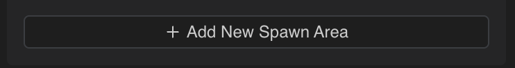
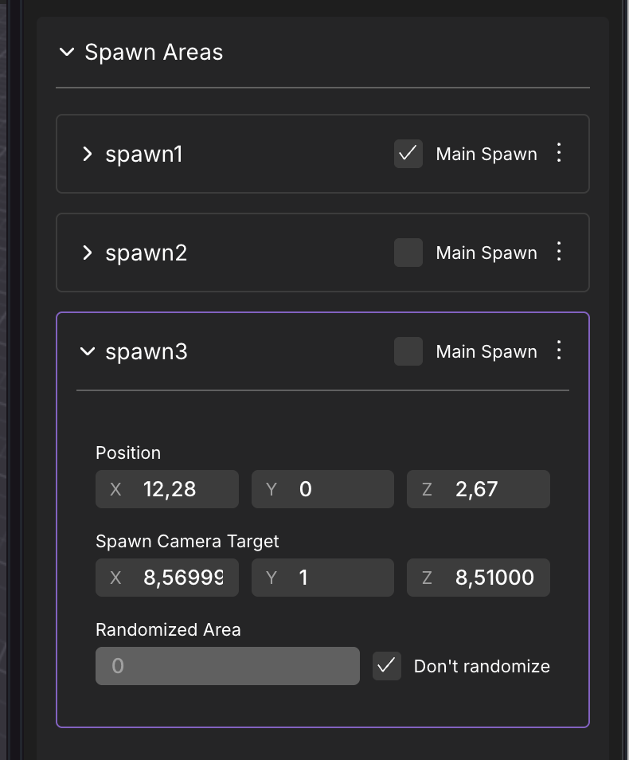
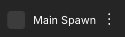

# Spawn Areas

The creator can set the **Spawn Position** and **Spawn Camera Target** in the Creator Hub by editing a **Spawn Area** Entity. 

This gives the creator a visual way of setting the Spawn Area and the direction the avatar will be facing when spawned as done with other objects in the scene. 

Spawn Areas define where players appear when they access your scene directly, either by typing in the coordinates or teleporting. Your scene might have objects that can block players from moving if they happen to spawn right over them, like trees or stairs, or your scene might have an elevated terrain. It would be a bad experience for players if they spawned over something that doesn't let them move. That's why you have the option to set one or several spawn positions in ad-hoc locations.


**📔 Note**: All spawn points must be within the parcels that make up the scene. You can't spawn a player outside the space of these parcels.


The Spawn Area is composed of two different entities that work together:

* **Spawn** Entity: can be found inside the **Player** Entity. Defines the actual Spawn Point of the Player.

* **Camera Target** Entity: can be found inside the **Spawn Area** Entity. Move it to the desired direction in which the Player will be spawned.

## Changing Spawn Areas

**Spawn Areas** and their **Camera Target** can be moved directly from the Scene Editor as with any other object in the scene, or modify its values manually (as with Transforms in other Entities).

### Parameters

When a Spawn Area is selected, the creator is able to see and set the following values on the Components section:

* **Position**: Avatar's Spawn Position. These are coordinates inside the scene, relative to the scene's origin, similar to what you'd use in a Transform component.
* **Spawn Camera Target**: The direction the camera (and the avatar) will be facing once spawned into the scene. Use this to have better control over the player's first impression when they jump into your scene.
* **Randomized Area**: Adds randomness to the Spawn Area in meters, enabling and disabling it with the **Don't randomize** toggle. When enabled, an area is rendered in the Scene Editor, showing the area in which the Player can randomly be spawned in. The random offset applies on both the X and Z axis, and prevents all players from appearing overlapping each other when they spawn, which looks especially bad in crowded scenes.

## Multiple Spawn Areas

The creator can have multiple **Spawn Areas** defined. To create a new Spawn Area, follow these steps:

1. Select any Spawn Area, **spawn1** being the default.
2. All the Spawn Areas show on the right Panel. You can add new ones by clicking on **+ Add New Spawn Area** .

3. Enable the **Main Spawn**  of the desired Spawn Area. If there are many Spawn areas toggled as **Main Spawn**, the player will randomly appear in one of them.
4. Preview the scene.

