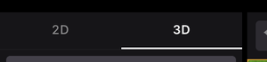
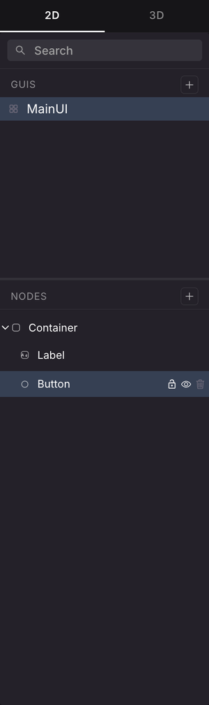
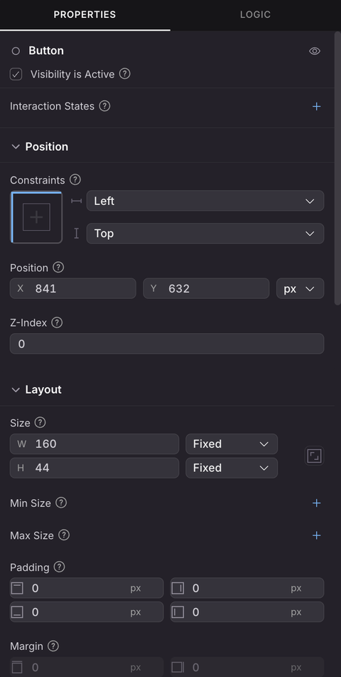
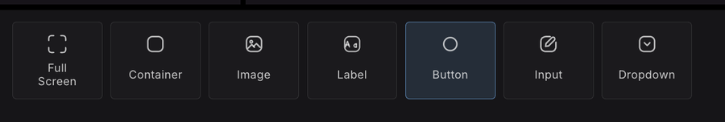
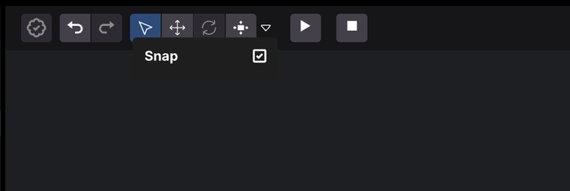

# UI Editor

The UI Editor lets you build your scene's on-screen interface by dragging widgets onto a canvas, instead of writing layout code by hand. It writes real files into your scene, so anything you make here is normal SDK7 UI that you can keep editing in code.

The UI Editor is an experimental feature and is turned off by default.

## Turn it on

1. Click the Creator Hub logo in the top-left corner and select **Settings**.
2. Go to the **EXPERIMENTAL** tab.
3. Switch on **Enable UI Editor**.

A **2D** / **3D** tab switch then appears at the top of the editor's left panel. **3D** is the scene canvas you already know. **2D** is the UI Editor.


**📔 Note**: The UI Editor needs `@dcl/sdk` version 7.26.0 or newer in your scene. On an older scene it shows a **UI Editor Unavailable** notice with an **Update SDK** button that upgrades the scene for you.


The Creator Hub remembers whether you left a scene in 2D or 3D and reopens it the same way. This is stored per project and is never published with your scene.

If you are using the Bevy scene renderer, switching to **2D** pauses the running scene, and going back to **3D** resumes it if it was running before.

## Make your first UI

1. Switch to the **2D** tab.
2. Click **New GUI**, either the button in the middle of the empty canvas or the **+** next to **GUIs** in the left panel. A GUI is one UI component, stored in its own file.
3. Drag a widget from the palette along the bottom onto the canvas. **Full Screen** is a good first widget, it gives you a root that covers the screen. Then drop other widgets inside it.
4. Select a widget and set its properties in the right panel.

There is no save button. The editor writes your changes to disk as you go, and the badge at the left of the toolbar reads **All changes saved**.

## The panels

* **Left**: **GUIs**, the list of your UI components, and **Nodes**, the tree of the selected one. A search box filters both. Hover a node to lock, hide or delete it.
* **Right**: a **Properties** tab for the selected node, and a **Logic** tab.
* **Bottom**: the widget palette. Drag a card onto the canvas to add it.
* **Middle**: the canvas. Drag nodes to move them, use the handles to resize, and pan freely with the mouse wheel or by dragging. The zoom controls in the bottom-right corner also switch between desktop and mobile previews, and the frame button re-centers the view.

 

## Widgets

The palette groups widgets into three categories:

* **Containers**: **Full Screen**, **Container**, **Image**
* **Text**: **Label**, **Button**
* **Input**: **Input**, **Dropdown**

**Full Screen** is a container that fills whatever it is placed inside, which makes it a good starting point for a UI that should cover the screen.

## Moving and resizing

The toolbar has three tool modes:

* **Free**: move and resize, the general-purpose mode.
* **Move**: drag only.
* **Resize**: handles only.

Positions snap to a 10 pixel grid. Hold **Shift** while dragging to move freely, ignoring the grid. The small arrow next to the tool buttons opens a **Snap** checkbox that turns snapping off entirely.

## Layout: flow and free positioning

Two separate properties decide where a node ends up. Getting these straight saves a lot of confusion.

**Flow** is set on a **container** and decides how it arranges its children:

* **Free**: children stay wherever you put them.
* **Row** / **Row reverse**: children are laid out left to right, or right to left.
* **Column** / **Column reverse**: children are stacked top to bottom, or bottom to top.
* **Wrap children**: lets children spill onto more than one line when they don't fit.

**Ignore Layout Flow** is set on a **child** and decides whether that one node opts out of its parent's arrangement. Off, the parent positions it. On, you pin it yourself with Anchor and Position values.

Two consequences follow from this:

* Drop a widget into a **Free** container and it stays exactly where you dropped it.
* Drop it into a container with a direction and it joins the flow, taking its place in the line.

Switching a container to **Free** pins its existing children where they currently sit, so nothing jumps.

The root of a GUI is always positioned freely.

## Other properties worth knowing

* **Opacity**: 100% is fully opaque, 0% fully transparent. The default is 100%.
* **Scene Inset**: which part of the screen the GUI sits in.
  * **Full Screen** uses the whole renderable screen.
  * **Gameplay Safe Area** stays clear of the client's own interface, such as chat, the minimap, and HUD indicators.
  * **Device Safe Area** also avoids physical obstructions such as a notch or system bars. This option is offered when the canvas is in mobile preview.

If you give a GUI's root a width and a height in fixed pixels, the canvas frames it as an artboard of exactly that size rather than as a screen.

## Where the files go

The UI Editor edits your scene's real source files. There is no separate saved format.

* Each GUI is one `.tsx` file under `src/ui/`.
* `src/ui/index.tsx` is generated by the editor to gather them together. Don't edit it by hand.

If your scene has an older single `src/ui.tsx` file, the editor backs it up as `src/ui.tsx.bak` the first time you open the UI Editor.

Because these are ordinary files, you can open them in your [code editor](../code/overview.md) at any time. See [UI](../../sdk7/2d-ui/) for what the underlying code does.

## Code the editor can't edit

The editor understands a particular shape of UI code. A node written some other way, for example built inside a loop or a conditional, or using a custom component or spread props, is drawn on the canvas as a grey block with a **non-standard, edit in code** badge. Its children are not shown, and you edit it in code instead.

The rest of the GUI around it keeps working normally.

## Related pages

* [UI](../../sdk7/2d-ui/): writing scene UI in code.
* [Combine with code](../code/overview.md): open your scene in a code editor.
* [Entities and Components](components.md): the 3D side of the editor.
