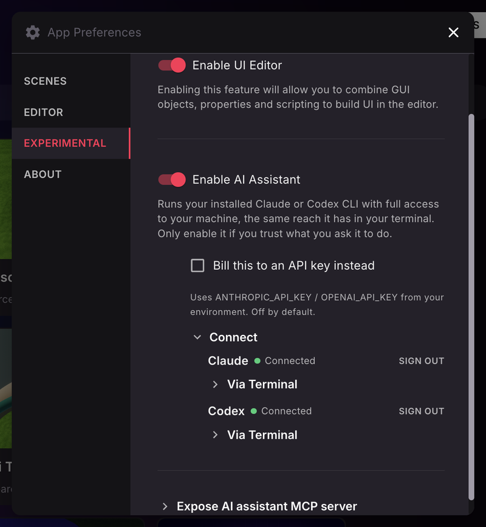
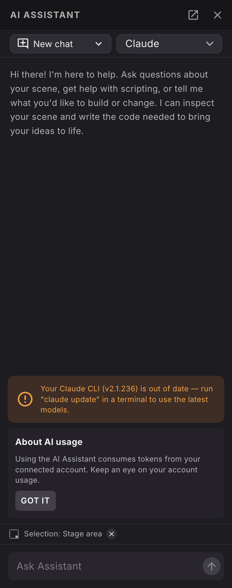
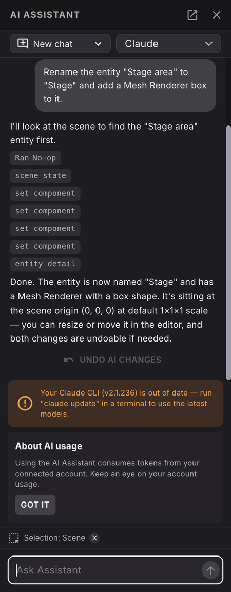
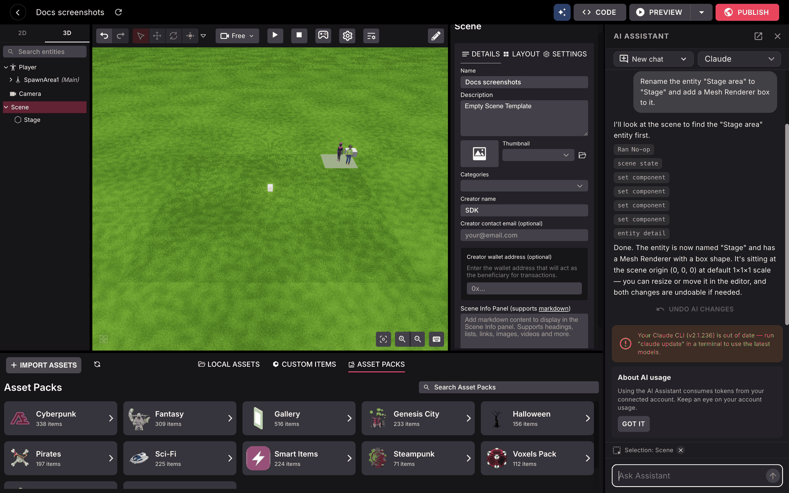

# AI Assistant

The Creator Hub can run an AI assistant that sees your open scene and edits it for you. Ask it to place items, wire up behavior, write scripts, or run the preview and check the result.

The assistant is an experimental feature and is turned off by default.


**📔 Note**: The assistant runs a coding CLI that you install and sign into, with full access to your machine, the same reach it has in your terminal. Only enable it if you trust what you ask it to do.


## Turn it on

1. Click the Creator Hub logo in the top-left corner and select **Settings**.
2. Go to the **EXPERIMENTAL** tab.
3. Switch on **Enable AI Assistant**.



Once enabled, an **AI Assistant** button (the sparkles icon) appears in the editor's top bar, to the left of the **Code** button. Click it to open the chat panel beside your scene.




## Connect a coding CLI

The assistant does not use an API key of its own. It runs a coding CLI that you install and sign into, so the work is billed to that tool's own subscription.

Two are supported:

| CLI | Install | Sign in |
| --- | --- | --- |
| Claude Code | `npm i -g @anthropic-ai/claude-code` | `claude` |
| Codex | `npm i -g @openai/codex` | `codex login` |

You can do this from inside the Creator Hub. In the settings, under **Connect**, each detected CLI shows its status and a **Sign in** link that runs the login for you and opens your browser. A green dot and **Connected** mean it is ready. **Sign out** disconnects it.

If you prefer to do it yourself, open the **Via Terminal** section under a CLI. It gives you the exact **Install** and **Sign In** commands to copy.

The same setup card appears in the chat panel itself the first time you open it with no CLI connected.


**💡 Tip**: If you have more than one CLI signed in, a dropdown in the chat panel lets you switch between them.


### Bill to an API key instead

If you would rather pay per token than use a CLI subscription, switch on **Bill this to an API key instead** in the settings. It reads `ANTHROPIC_API_KEY` or `OPENAI_API_KEY` from your environment. This is off by default.

## What it can do

The assistant works on the scene you have open. It can:

* **Edit the scene**: create and delete entities, change components, place [smart items](../interactivity/smart-items.md), attach [scripts](script-component.md), and read and write `scene.json`.
* **Write code** in your scene's files.
* **Run the preview** and drive it: take screenshots, walk around, click things, read the logs, and check performance.
* **Read your selection**, so you can select an entity and say "make this one taller".

Changes are saved as they happen and go into the normal undo history. To take back a whole exchange at once, use **Undo AI changes** on the assistant's reply.



While the assistant works, its changes show up live in the entity tree and the canvas.



## Working with the chat

* **New chat** starts a fresh conversation.
* **Chat history** lists earlier conversations with how long ago they ran. Conversations are saved per project, so reopening a scene brings its chats back.
* **Open in a separate window** pops the assistant out into its own window, which is handy on a second monitor. **Dock back in the editor** returns it.
* The panel can be dragged wider or narrower.

An **About AI usage** card reminds you that the assistant consumes tokens from your connected account. Keep an eye on that account's usage.

If your Claude CLI is too old, the panel shows a warning. Run `claude update` in a terminal to fix it.

## Decentraland skills are installed for you

When the assistant runs, the Creator Hub downloads the official [Decentraland SDK Skills](../../sdk7/getting-started/vibe-coding.md) and links them into your project, so the assistant follows verified SDK7 patterns instead of guessing.

They are linked at `.claude/skills` and `.agents/skills` inside your project folder, and both are added to a `.gitignore` for you, so they never end up in your repo.

## Use your own AI tool instead

If you already work in Claude Code, Cursor, Codex, or another tool that speaks MCP, you can point it at the open scene rather than using the built-in panel. MCP (Model Context Protocol) is a standard way for an AI tool to call out to another program.

1. Open the main menu from the Creator Hub logo, select **Settings**, and under the **EXPERIMENTAL** tab expand **Expose AI assistant MCP server**.
2. Click **Copy configuration**.
3. Paste it into your tool's MCP configuration.

The copied configuration looks like this, with a real port and token filled in:

```json
{
  "mcpServers": {
    "creator-hub": {
      "type": "http",
      "url": "http://127.0.0.1:<PORT>/mcp",
      "headers": { "Authorization": "Bearer <TOKEN>" }
    }
  }
}
```

For Claude Code, you can instead add it from a terminal in your scene folder:

```bash
claude mcp add --transport http --scope local creator-hub http://127.0.0.1:<PORT>/mcp \
  --header "Authorization: Bearer <TOKEN>"
```


**📔 Note**: The port and the token are new every time the Creator Hub starts. If your tool suddenly gets a `401` error, copy the configuration again. The server only listens on your own machine, and only ever acts on the scene you have open.


## Related pages

* [Vibe Coding with AI](../../sdk7/getting-started/vibe-coding.md): the full guide to the SDK Skills and to prompting well.
* [Combine with code](overview.md): open your scene in a code editor.
* [Using the Script Component](script-component.md): attach behavior to an entity from a file.
