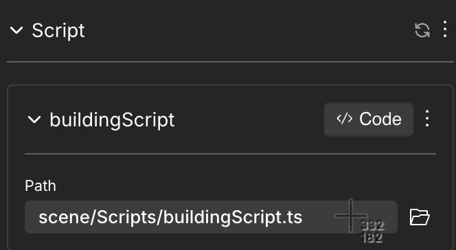
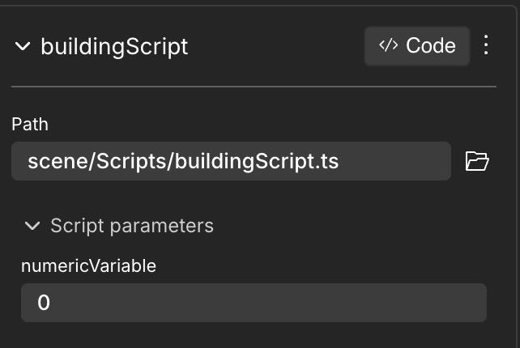
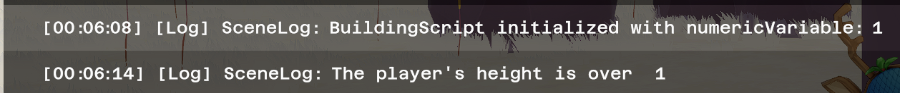
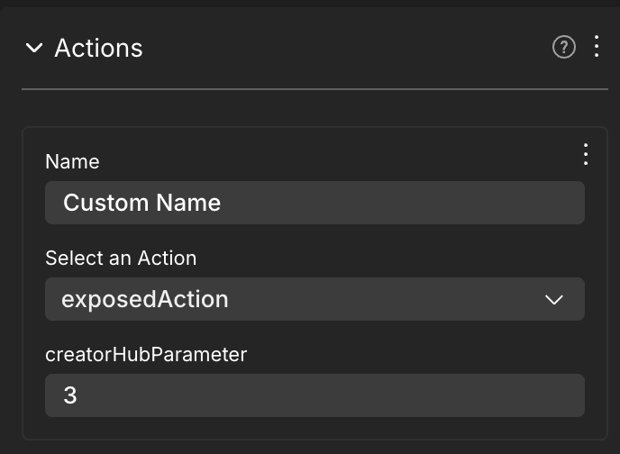
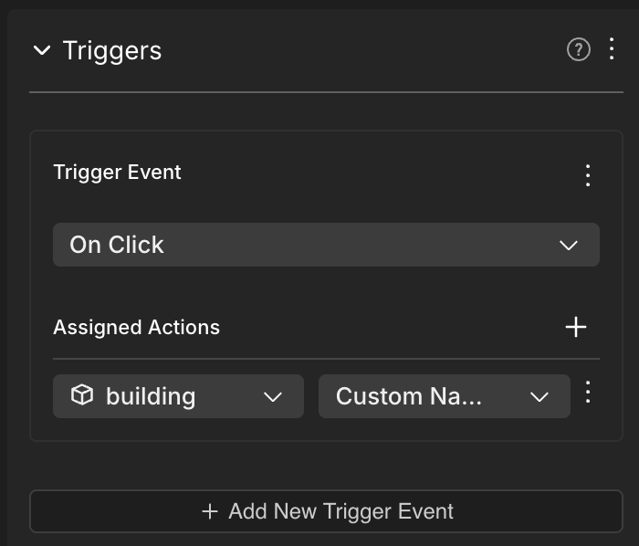
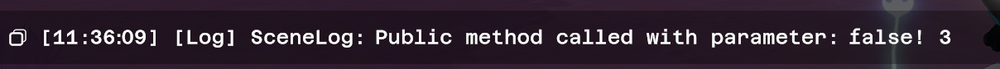
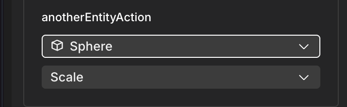

# Script Component

With the new Script Component, it's possible to create Entities that execute custom code from within the entity itself. 

Script Components allow the execution of an Entity's custom behaviour without the need to work directly on the `index.ts` and potentially other files.

## Setting up the Script Component

1. Add the Script Component to an Entity by clicking on the `+` button and select it. Create a new Script by clicking on **+ Add New Script Module** and choose a name, or using the File Path (browse or drag and drop an existing file).



2. Click on the CODE button in the component to open the default code editor. Let's check its structure. For more details on how to select and manage your default editor, please go to [Combine with code](reference-items.md).


## Understanding the Script structure

When the Script is first opened, it has the following code:

```ts
import { engine, Entity } from '@dcl/sdk/ecs'
import {} from '@dcl/sdk/math'

export class BuildingScript {
  /**
   * Properties
   * Define class fields you want to reuse across methods.
   * Example usage: this.myVariable
   */
   // private myVariable: boolean = true

  /**
   * Constructor / Inputs
   * Parameters declared here appear in the Script component UI in Creator Hub.
   * Supported types: Entity, String, Number, Boolean, ActionCallback.
   *
   * Note: After editing this file, click the refresh icon in the Script component UI
   * to see updated inputs.
   *
   * The `src` and `entity` fields in the constructor are required by internal references.
   */
  constructor(
    public src: string,     // DO NOT REMOVE
    public entity: Entity,   // DO NOT REMOVE
    // Add your custom inputs below
  ) {}

  /**
   * start()
   * Called once when the script is initialized.
   */
  start() {
    // Script initialization
    console.log("BuildingScript initialized for entity:", this.entity);
  }

  /**
   * update(dt)
   * Called every frame.
   * @param dt - (optional) Delta time since last frame (in seconds)
   */
  update(dt: number) {
    // Called every frame
  }
}
```

The class is composed of three main parts:
* The **constructor**, 
* the **start()** method 
* the **update()** method. 

## Constructor

The constructor contains the parameters you want to expose and modify dynamically from your scene in Creator Hub. 

```ts
export class BuildingScript {
  constructor(
    public src: string,
    public entity: Entity,
    public numericVariable: number, 
  ) {}
...
}
```

Once the file is saved, the **Refresh** button in the Script Component updates all changes done.


Once refreshed, the Script Component now shows the `numericVariable` added in the code.



## Parameters

If different Entities use the same file in the Script component, each still have independent parameters: if the scene has two buildings, `building1` and `building2`, both with a Script Component pointing at `BuildingScript.ts` file, each building has it's own `numericVariable` parameter that can be modified independently.


**Important Note**: Don't modify/delete `public src: string` and `public entity: Entity`. You can add new inputs following these.


The allowed types for the constructor parameters are:
* `Entity`
* `string`
* `number`
* `boolean`
* `ActionCallback`


**📔 Note**: Both `public` and `private` constructor parameters are exposed to Creator Hub. The `private` keyword only restricts access within the `BuildingScript` class. For more details, see the official TypeScript documentation on  
[Parameter Properties](https://www.typescriptlang.org/docs/handbook/2/classes.html#parameter-properties).


### Accessing Parameters inside the Script

To access a parameter's value from your code, use the notation `this.definedParameter`. For example, `this.numericVariable` or `this.entity`.

The default Script template includes this line in the start() method:

`console.log("BuildingScript initialized for entity:", this.entity);`.

Change it like this to log the value of a value that you defined in the constructor:

`console.log("BuildingScript initialized with numericVariable:`, `this.numericVariable);`

Note that when you change the parameter's value in the Creator Hub UI, you should also see this logged value reflect that.

### Default parameters

The constructor by default contains an `src` and an `entity` parameter, these are very useful for the code in your script:

- `this.entity` always refers to the entity that holds the `Script` component, use this to access info about the entity or add components to it.
- `this.src` is the path where the script is stored. This is particularly useful when creating Smart Items that are meant to be used by others. Use this field to construct the path to files that are packaged with your smart item, even if the smart item's path changes or is renamed.

```ts
export class BuildingScript {
  constructor(
    public src: string,
    public entity: Entity,
  ) {}

  start() {
    Material.setPbrMaterial(this.entity, {
      texture: Material.Texture.Common({
        src: this.src + '/images/myImage.png',
      })
    });
  }
}
```
The script above fetches the entity that owns the script and applies a texture to it. It obtains the texture from a `.png` file that is packaged in the smart item folder, in a subfolder named `/images`. By using `this.src`, we ensure that the file path is always known, no matter if the smart item is imported to the scene under `/assets/custom/itemName` or `/assets/asset-packs/itemName`

### Tooltips on parameters

Add tooltips to your input parameters, so that users know what these fields are used for, or what values are accepted. Users will see a tooltip icon next to each field in the Script component UI, and are able to read custom text when hovering over the icon.

To add tooltips to your constructor, add a commented out block right before the constructor, and write a line with `@param` plus the name of the field, followed by a description, for each tooltip.

```ts
  /**
   * @param startDate - The start date of the event in YYYY-MM-DD format
   * @param yOffset - How many meters above the ground to display the item
   */
  constructor(
    public src: string,
    public entity: Entity,
    public startDate?: string,
    public yOffset: number = 0.5,
  ) {
  }
```

You may need to click the refresh icon on the Script component UI to see changes in your tooltips.


## start() & update() Method

The **start()** method contains code that is executed only once, when the Entity is created (in this case, when the scene first loads). 

Preview the scene and check the logs (**Tip**: you can use the `` ` `` shortcut): It displays the new message including the `numericVariable` parameter.


The **update()** method, on the other hand, executes its code every frame of the game (as Systems do). For example, checking values of the `PlayerEntity` to trigger behaviours in the script. 

The following code prints Logs every frame of the game that the `PlayerEntity` is higher than the previously defined `numericVariable`, that is provided by the creator dynamically from the Script Component UI.

```ts
update(dt: number) {
    if (Transform.get(engine.PlayerEntity).position.y > this.numericVariable ) {
      console.log("The player's height is over ", this.numericVariable);
    }}
```

 

The first log belongs to the start() method, indicating that we set numericVariable. The second one belongs to the update() method, when the player is higher than that value.

## Exposing Actions to the Creator Hub

It is possible to define an `Action` inside a Script Component script and have it accesible on the Creator Hub's UI. This enables the possibility to trigger this `Action` with another Entity. 

```ts
  /**
   * Expose this action to be triggered
   * @action
   */
  exposedAction(creatorHubParameter: number) {
    console.log("Triggered from another entity using parameter: ", this.numericActionVariable);
  }
  ```

`creatorHubParameter` will be exposed as an `Action` parameter to give it a custom value. After refreshing the Script Component, the new action will be available as an option for the Actions dropdown.



After adding the Action, any Entity in the Creator Hub can trigger it using `Triggers`




**📔 Note**: You can add as many Actions as needed inside the Script. All of them will be accesible independently from the `Action` dropdown.


## Calling Script methods from Outside

To call a Script method from another Script or from `main.ts`, the following steps should be followed:

1. Create a `public` method inside the Script class.
2. Run `npm run build` from the scene's root directory.
3. From the file where you want to use the public method, add `import { callScriptMethod } from '~sdk/script-utils'`.
4. Call `callScriptMethod` with the parameters needed (in this case, `someParamter`).

Here's an example with a `public` method exposed

```ts
export class BuildingScript {
  constructor(
    public src: string,
    public entity: Entity,
    ...,
  ) {}

  public publicMethod(boolParameter: boolean, someNumberParameter: number) {
    if (boolParameter) {
      console.log("Public method called with parameter true!: ", someNumberParameter);
    } else {
      console.log("Public method called with parameter: false!", someNumberParameter);
    }
  }
...
}
```

To call it from `main.ts`, use:

```ts
import { callScriptMethod } from '~sdk/script-utils'


export function main() {
    const buildingEntity = engine.getEntityOrNullByName("building")
    if (buildingEntity) {
        const scriptMethod = callScriptMethod(
            buildingEntity,
            "assets/scene/Scripts/BuildingScript.tsx",
            "publicMethod",
            false,
            3,
        )

        scriptMethod
    }
}
```

First, the `main` function looks for the `Entity` that has the Script component.
Second, if the `Entity` exists, `callScriptMethod` is called with the following parametrs:
1. `entity`: `Entity` that has the `public` method.
2. `scriptPath`: `path` where the `Script` class lives.
3. `methodName`: name of the `public` method to be called.
4. `...args`: Arguuments of the method. In this case, there are two. They should be added in order, one after the other.

Third, we call the defined `callScriptMethod`, in this case, `scriptMethod`.

With the parameters' values given, the output is:




**📔 Note**: You can follow the same logic to call a `public` Script method from another script or file. You can use it to fetch or change values from `public` variables in the Script class.


## Triggering other Entities' Actions from a Script

It is possible to use a parameter of type `ActionCallback` in the Script class constructor. This allows triggering another `Entity`'s `Action` defined through the Creator Hub UI from the Script's methods.

In this example, `anotherEntityAction` is added as a `public` parameter.

```ts
export class BuildingScript {
  constructor(
    public src: string,
    public entity: Entity,
    public anotherEntityAction: ActionCallback,
    ...,
  ) {}
  ...
}
```

A selectable `Entity` and `Action` are now available when the Script Component is refreshed in the Creator Hub UI. `Sphere` is an already existing Entity in the scene that has an action called `Scale`.



The action from the other Entity is now accesible on the Script class. It could be used in many different ways. In the following example, pressing E will trigger `this.anotherEntityAction` by defining a `pointerEventsSystem` in the `start` method.

```ts
  start() {
    pointerEventsSystem.onPointerDown(
      {
        entity: this.entity,
        opts: {
          button: InputAction.IA_PRIMARY,
          hoverText: "Press E to trigger an Action from another Entity.",
        },
      },
      () => {
        this.anotherEntityAction();
      }
    );
  }
```

**📔 Note**: Combining exposing and triggering `Actions` is a very powerful tool. You can define a Script Component on one Entity, expose an action using a `public` method, and then triggering it from another Entity's Script Component using an `ActionCallback` parameter.


## See also

* [Smart items - Basics](../interactivity/smart-items.md)
* [Smart items - Advanced](../interactivity/smart-items-advanced.md)
* [States and conditions](../interactivity/states-and-conditions.md)
* [Making any item smart](../interactivity/make-any-item-smart.md)
* [SDK Quick start](../../sdk7/getting-started/sdk-101.md): follow this mini tutorial for a quick crash course.
* [Development workflow](../../sdk7/getting-started/dev-workflow.md): read this to understand scene creation from end to end.
* [Examples](https://studios.decentraland.org/resources?sdk_version=SDK7): dive right into working example scenes.
