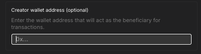
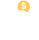
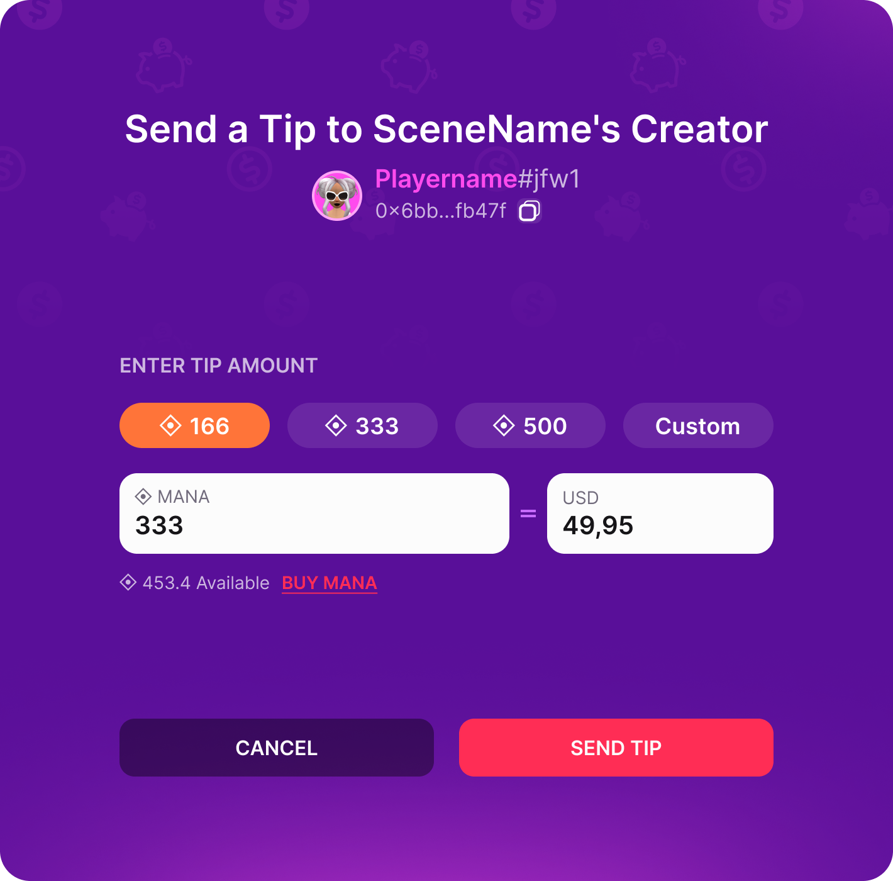

# Scene Settings

Click the **Pencil icon** on the top-right of the screen. This opens a series of scene-level properties to edit.

Here you can configure multiple properties including title and thumbnail, scene size, scene categories, and feature toggles.

See [Scene Metadata](../../sdk7/projects/scene-metadata.md).

## Scene details

The **Details** tab lets you configure several fields about your scene. These fields are shown to players that might visit your scene, for example when expanding the location on the map, when being prompted to teleport, or when sharing a link to the scene on social media. Make sure you make the information here attractive and accurate to drive more traffic to your scene!

The following fields are available:

- **Name**
- **Description**
- **Thumbnail**

  
  **💡 Tip**: If no thumbnail is provided, it uses the automatic capture you see on the scene's card. We recommend uploading a more attractive image
  

- **Categories**
- **Creator name** (optional)
- **Creator contact email** (optional)
- **Creator wallet address** (optional)

The thumbnail should be a .png image of a recommended size of 228x160 pixels. The minimum supported size is 196x143 pixels. The image may be stretched if the width-to-height proportions don’t match 228x160.

See [scene metadata](../../sdk7/projects/scene-metadata.md) for more details on these fields.


**📔 Note**: The scene's **Age Rating** is not edited on this panel. You can set the `rating` field directly in the `scene.json` file, or, for scenes published to a World, change the **Content Rating** in the Creator Hub's World Settings after publishing. Decentraland is an 18+ platform, so the rating to set is `A` for Adults. See [Age Rating](../../sdk7/projects/scene-metadata.md#age-rating).


### Tipping

You can receive tips from players who visit your scene. To enable tipping, got to the **Details** tab on the scene settings and provide an Ethereum address under **Creator wallet address**.

When a player visits your scene, they will see a piggy bank icon on the top-left of the screen. Clicking on it opens a modal where they can send you a tip. This menu can also be accessed by opening your scene's info on the map.

The tip modal allows the player to select the amount of MANA they want to send. The player must own MANA in their wallet to send a tip. If the address you provided is linked to a Decentraland NAME, this modal will show the name of the wallet owner besides the Ethereum address.

You will receive a notification on the Decentraland notifications tab whenever a player sends you a tip.


**💡 Tip**: You can also make tipping more discoverable by adding 3D content that invites players to tip, like a tip jar or a donation sign, and using [`openExplorerUi()`](../../sdk7/interactivity/external-links.md#open-explorer-ui-panels) so that clicking it opens the tipping UI.


## Layout

You can edit the size of your scene by clicking the _pencil icon_ and then changing the number of rows and columns.

Scenes in Decentraland occupy one or several adjacent LAND parcels. Each LAND parcel measures 16x16 meters.

Set the number of parcels for the rows and columns and click **Apply layout** for it to affect how your scene looks on the Scene Editor canvas.

To build something to deploy to LAND parcels you own, make sure the shape of the scene matches the shape of where you want it deployed.


**💡 Tip**: You can toggle each tile on the grid off by clicking on it. This allows you to draw non-rectangular shapes for your scene layout.



If you own a Decentraland NAME, you can also deploy your scene to a [Decentraland World](../../sdk7/publishing/publishing-options.md#decentraland-worlds). In that case, you can use any layout of up to 300x300 parcels without needing to own them, but you will have a size limit in MB.

See [Kinds of project](../../sdk7/projects/kinds-of-project.md) to better understand the different options.

### Advanced view

You can also click the **Set Coordinates (Advanced)** button to manually list the coordinates of your scene.

In **Custom Coordinates**, write the coordinates of each of the parcels where you wish to publish. Separate the x and y coordinate with a comma, and each set of coordinates separated by spaces. Remember that these coordinates must all be adjacent to be valid. For example:

`78,-2 79,-2 78,-3 79,-3`

In the **Origin Point** field, define which of the coordinates in the scene should be treated as the point of origin. This has to be one of the coordinates you listed in the **Custom Coordinates** field. It's recommended to set the parcel on the bottom-left of the scene.

## Scene restrictions

You can disable certain functionalities on your scene if you chose, in case they might be abused or clash with the kind of experience you want to create.

- **Silence Voice Chat**: Prevent players on your scene from using voice chat.
- **Disable Nearby Voice Chat**: Prevent players on your scene from using the nearby (proximity-based) voice chat.
- **Disable Smart Wearables & Portable Experiences**: Prevent players from using [Smart Wearables](../../sdk7/projects/smart-wearables.md) or [Portable Experiences](../../sdk7/projects/portable-experiences.md).

## Skybox Control

You can control the skybox time of day in the **Settings** tab. You can set a fixed time of day for your scene. All players will see the scene with this time of day, and the skybox will not follow the day/night cycle.

In the Creator Hub, open the scene settings and click on the **Settings** tab to find the **Skybox** section. Uncheck the **Auto** option to avoid using the day/night cycle and set the time of day you want.

