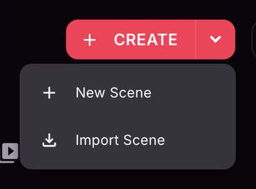
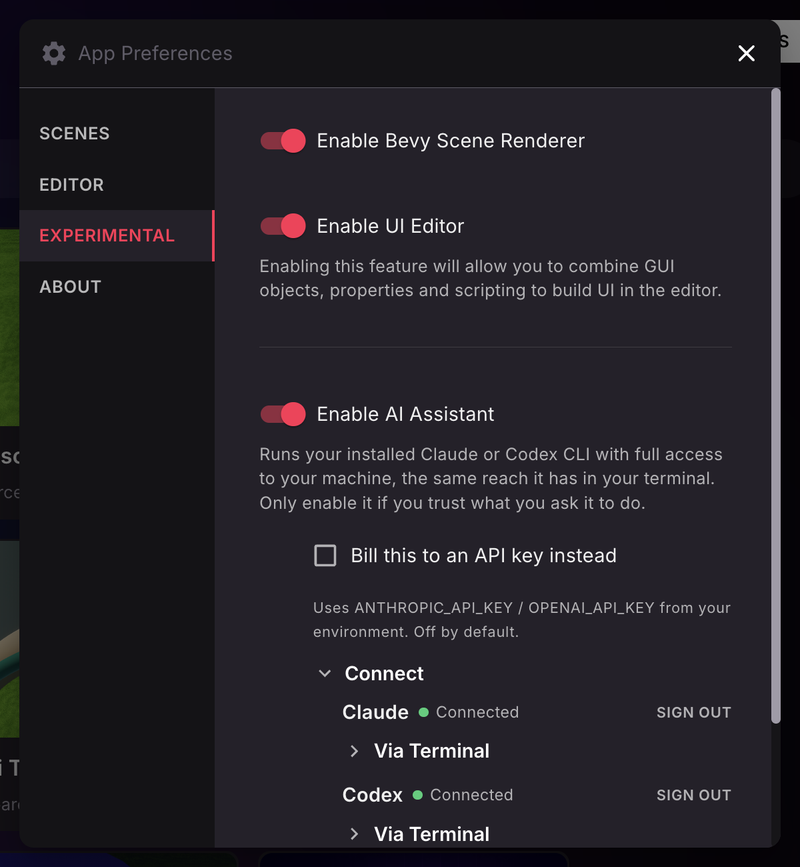
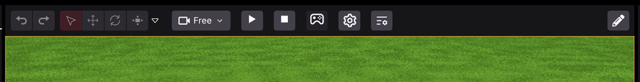

# Editing Scenes

The Creator Hub includes a powerful Scene Editor that combines a simple no-code interface with the ability to write code to customize your scenes further.

See [Creator Hub Installation](editor-installation.md) to get started.



## Create a scene

To create a new scene, open the Creator Hub and click the arrow next to the **Create** button. From the dropdown, select **New Scene**.

You'll then be asked to name your scene, and choose a location to save it. To start from a project with some initial content instead of an empty scene, click **Templates** on the **Scenes** tab and pick one.

See [Manage scenes](manage-scenes.md) for more details.

Once the scene opens, you'll see the entity tree on the left, the canvas in the middle, the properties of the selected item on the right, and the asset packs at the bottom.

See [Scene Editor Essentials](scene-editor-essentials.md) for a tour of each section.

## Moving around

To find your way around the Scene Editor:

- Use **W** and **S** to move close or far. You can also use the mouse scroll wheel, or **+** and **-** keys
- Use **A** and **D** to move sideways.
- Use **Q** and **E** to move up and down.
- Use the **Left Mouse Button** to click and select items and to move them around.
- Use the **Right Mouse Button** and drag to rotate the camera.


**💡 Tip**: You can also rotate the camera by pressing **Alt** on Windows, or **Option** on Mac while dragging. This is especially handy when using a trackpad instead of a mouse.


- Press **Space bar** to reset the camera back to the default position

## Add items

Navigate the themed asset pack categories on the menu on the bottom to find different items that you can place on your scene.

To place an item, click and drag it in from the asset pack menu into a location on your scene in the canvas.

Click and drag a selected item to move it freely around the scene at ground level. See [Scene editor essentials](scene-editor-essentials.md#position-items) for more details.


**💡 Tip**: Some items are **Smart items**, these come with built-in interactive behaviors. See [Smart items](../interactivity/smart-items.md) for more details.


## Preview

To test your scene and experience it like a player, click the _Preview_ button on the top-right corner. This will open a new window with the Decentraland Desktop Explorer, running just your scene. There you can move around the scene and interact with interactive items.


**📔 Note**: If you don't have it installed on your machine, download the **Decentraland Launcher** from [Decentraland.org](https://decentraland.org).


Configure different preview options from the dropdown menu next to the **Preview** button. See [Preview your scene](../../sdk7/getting-started/preview-scene.md) for a full list of all available options.

## Scene renderer

The Scene Editor uses **Babylon** as its default renderer for the editing canvas. You can switch to **Bevy (experimental)**.

To change the renderer:

1. Click the Creator Hub logo in the top-left corner and select **Settings**.
2. Go to the **EXPERIMENTAL** tab.
3. Switch on **Enable Bevy Scene Renderer**.

The Bevy renderer is an alternative engine for the editing canvas. It affects how your scene looks while editing, not how it looks to players after publishing.

When using the Bevy renderer, the toolbar gains a camera mode dropdown, play and stop buttons to run the scene in the canvas, and an **Interact** toggle (the gamepad icon).

Use the **Interact** toggle to test a running scene directly in the editor canvas without opening a separate preview window. This lets you quickly check interactions without stopping the scene. While interacting, smart items show their hover hints, such as the key to press, right in the canvas.

The Bevy editor also loads [custom items](../interactivity/custom-items.md), shows placeholder markers for broken or missing assets, and provides friendly error messages with fix actions when your scene's SDK dependencies are outdated. The camera toggle in the toolbar reads **Free** or **Player**, depending on the mode you're in.


**📔 Note**: The scene metrics tab is not available under Bevy. Run a scene preview in the desktop or mobile client and view the stats from there.



**Note:** The Bevy renderer is experimental and may not support all editing features that the default Babylon renderer does.


## Scene settings

Click the **Pencil icon** on the top-right of the screen. This opens a series of scene-level properties to edit, including name, thumbnail, scene size, and more.

See [Scene Settings](../configure/scene-settings.md) for more details.

## Publish your scene

Once you're happy with your scene, press the **Publish** button.

See [Publish scene](../publish/publish-scene.md) for more details.

## See also

- See [Scene Editor Essentials](scene-editor-essentials.md) for more details about the Scene Editor's interface.
- See [Smart items](../interactivity/smart-items.md) for how to add simple interactivity to your scene.
- See [Combine with code](../code/overview.md) for how to edit the code of your scene.
- See [Publish scene](../publish/publish-scene.md) for how to publish your scene to Decentraland.
