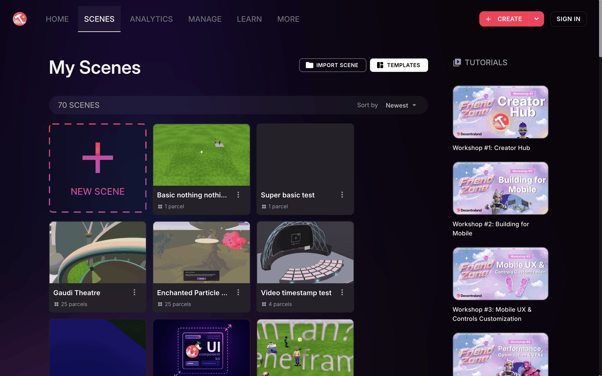
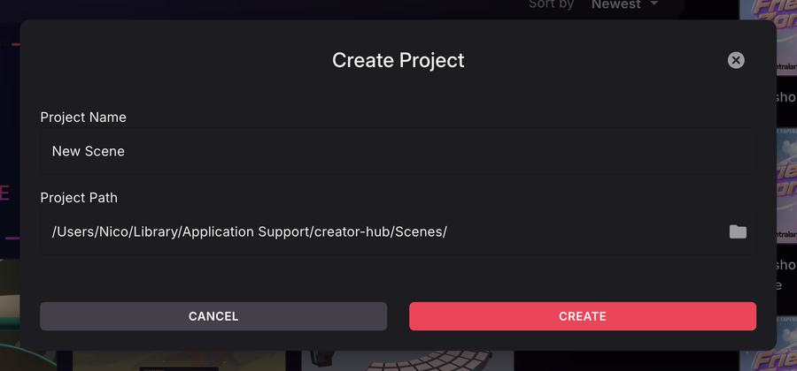
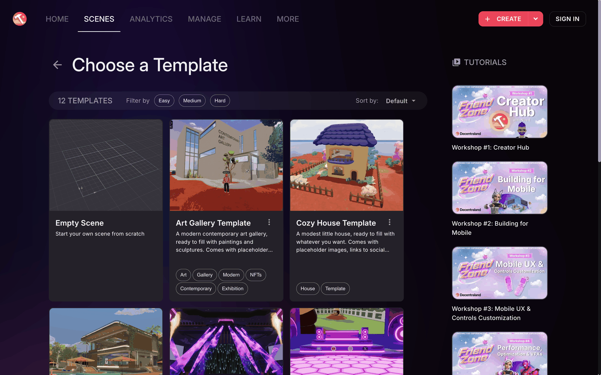
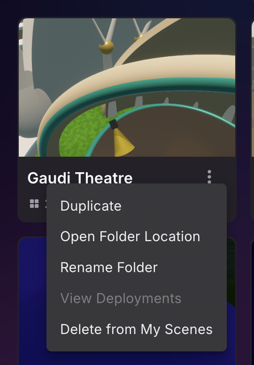
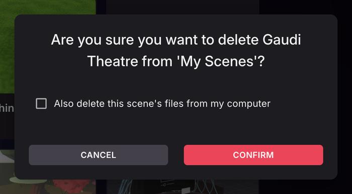
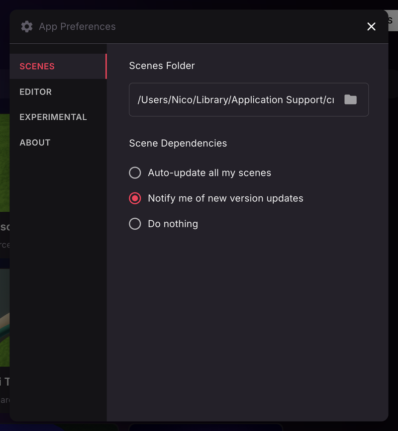

# Manage scenes

The **Scenes** tab lists each of your available scenes as a card. Open the card to edit that scene, from there you can preview it or publish it too.

## Create a scene

Click the arrow next to the **Create** button and select **New Scene** to create a new scene. You can also click the **New Scene** card at the start of the scene list.

You'll be asked to name your scene, and to choose a location to save it. The default location is the Scenes folder set in the app preferences, see [Change the scenes folder](#change-the-scenes-folder).

Once you confirm these steps, the scene project will be created. This may take a minute or two, as it downloads dependencies and sets up a folder on your local machine with everything it needs. When done, your scene will be opened in the [Scene Editor](scene-editor-essentials.md).

### Start from a template

To start from a ready-made scene instead of an empty one, click **Templates** on the **Scenes** tab, or scroll to the **Templates** row on the **Home** tab. Templates range from an **Empty Scene** to full scenes like an art gallery or a nightclub. You can filter them by difficulty. Click a template card to create a new scene based on it, then name it and choose a location as you would for an empty scene.

### Scene card options

Click the three dots on a scene's card to see more options.

Click **Duplicate** to make a copy of an existing scene.

To rename your scene's display name, open it and click the pencil icon to change the **Name** field and other properties.

To rename the scene's folder on disk, click the three dots on the scene's card and select **Rename Folder**. Enter the new folder name and confirm. The folder name must be valid for your operating system and must not collide with an existing folder in the same location.

## Import a scene

The scene manager displays the scenes it finds in the default path on your machine.

To add a scene that is elsewhere on your local disk, click **Import scene** and find the path to the project folder. The imported scene will now be available as a new card in the scene manager screen.

The imported scene does not get moved in your local disk.


**📔 Note**: Do not manually rename or move the folder of an imported scene directly from your file manager. The Scene Editor will no longer be able to find the imported scene in its new path.


Scenes you created on the older web editor are stored in the cloud. To work on these scenes from the desktop Scene Editor, you must export the scene from the Web Editor, unzip it into a folder, and then import it on the desktop Scene Editor. See [Migrate from Web Editor](migrate-from-web.md) for more details.

## Delete a scene

In the scene selector screen, press the _three dots_ icon and select _Delete from My Scenes_.

This removes the scene from your Scene Editor home screen. By default it doesn't delete the files from your machine, but the confirmation dialog includes a checkbox to **also delete the scene's files from your computer**.

## Change the scenes folder

By default, projects created via the Scene Editor are kept inside a `Scenes` folder in the Creator Hub's application data directory. To change this location:

1. Click the Creator Hub logo in the top-left corner to open the main menu, then click **Settings**.
2. In the **SCENES** tab, click the folder icon next to **Scenes Folder** and pick a new folder.

The same tab also controls what happens when a new version of the scene dependencies is available: update all your scenes automatically, get notified, or do nothing.

To navigate to a project's folder, click the three dots on its card and select **Open Folder Location**.

## Managing Worlds

If you own a Decentraland NAME or ENS domain, you can publish scenes to your [Decentraland World](../../sdk7/publishing/publishing-options.md#decentraland-worlds). Worlds appear in the Scene Editor just like regular scenes, and you can publish to them using the same **Publish** button.

A World has its own metadata (name, description, and thumbnail), separate from the metadata of each scene published to it. In Worlds with a single scene it's kept in sync with the scene's metadata automatically, in Worlds with multiple scenes it can only be edited in the **Manage** tab. See [World metadata vs scene metadata](../publish/publish-scene.md#world-metadata-vs-scene-metadata).

### Visualizing storage space

Scenes published to Worlds count against a storage budget that is shared across all the Worlds owned by your wallet. The budget is calculated from your holdings: each Decentraland NAME or LAND parcel you own grants 100 MB, and every 2,000 MANA held in your wallet grants an additional 100 MB.

You can check your used and remaining storage budget in two places:

- The **Manage** section of the Creator Hub shows how much of your total budget is used and your total storage capacity. Click **View Details** for a breakdown of how your MANA, LAND, and NAME holdings add up.

- The **Worlds** tab of the [Builder](https://decentraland.org/builder/worlds).

### Undeploying scenes

If you need to free up storage space, you can undeploy scenes from the World Content Server. This can be done through the Builder interface, which allows you to easily undeploy scenes to release storage space.

For Decentraland NAME holders, if you exceed your allocated storage space (for instance, through asset sales or transfers to another wallet), you will be provided with a 48-hour window to address the situation. Failure to do so will result in your Worlds becoming inaccessible after this grace period.

To regain access to a blocked World, you can either:

- Acquire more MANA, Decentraland NAMEs, or LANDS to increase your storage capacity
- Undeploy existing scenes from the World Content Server to free up storage space

See [Worlds size limits](../../sdk7/projects/kinds-of-project.md#size-limits) for detailed information on how storage capacity is calculated.
