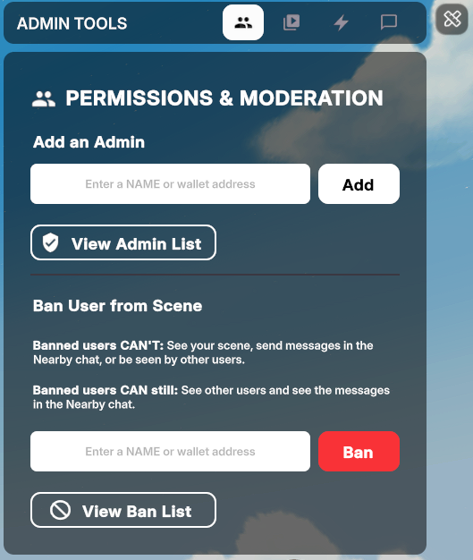
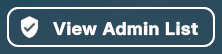
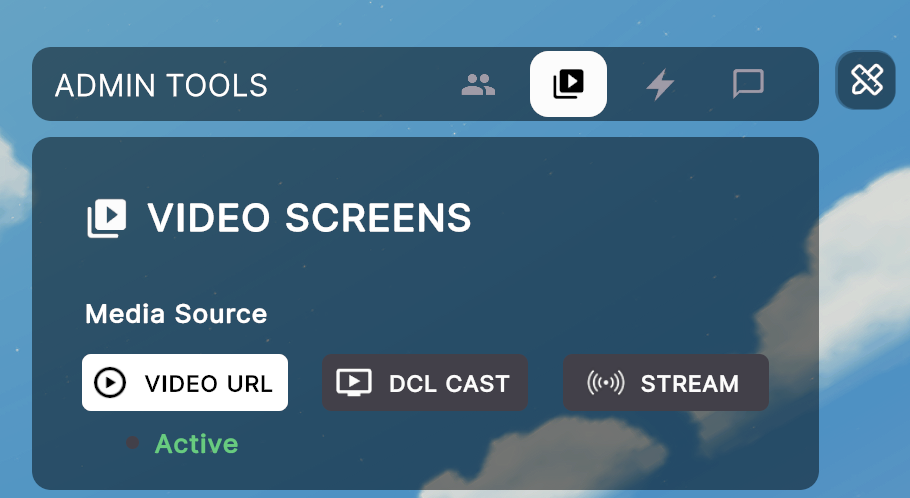
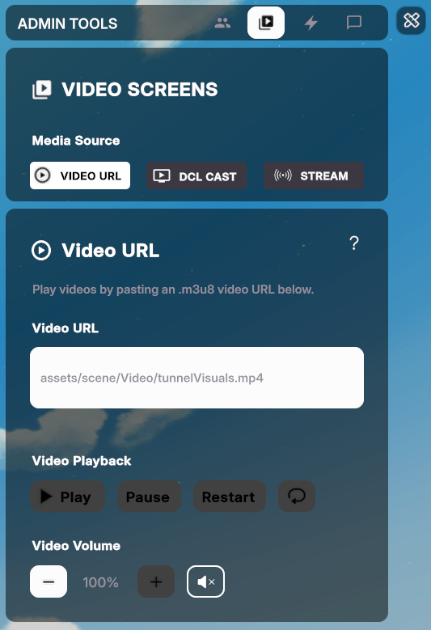
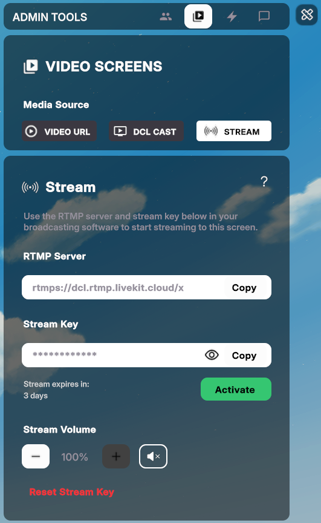

# Scene Admin

Grant certain players the special role of **admin** on your scene.

During a live event, an admin can spontaneously control what happens in the scene from inside Decentraland, without needing to pre-schedule actions or relying on a 3rd party service. Start playing the music when enough of a crowd gathered, drop confetti or make a spaceship appear when the time feels right.



When a scene admin visits your scene, they see a special UI on the top-right corner that only they are able to see. Through this UI they can play videos or live streams, send announcements, ban players, or activate any smart item that is configured to be activated like this. These actions are seen by all other players in the scene that are connected to the same comms island as the admin.


## Setting up admins

To assign admins, you need to add the **Admin Tools** smart item to your scene.



**📔 Note**: Update your scene to use the latest dependencies.




While you're developing the scene and trying it locally, you are always an admin. Once the scene is published, anyone with publish permissions to the scene is also automatically an admin. This includes:

- The owner of the LAND parcels or World NAME where the scene is published
- Anyone who is granted **Operator rights** on these parcels or name. See [Give permissions](https://docs.decentraland.org/player/marketplace/land-manager/#give-permissions).
- Any user renting that land. See [Rentals](https://docs.decentraland.org/player/marketplace/rentals/).

To assign additional admins that don't have publish permission but can do live-ops in the scene:

1. Publish the scene and visit the live version as an admin
2. Open the **Permissions & Moderation** tab.

   

3. Write the wallet address of the person you want to add next to **Add an Admin** and click **Add**.

You can see who is an admin in the scene by clicking the **View Admin List** button. From this screen you can also **Remove** people from the admin list.




**📔 Note**: It's only possible to remove the admin role from players that were added manually to the list via the **Permissions & Moderation** tab. Players who are owners, operators, or renters of the scene are displayed on this list but can't be removed from their admin roles from this UI. To remove an admin role from an operator, you must first remove their operator role.


Whenever an admin player is in the scene, they will see a special UI on the top-right corner. Non-admin players don't see this UI.


### Check admin status via code

It is also possible to know if a Player is an Admin of a scene using code. This allows for other behaviors to be available (or not) for a Player, for example, allowing interactions with a specific Entity of the scene.

```ts
import { isAdmin } from "@dcl/asset-packs/dist/admin";

async function onPlayerSpawn() {
  const isAdminUser = await isAdmin();
  if (isAdminUser) {
    // Show admin-only UI, teleport to stage, show entity, etc.
  }
}
```


**💡 Tip**: For more information about async functions, see [Async Functions](../../sdk7/programming-patterns/async-functions.md).


## Video playing

One of the most common actions for admins to do is to play videos. The admin panel includes a video player section where they can control anything related to videos.

To enable this, you need to add a **Video Player** smart item to your scene and link it to the Admin Tools smart item.

1.  Add a **Video Player** smart item to your scene

    

    See [Video Screen](../interactivity/video-screen.md) for more details on how you can configure the default media source and other settings of the Video Player smart item. Most of these configurations can be overriden by the admin once the scene is running.

    
    **📔 Note**: An admin can only manage videos that play on the Video Screen smart item, not on screens added via SDK code.

    You can include as many video screens as you want. In general, avoid having more than one different video playing at the same time, as that hurts performance a lot.
    

2.  Open the Admin Tools Smart Item, make sure the **Video Screens** checkbox is enabled for this section to show. Then select the screen from a dropdown list and give it a friendly name to display on the Admin UI. You can add as many Video Screens as you want, each screen is controlled independently.

    

Once the above is configured, admin users in your scene can open the admin panel and select the video section to control these video screens.



If your scene has multiple independent video screens, the **Current Screen** dropdown lets you pick which video screen to control. The list displays the names you gave to each video screen on the Admin Tools smart item configuration.


**💡 Tip**: To show the same video on multiple screens that can be controlled as one, see [Multiple Video Screens](../interactivity/video-screen.md#multiple-video-screens).


## Media Sources

There are three media source options for playing videos:

- **Video URL**: Play a video file from your local filesystem or from an URL. Paste a video URL into the **Video URL** field and click the green **Activate** button. The video will start playing on the selected screen for all players. You can also stop, pause, restart, mute, or change the volume of the video.

  

  
  **📔 Note**: Not any video URL will work. Videos from some sites have strict policies about their content and will block access to them from Decentraland. See [Streaming from other sources](../interactivity/video-screen.md#streaming-from-other-sources) for more information on what you can and can't play in Decentraland.
  

- **DCL Cast**: Use Decentraland's free streaming web app to easily share your camera or screen with other players in the scene, no need to set up a streaming software.

  

- **Stream**: Play a live stream using Decentraland's free streaming infrastructure and a streaming software like OBS or StreamYard.

  

  See [Live Streaming](../live-ops/live-streaming.md) for more information on how to set up a live stream.

Each screen in your scene will have one of the above media sources set as **Active**. You can click the **Video URL**, **DCL Cast** or **Stream** buttons to explore the settings on each section, you won't interrupt what's currently playing until you click the **Activate** button on either section.


## Announcements

In the **Announcements** tab of the admin panel, admins can write messages that get seen by all players in the scene. Messages like this can only be sent by admins, so other players will perceive them as more legitimate than a message on the chat by someone claiming to be an admin.

Select the Message section of the admin UI. Write a message and click **Share**. The message can be up to 90 characters long.


## Ban players

You can ban players from your scene by selecting the **Moderation** tab of the admin UI, writing the name or wallet address of the player you want to ban and clicking the **Ban** button.



**💡 Tip**: To obtain a player's wallet address, click on their avatar to open up their profile, then click on the **Copy to clipboard** button next to the wallet address.


Banned players will be unable to load your scene or interact with any of its content. Other players will not see them in the scene, or read any of their chat messages.


**📔 Note**: The effects of your ban are immediate and permanent. Once a player is banned, they will remain banned until the ban is lifted. While banned, a player can't see or interact with your scene, can't chat in the Nearby channel while in it, and other players in the scene can't see them.

If a player steps outside your scene's bounds, they are no longer affected by your scene's ban rules and will see banned players once more.


Click **View Ban List** to see the list of currently banned players. From this list you can also **Unban** players.

## Trigger smart items

To Trigger an action from any smart item in the scene:

- Add a smart item to your scene
- Open the settings for the **Admin Tools** Smart Item in the Creator Hub
- In the **Smart item actions** section, add the smart item from the dropdown, give it a custom name and select a default action

Once the above is configured, admins can trigger the action by opening the **Smart Item Actions** section of the admin UI and then selecting an item from the dropdown list. They can then pick one of the item's actions from the **Actions** dropdown and click **Play Action** to trigger it. There's also a button to **Hide/Show** the selected item.


You can also show or hide any smart item in this list, even if it doesn't include an action to do that.
