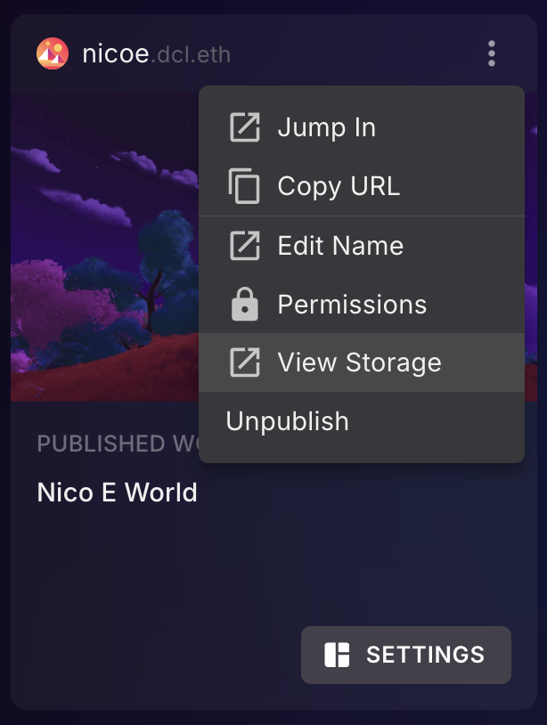
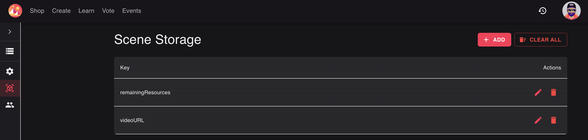
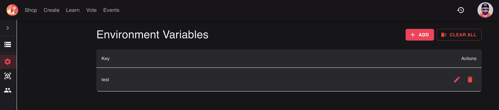

# Server Data

Scenes that use an [authoritative server](../../sdk7/networking/authoritative-servers.md) can persist data on the server: leaderboards, player progress, environment changes like doors opened or items placed, and more. This data is updated **live** as players interact with your published scene.

You can view all of this data from a web UI, and you can also **change it directly from there**. Any edits you make take effect on the live scene, without needing to republish. This includes:

- **Scene data**: values shared by all players, like a leaderboard or the state of a door.
- **Player data**: values stored for a single player, like their progress or preferences.
- **Environment variables**: configuration values and secrets that only the server can read.

## Access the storage UI

You can open the storage UI directly at [decentraland.org/storage](https://decentraland.org/storage).

You can also reach it from the Creator Hub:

1. Open the **Manage** section of the Creator Hub.
2. Click the **three dots** next to a place where you have published content.
3. Select **View Storage**.

The storage UI shows a list of all the Worlds and LAND locations where you have published scenes, or have operator permissions. Open a scene to see its data, organized into three tabs: **Scene**, **Player**, and **Environment**.


**💡 Tip**: This data only exists for scenes that use an authoritative server and that store data via the `Storage` API. See [Authoritative Servers](../../sdk7/networking/authoritative-servers.md) to learn how to set that up.


## Scene data

The **Scene** tab lists all the stored variables that are shared across all players, for example a leaderboard or the current state of the environment.

Values on this list update live as players interact with your scene. You can also edit or remove any of these variables by clicking the pencil or trash icon. Changes are picked up by the running scene, so this is a handy way to tweak live values, like resetting a leaderboard, without republishing.

## Player data

The **Player** tab lists all the players that have any data stored on your server. You can search for a player by wallet address or name, and then see all of their associated data.

As with scene data, you can edit or remove any value by clicking the pencil or trash icon.

This is especially useful for support: if a particular player reports an issue in your scene, you can look them up and inspect their stored data to understand their situation. If they ended up wedged in a bad state, for example with contradicting data from an older version of your scene, you can edit or clear their records to restore them to a stable state, without redeploying anything.

## Environment variables

The **Environment** tab lists all the environment variables defined for your scene. These are configuration values that only the server can read, which makes them the right place for **secrets** like private keys or reward claim codes: the values never travel through a player's machine or appear in your scene's published code.

From this tab you can add new variables, or overwrite and delete existing ones using the pencil or trash icon. Note that you can't _read_ the current value of a variable, this is intentional, to protect sensitive data. You can only replace or delete it.

Environment variables are also great for feature flags or game parameters, like a match duration or a maximum player count, that you may want to adjust on the live scene without republishing.

## Learn more

To learn how to read and write this data from your scene's code, including best practices for changing the structure of stored data over time, see [Authoritative Servers](../../sdk7/networking/authoritative-servers.md).
