# Publish Scene

## Before you begin

Make sure of the following:

* Your scene complies with all of the [scene limitations](../../sdk7/optimizing/scene-limitations.md). Most of these are validated each time you run a preview of your scene.
* You have a [Metamask](https://metamask.io/) account, with your LAND parcels or NAME assigned to it.
* You own the necessary amount of adjacent LAND parcels or a Decentraland NAME. Otherwise you can purchase LAND in the [Marketplace](https://decentraland.org/marketplace/) or a NAME in the [Builder](https://decentraland.org/builder/names).


**📔 Note**: Multi-parcel scenes can only be deployed to adjacent parcels.


Check your [scene's details](../configure/scene-settings.md#scene-details), make sure you provide an appealing name, description, thumbnail, categories, etc.


**❗Warning**: When planning live events, make sure you don't make last minute changes to the scene right before the event.

After each publish, an internal process optimizes all 3D models before they can be rendered. This takes around 15 minutes. If you visit the scene before this is done, the scene may appear broken. This process runs even if the 3D models were all previously published.


## Publish your scene

To publish your scene:

1. Open your scene in the Scene Editor and click **Publish**. This opens a window showing details about the publication.
2. Select if you want to publish to LAND or to a WORLD. See [Kinds of projects](../../sdk7/projects/kinds-of-project.md) to better understand the different options.


3. If publishing to LAND, select the location on the map. You'll see your eligible parcels marked in red. If publishing to a WORLD, you'll see your eligible NAMEs in a dropdown.


**💡 Tip**: If you don't see your parcels or NAMEs, make sure you're connected to the Creator Hub using the right user account. Otherwise exit the project and click the user settings icon on the top-right corner, then select **Sign Out** and sign back in again.


4. The next screen shows all of the files you're currently uploading and their sizes, confirm the operation.
5. The publication process will then start. Stages **1** and **2** are necessary for your scene to be playable, once done a **Jump In** button appears. You don't need to wait for **Stage 3** to try out your scene. 


**📔 Note**: The three stages of the deployment involve:

- **1. Uploading**: Uploading the files to the servers.
- **2. Converting**: The scene's 3D models are compressed into Asset Bundles for faster rendering. This may take 15 minutes or less. It may delay more for very large scenes, or if the servers are currently busy converting other scenes.
- **3. Optimizing**: Low Level of Detail (LOD) versions of your assets are generated. These are only used to render your scene from far away, meaning you don't need to wait for this to finish to jump in and test your scene.


## Managing Worlds

The Creator Hub enables World management via the **Manage** tab in its main panel. The **Manage** tab allows World tracking and editing. From here, you can edit World Settings, Permissions, and Scenes.

### World Settings

A World Owner can edit its settings by going into the desired World **Settings** under the **Manage** panel, or by accessing it during the publishing process by clicking on **Settings** if **Multi-Scene World (Advanced)** is enabled.

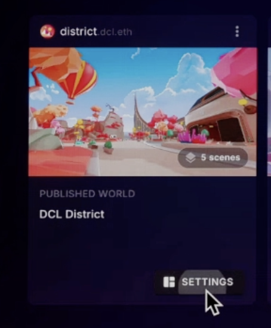

* **Details**: World's general information:
  * World Title
  * Description
  * Content Rating
  * Categories

The information added in **Details** will be shown in Decentraland Places and in the in-world World information once it is published.

* **Layout**: Only accessible in Multi-Scene Worlds. Contains information about all the World's published scenes.
  * Remove individual scenes by clicking the three dots and selecting **Remove from World**.
  * **World Map** shows the World layout and identifies parcels with content and the remaining free parcels.

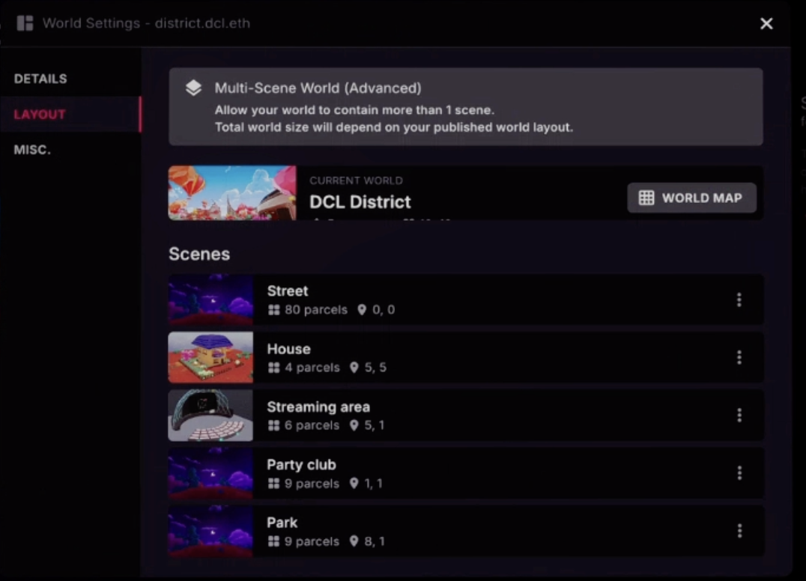

* **Misc**: Other useful World configurations:
  * World Spawn Coordinate: This sets up the Parcel (X,Y) in which the user will spawn inside the World. The scene located in that Parcel determines the exact position the user will spawn (for example, Parcel 1,1 is the World Spawn, and the scene in 1,1 has a Spawn point of 1,0,1 **inside that scene**).
  * Skybox settings


**📔 Note**: World Settings are only accessible to the World Owner (the address that minted the NAME). For more details about how to obtain a NAME, check the [Marketplace NAMEs section](https://decentraland.org/marketplace/names/claim).


### Multi-Scene Worlds

A World can have multiple scenes, published by the World Owner or by other creators. This enables a collaborative environment where each parcel can be managed by different Collaborators.

#### Making a World Multi-Scene

A World Owner can choose to make the World Multi-Scene by toggling **Multi-Scene World (Advanced)** when publishing to a single-scene World.

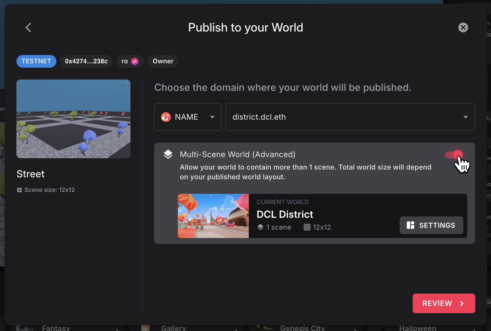

Once the Multi-Scene World is published, the World Owner can publish additional scenes or add Collaborators to publish within the World.


**📔 Note**: A Multi-Scene world size adapts automatically to contain all the published scenes, growing and shrinking dynamically on each publish. The space left between different scenes in the Multi-World is filled with environment.


#### Adding Collaborators to a Multi-Scene World

In the **Manage** panel, a World Owner can access the World's **Permissions** by clicking on the three dots. The World Owner can manage collaborators under the **Collaborators** tab.

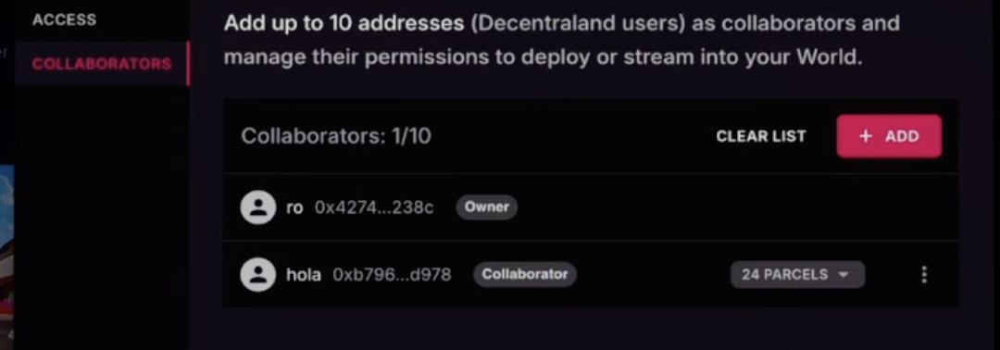

A Collaborator can have deploy rights to All Parcels or to specific Custom Coordinates. Custom Coordinates can be selected and confirmed through an interactive World map, similar to the one in the World Settings.

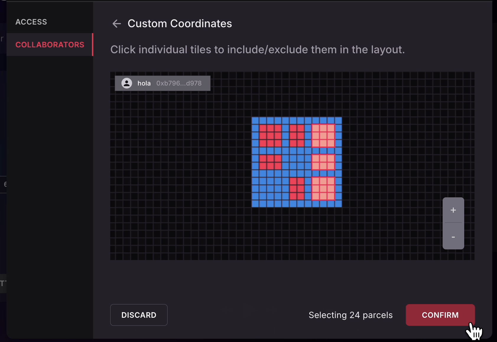

#### Deploying to a Multi-Scene World as a Collaborator

World Collaborators cannot edit its Settings or Permissions. In the **Manage** tab, a creator can see the World they are a Collaborator in but cannot access **Settings** or **Permissions**.

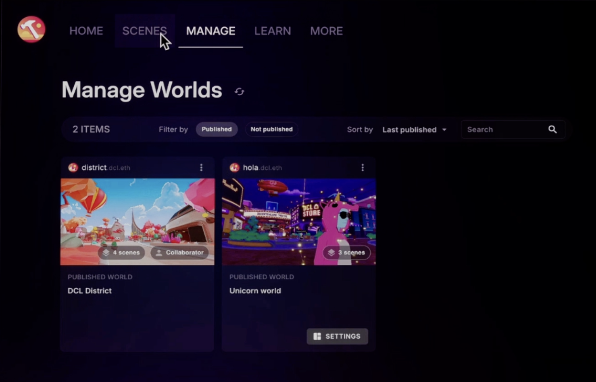

When going through the publishing process, the creator can select to publish only to the parcels they are a Collaborator in (as set by the World Owner).

In the **Collaborators** section, if the World Owner set **Custom Coordinates** for the creator, only the assigned parcels will be available for publishing. If access was set to **All Parcels**, the creator will be able to select any parcel in the World to publish their scene.


**📔 Note**: Collaborators with **All Parcels** publishing access can overwrite any scene from the world, even if it was published by the owner or other collaborators.


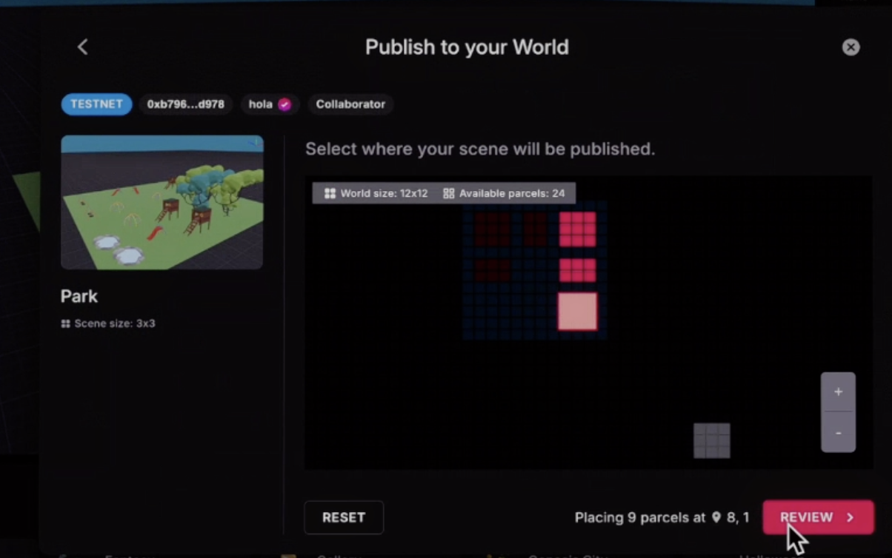

### Private Worlds 

A WORLD can have different **Access** settings. It can be accessible to anyone, or be restricted in different ways.

#### Setting the Access of a WORLD

In the **Manage** panel, a World Owner can access the World's **Permissions** by clicking on the three dots. The World Owner can manage access restrictions under the **Access** tab.

##### Access Types

A World Owner can choose between three types of **World Access**:

###### Public

Anyone can access the World. This is the default setting of a World.

###### Password Protected

Only users with the password can enter the World.

Passwords must be at least 8 characters long and contain at least 2 numbers. Once created, the password won't be accessible, so make sure to keep a copy.

###### Invitation Only

Only addresses and Communities added in the **Approved Addresses** can access the World.

To add new addresses or communities to the **Approved Addresses**, follow these steps:

1. Click on the **+ New Invite** button.

2. You can add addresses in three different ways:

  * **Wallet Address**: Add individual wallets, one at a time. 

  * **Community**: Search and add any Public Community. This adds **all Community addresses** to the **Addresses Approved**.

  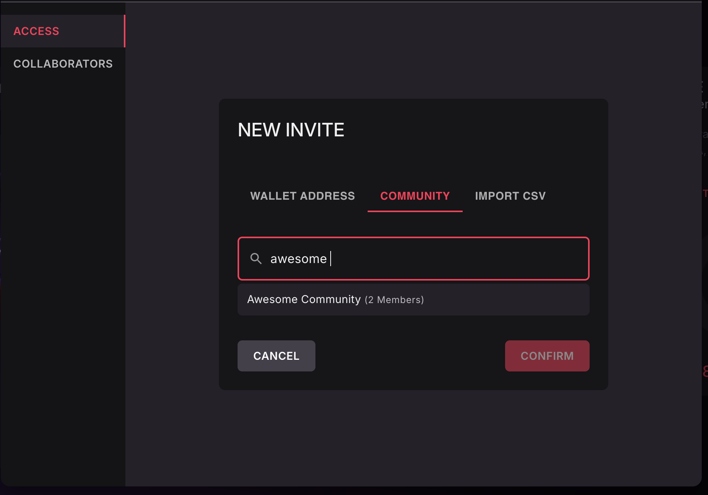

  * **Import CSV**: Use an existing CSV with a list of addresses or community IDs to add to **Approved Addresses**. The structure is one wallet per line, for example:

  ```
  0x3bA7fD92eC4a1F6B8d2E9c5A7b1D3f6C8e4A2d9F
  0xA1c9E4b7D2f6C8a3B5e9F1d4A7c2E6b8D3f9C5a1
  ```

  Once imported, it tracks each Address individually, as shown in the image.
  
  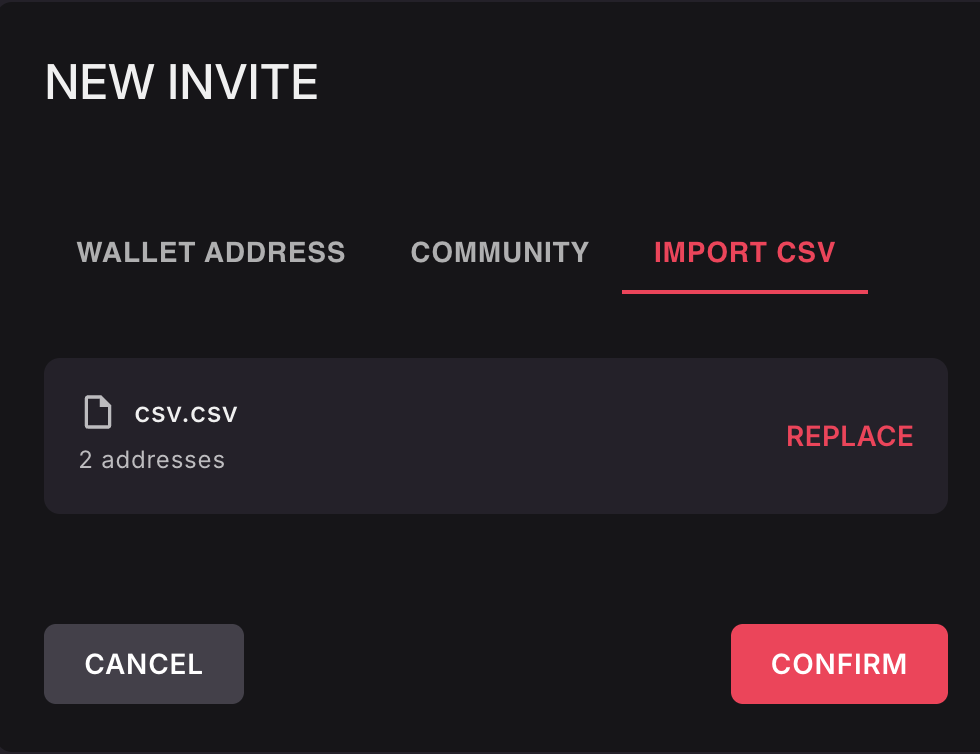

3. After confirming, the address/es are in the **Approved Addresses**. 

4. With a new **+ New Invite**, addresses are added to the existing list, helping the World Owner manage and extend the list if needed.

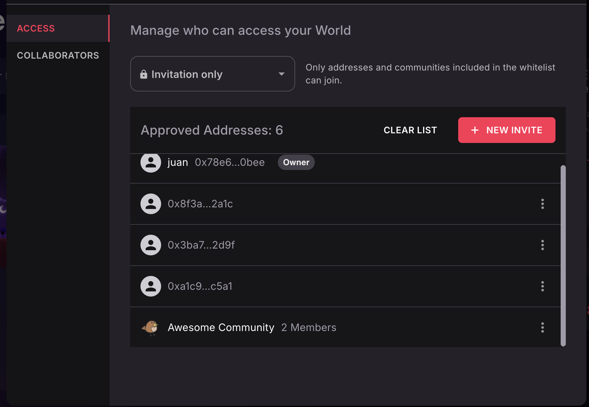

5. Individual Addresses or set of Addresses (in case of a Community) can be removed by selecting **Delete** on the three dots in the **Approved Addresses** section.


**📔 Note**: If you change the **Access** type from **Invitation Only**, your **Approved Addresses** list will be removed. Make sure to have a copy in case you need it in the future.


#### Jumping into Private Worlds

There are different scenarios if a user jumps into a World that doesn't have **Public** access:

* Their address in the **Approved Addresses**: Will be able to join normally. If not, they will get information that the World is **Invitation Only**.

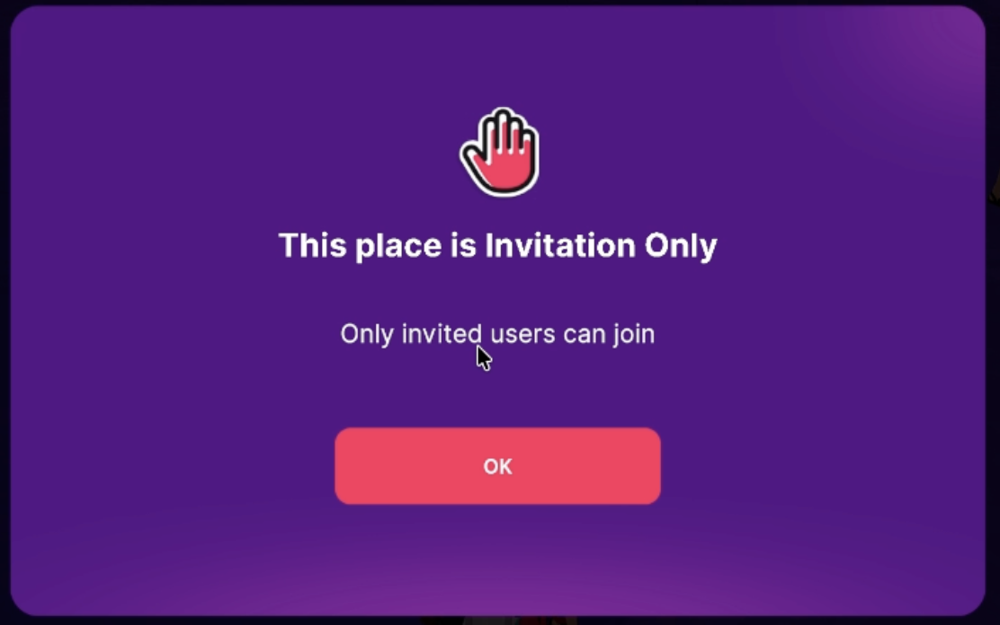

* The World is **Password Protected**: Users will be able to write the password. The maximum limit is ten (10) attempts.

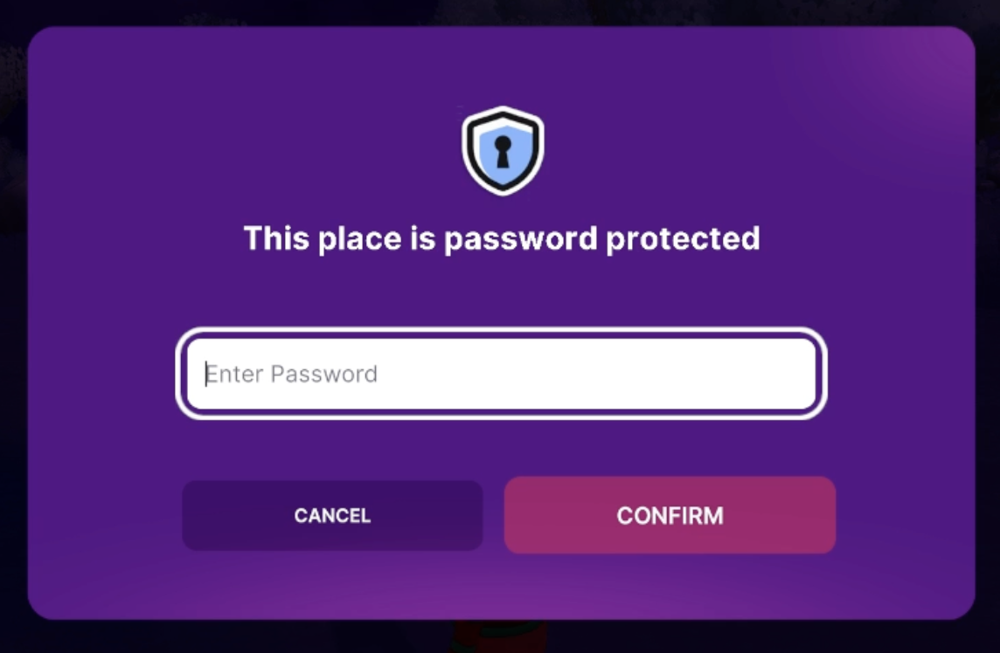


## Publish from a hardware wallet

Instead of storing your LAND tokens in a Metamask account, you may find it more secure to store them in a hardware wallet device, such as a [Ledger](https://www.ledger.com/) or a [Trezor](https://trezor.io/), that's physically plugged in to your computer.

If you're using one of these devices, you can link the hardware wallet to Metamask to enable signing messages, while keeping the tokens more secure. See [this article from Metamask](https://support.metamask.io/more-web3/wallets/how-to-connect-a-trezor-or-ledger-hardware-wallet/) for instructions to connect your account.

Once your hardware wallet can be used via Metamask, you can deploy following the same steps as if your tokens were on a Metamask account.

## Scene overwriting

When a new scene is deployed, it overwrites older content that existed on the parcels it occupies.

If a scene that takes up multiple parcels is only partially overwritten by another, all of its parcels are either overwritten or erased.

Suppose you deployed your scene _A_ over two parcels _\[100, 100]_ and _\[100, 101]_. Then you sell parcel _\[100, 101]_ to a user who owns adjacent land and that deploys a large scene (_B_) to several parcels, including _\[100, 101]_.

Your scene _A_ can't be partially rendered in just one parcel, so _\[100, 100]_ won't display any content. You must build a new version of scene _A_ that only takes up one parcel and deploy it to only parcel _\[100, 100]_.

## Publish to granted land

If you're publishing to land owned by the Decentraland Foundation that was granted to you via a grant, click the **Publish** button normally, then select **Publish to a different server** on the bottom. Then select **Custom Server** from the dropdown and enter the following server address: `https://linker-server.decentraland.org`.


**📔 Note**: You must first manually set the coordinates of your scene in the advanced tab of the Layout settings. See [Scene Settings](../configure/scene-settings.md#layout) for more info.


## Custom servers

You can deploy content to a custom server that doesn't belong to the official DAO-maintained network of catalyst servers. To do this, you don't need to own any LAND or NAME tokens, as you can configure the server to use any validation logic you prefer to control who can deploy where. Custom servers can chose to have content from the official servers, that you can overwrite, or start from a blank slate and publish entirely new content.

To publish to a custom server, click the **Publish** button normally, then select **Publish to a different server** on the bottom. Then select **Custom Server** from the dropdown and enter the address of the server.

See [How to run your own Catalyst Node](https://docs.decentraland.org/contributor/tutorials/how-to-run-a-catalyst/) for more info on what you can do with your own server and how to set it up.


**📔 Note**: Players will need to manually type in a URL to access your custom server. Certain validations from services like the [rewards server](../../rewards/getting-started.md) might fail in these contexts, as often these services require that the request comes from an official server.


Players are never directed to this server, the only way to access it is to explicitly type in the URL to connect to it.

## Verify deployment success

Once you deployed your scene, these changes will take a few minutes to be propagated throughout the various content servers in the network. If you enter Decentraland right after deploying, you might still see the previous version of your content, or that 3D models are missing entirely.

The Creator Hub displays the progress of the publication as it moves through the **Uploading**, **Converting** and **Optimizing** stages, and shows a **Jump In** button as soon as the scene is playable.

To check how the new version of your content propagates through the servers that make up Decentraland's content network, you can use the [catalyst monitor screen](https://decentraland.github.io/catalyst-monitor/). Each one of these servers refers to a different realm.
