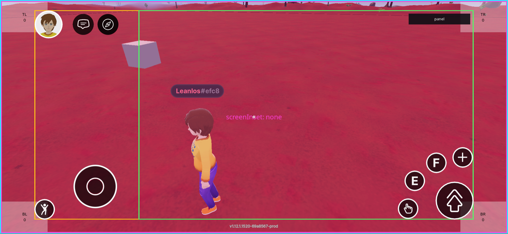
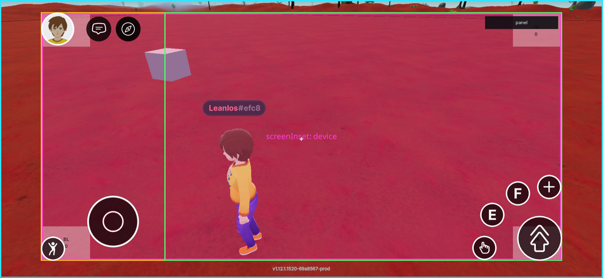
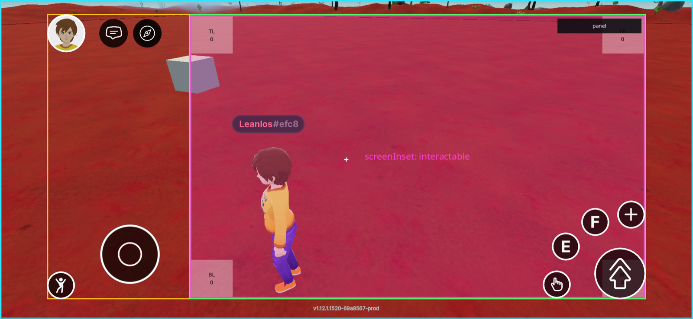

# Onscreen UI

You can build a UI for your scene, to be displayed in the screen's fixed 2D space, instead of in the 3D world space.

UI elements are only visible when the player is standing inside the scene's LAND parcels, as neighboring scenes might have their own UI to display. Parts of the UI can also be triggered to open when certain events occur in the world-space, for example if the player clicks on a specific place.

Build a UI by defining a structure of nested `UiEntity` objects in JSX. The syntax used for UIs is very similar to that of [React](https://reactjs.org/) (a very popular javascript-based library for building web UIs).


**📔 Note**: You can only define UI syntax in files that have a `.tsx` extension. `.tsx` files support everything that `.ts` files support, plus UI syntax. We recommend creating a `ui.tsx` file and defining your UI there. Remember to call your UI render method from `index.ts` with `ReactEcsRenderer.setUiRenderer(yourUiMethodName)`, see example below.


A simple UI with static elements can look a lot like HTML, but when you add dynamic elements that respond to a change in state, you can do things that are a lot more powerful.

The default Decentraland explorer UI includes a chat widget, a map, and other elements. These UI elements are always displayed on the top layer, above any scene-specific UI. So if your scene has UI elements that occupy the same screen space as these, they will be occluded.

See [UX guidelines](../design-experience/ux-ui-guide.md) for tips on how to design the look and feel of your UI.


**📱 Designing for mobile**: The [mobile client](../../build-for-mobile/mobile-client/overview.md) reserves the left side, the top-right, and the bottom-right of the screen for system controls (joystick, chat, profile, camera, interaction button). Scene UI in those regions will clash with the controls. Before publishing, review the [Mobile safe area](../../build-for-mobile/develop/safe-area.md) and the [UI best practices for mobile](../../build-for-mobile/develop/ui-best-practices.md).



**📱 Hardware-reserved margins are avoided by default**: On mobile, devices reserve screen space for the notch, status bar, home indicator, and rounded corners. Every UI renderer is placed inside the device safe area automatically — see [Screen inset area](#screen-inset-area) below. You only need to wrap your UI in the [`ScreenInsetArea` component](../../build-for-mobile/develop/safe-area.md#device-hardware-insets-screeninsetarea) by hand if you opted out with `screenInset: 'none'`. On desktop the insets are zero, so this has no effect there.


When the player clicks the _close UI_ button, on the bottom-right corner of the screen, all UI elements are hidden.

## Render a UI

To display a UI in your scene, use the `ReactEcsRenderer.setUiRenderer()` function, passing it a valid structure of entities, described in a `.tsx` file.

Each entity is defined as an HTML-like node, with properties for each of its components.

_**ui.tsx file:**_

```ts
import { UiEntity, ReactEcs } from '@dcl/sdk/react-ecs'
import { Color4 } from '@dcl/sdk/math'

export const uiMenu = () => (
  <UiEntity
    uiTransform={{
      width: 700,
      height: 400,
      margin: { top: '35px', left: '500px' },
    }}
    uiBackground={{ color: Color4.Red() }}
  />
)
```

_**index.ts file:**_

```ts
import { ReactEcsRenderer } from '@dcl/sdk/react-ecs'
import { uiMenu } from './ui'

export function main() {
    ReactEcsRenderer.setUiRenderer(uiMenu, { virtualWidth: 1920, virtualHeight: 1080 })
}
```

You can also define an entity structure and render it, all in one same command in a `.tsx` file.

_**ui.tsx file:**_

```tsx
import ReactEcs, { ReactEcsRenderer, UiEntity } from '@dcl/sdk/react-ecs'
import { Color4 } from '@dcl/sdk/math'

export function setupUI() {
  ReactEcsRenderer.setUiRenderer(() => (
    <UiEntity
      uiTransform={{
        width: 700,
        height: 400,
        margin: { top: '35px', left: '500px' },
      }}
      uiBackground={{ color: Color4.Red() }}
    />
  ), { virtualWidth: 1920, virtualHeight: 1080 })
}
```

_**index.ts file:**_

```ts
import { setupUI } from './ui'

export function main() {
    setupUI()
}
```


**📔 Note**: All of your UI elements need to be nested into the same structure, and have one single parent at the root of the structure. You can only call `ReactEcsRenderer.setUiRenderer()` once in the scene.


## UI Entities

Each element in the UI must be defined as a separate `UiEntity`, wether it's an image, text, background, an invisible alignment box, etc. Just like in the scene's 3D space, each `UiEntity` has its own components to give it a position, color, etc.

The React-like syntax allows you to specify each component as a property within the `UiEntity`, this makes the code shorter and more readable.

The components used in a `UiEntity` are different from those used in regular entities. You cannot apply a UI component to a regular entity, nor a regular component to a UI entity.

The following components are available to use in a `UiEntity`:

* `uiTransform`
* `uiBackground`
* `uiText`
* `onMouseDown`
* `onMouseUp`
* `onMouseEnter`
* `onMouseLeave`
* [`uiInputBinding`](ui_input_binding.md) — hold input actions while the element is pressed, to build custom controls

Like with HTML tags, you can define components as self-closing or nest one within another.

_**ui.tsx file:**_

```tsx
import ReactEcs, { ReactEcsRenderer, UiEntity } from '@dcl/sdk/react-ecs'
import { Color4 } from '@dcl/sdk/math'

export const uiMenu = () => (
  // parent entity
  <UiEntity
    uiTransform={{
      width: 200,
      height: 200,
      margin: { top: '250px', left: '500px' },
    }}
    uiBackground={{ color: Color4.Blue() }}
  >
    {/* self-closing child entity */}
    <UiEntity
      uiTransform={{
        width: 400,
        height: 400,
        margin: { top: '35px', left: '500px' },
      }}
      uiText={{ value: `Hello world!`, fontSize: 40 }}
    />
    {/* closing statement for the parent entity */}
  </UiEntity>
)
```

_**index.ts file:**_

```ts
import { ReactEcsRenderer } from '@dcl/sdk/react-ecs'
import { uiMenu } from './ui'

export function main() {
    ReactEcsRenderer.setUiRenderer(uiMenu, { virtualWidth: 1920, virtualHeight: 1080 })
}
```

A definition of a UI module can only have one parent-level entity. You can define as many other entities as you want, but they must all fit inside a structure with one single parent at the top.

## Screen Virtual Scale

Set a virtual width and height for the UI. This makes sure your UI looks the same on different screen sizes, regardless of the actual screen size in pixels.

```ts
export function setupUi() {
    ReactEcsRenderer.setUiRenderer(uiComponent, { virtualWidth: 1920, virtualHeight: 1080 })
}
```

If you set a virtual width to 1920, and a virtual height to 1080, the UI will be scaled to fit the screen size. If the screen is 1920x1080, the UI will be displayed at the same size as the virtual size. If the screen is larger or smaller, any pixel values will be scaled to fit the virtual size. For example, if the screen is 3840x2160, an item that is defined as 100 pixels in width will be displayed over 200 actual pixels.

The actual calculation for the Ui Scale Factor that gets multiplied on pixel values is [`Math.min(realWidth / virtualWidth, realHeight / virtualHeight)`](https://github.com/decentraland/js-sdk-toolchain/blob/main/packages/%40dcl/react-ecs/src/system.ts).

### Default virtual size

The virtual size is optional, but its two dimensions go together: pass both, or neither. When you don't pass one, a platform default is applied:

| Platform | Default virtual size |
|---|---|
| Mobile | `1600x720` |
| Desktop and Web | `1920x1080` |

This means pixel values in your UI are always scaled against a reference resolution, even when you pass no options at all. It also applies when the scene only uses `addUiRenderer()` and never calls `setUiRenderer()`.

Three special cases:

* **Opting out of scaling**: pass an invalid size — any value that is `0` or less — to disable the virtual screen entirely. Pixel values are then used as raw canvas pixels, with no scaling. This is the documented way to turn the virtual screen off, so nothing is logged.

  ```ts
  ReactEcsRenderer.setUiRenderer(uiComponent, { virtualWidth: 0, virtualHeight: 0 })
  ```

* **Incomplete sizes**: giving only one of the two dimensions is also invalid, so it disables the virtual screen just like the case above — the platform default does **not** step in. Unlike the opt-out above, this one is reported: a half-given size is a mistake rather than a deliberate choice, so the SDK logs `Incomplete virtual screen size (…): both dimensions are required, so the virtual screen is disabled and no UI scaling is applied.` once per size. Pass both dimensions, or neither.

  ```ts
  // Don't do this — no scaling is applied at all
  ReactEcsRenderer.setUiRenderer(uiComponent, { virtualWidth: 1920 })
  ```

  This is worth double-checking on the main renderer, because an incomplete size there is also a scene-wide switch: a `setUiRenderer()` call that mentions *either* dimension wins over any `addUiRenderer()`, so the example above disables the virtual screen for the whole scene and discards a valid size passed to an additional renderer.

* **16:9 sizes on mobile**: phone screens are much wider than 16:9, so a 16:9 virtual canvas would letterbox the UI. If you pass a 16:9 size (`1920x1080`, `1280x720`, …) and the scene runs on mobile, it is overridden to `1600x720`, and a message is logged to the console once. Non-16:9 sizes on mobile, and every valid size on desktop or web, are respected as-is.


**📔 Note**: The `vw` and `vh` units are independent of the virtual screen: `1vw` is 1% of the canvas width and `1vh` is 1% of the canvas height, exactly as in CSS. They also ignore the [`screenInset`](#screen-inset-area), so inside the default `'device'` inset a `width: '100vw'` is wider than a `width: '100%'` — the first spans the whole screen, the second fills the inset area.



**📱 Note**: Platform detection resolves asynchronously. During the first frames the SDK doesn't know yet that it's running on mobile, so the virtual screen starts at `1920x1080` and switches to `1600x720` once detection completes — you may see the UI re-scale briefly on load, and the 16:9 override message appears in the console a moment after the scene starts. Pass an explicit non-16:9 virtual size if you want a single stable reference resolution from the very first frame.



**📔 What changed for scenes written before this SDK version**

Three changes affect existing scenes. None of them are opt-in, so a scene that isn't touched at all will still look different once it updates its SDK version:

1. **A virtual screen now applies by default.** A scene that passed no options used to lay out pixel values as raw canvas pixels. It's now scaled against `1920x1080` (`1600x720` on mobile). To get the previous behavior back, disable the virtual screen explicitly with `setUiRenderer(ui, { virtualWidth: 0, virtualHeight: 0 })`.
2. **`screenInset` defaults to `'device'`.** Your UI is now positioned inside the device safe area, so on mobile it moves inwards, and a root-level `100%` is no longer the full screen — full-screen backgrounds, dimmers and overlays stop short of the notch and the home indicator. To get the previous behavior back, pass `setUiRenderer(ui, { screenInset: 'none' })`. See [Screen inset area](#screen-inset-area).
3. **`devicePixelRatio` takes no part in UI layout.** Pixel-sized UI is now up to 2–3 times larger on high-density (retina and mobile) screens than it was before. **There is no opt-out for this one** — re-check any sizes that were hand-tuned, and remove any scale factor your scene computed for itself.


## Screen inset area

Screens are not fully usable: a phone reserves space for the notch, status bar, home indicator and rounded corners, and every explorer draws its own HUD (minimap, chat, …) over part of the canvas. The optional `screenInset` property of the renderer options selects which screen area your UI is positioned in:

| Value | Area the UI is placed in |
|---|---|
| `'device'` _(default)_ | The device safe area, excluding the notch, status bar and rounded corners. Read from `UiCanvasInformation.screenInsetArea`. |
| `'interactable'` | The area the explorer reports as free of its own HUD (minimap, chat, …). Read from `UiCanvasInformation.interactableArea`. What it covers is up to each explorer — verify on the platforms you target. |
| `'none'` | The whole screen, with `0,0` at its top-left corner. |

```ts
// UI is kept clear of the notch, status bar and rounded corners — this is the default
ReactEcsRenderer.setUiRenderer(uiComponent, { virtualWidth: 1920, virtualHeight: 1080 })

// UI is kept clear of the explorer's own HUD
ReactEcsRenderer.setUiRenderer(uiComponent, { screenInset: 'interactable' })

// UI covers the whole screen, you handle the margins yourself
ReactEcsRenderer.setUiRenderer(uiComponent, { screenInset: 'none' })
```

On desktop the device insets are zero, so `'device'` places the UI over the whole screen there — the same result as `'none'`. The area is re-read every tick, so the UI follows the insets when they change, for example on rotation or when system bars appear and hide.


**📔 `'interactable'` is not a no-op on desktop.** Unlike the device insets, the interactable area is *not* zero on the desktop client: it reserves roughly the left 25% of the screen for its own UI, so `screenInset: 'interactable'` places your UI in the remaining 75% there. That is the point of the option, but it does mean it changes your desktop layout too — branch with [`isMobile()`](../../build-for-mobile/develop/detect-platform.md) if you only want it on phones.

**Client support**: `'interactable'` needs an explorer that reports the area. It is supported on desktop, and on mobile from client version `1.12.1` onwards — on older mobile clients the value is reported as zero, and the UI falls back to covering the whole screen. That same `1.12.1` release also normalizes the `'device'` area between Android and iOS, so treat it as the floor for any layout that depends on either inset. `'none'` behaves the same everywhere.



**📔 Note**: Don't wrap your UI in the [`ScreenInsetArea`](../../build-for-mobile/develop/safe-area.md#device-hardware-insets-screeninsetarea) or `InteractableArea` components while also leaving the matching `screenInset` value on the renderer — the inset would be applied twice, pushing the UI inwards by double the margin. Either rely on `screenInset`, or set it to `'none'` and place the wrapper yourself.


### The three areas on a real device

The captures below are the same scene on the same phone, rendered three times with only the `screenInset` value changed. The magenta rectangle is the UI itself; the outlines are the areas the explorer reports — cyan is the full canvas, amber is `screenInsetArea`, green is `interactableArea`.

<figure><figcaption><p><code>screenInset: 'none'</code> — the UI covers the whole canvas. Its corners sit under the notch and behind the client's own controls.</p></figcaption></figure>

<figure><figcaption><p><code>screenInset: 'device'</code> (the default) — the UI is pulled in to the device safe area, clear of the notch and the rounded corners. It still overlaps the client's controls, which are not part of this area.</p></figcaption></figure>

<figure><figcaption><p><code>screenInset: 'interactable'</code> — the UI is placed inside the rectangle the client designates for scene UI. On mobile client <code>1.12.1</code>, captured here, that excludes the left-hand column (profile, chat, joystick); the action buttons on the bottom right are drawn over the area by design.</p></figcaption></figure>


**💡 Tip**: `'interactable'` gives you the area each explorer designates for scene UI. That is deliberately not the same as "every client control is outside it" — as the third capture shows, the mobile action buttons are drawn over the area on purpose. Anything you place under them is still reachable to you but competes for the same taps, so keep the [reserved margins](../../build-for-mobile/develop/safe-area.md#reserved-margins) in mind for the corners, and check the platforms you target: what the area covers is each explorer's call and can change between versions.


Each renderer honors its own `screenInset`, so the main UI and any UI added with `addUiRenderer()` can use different areas at the same time. Unlike the virtual size, this value is never shared between renderers.

## Multiple UI modules

If your scene contains multiple systems or modules that each define their own UI, you can render each UI module with `ReactEcsRenderer.addUiRenderer()`. This is especially useful when working on a complex scene with multiple UI components, or when defining UIs for a [smart item](../smart-items/smart-items.md), which should be usable independent of what's in the code of the rest of the scene.

The `ReactEcsRenderer.addUiRenderer()` function requires that you provide an entity as the owner of the UI. This can be any entity, even a dummy entity created only to be used as the owner of the UI.

```ts
export function setupUi() {

    // Create a dummy entity to be the owner of the UI
    const dummyEntity = engine.addEntity()

    // Define the UI module as a function that returns an array of UI modules
    const uiComponent = () => [
      // Function returning a UI module,
      // Function returning a UI module
      // ...
    ]

    // Render the UI module with the dummy entity as the owner
    ReactEcsRenderer.addUiRenderer(dummyEntity, uiComponent)
}
```

This snippet can exist independently of any other UI code in the scene. The rest of the scene might include a `ReactEcsRenderer.setUiRenderer()`, or none at all, and the UI will still be rendered.

An `addUiRenderer()` call can also include a virtual width and height, just like `setUiRenderer()`. However, if the scene has a `setUiRenderer()` call that also defines a virtual width and height, the virtual width and height of the `addUiRenderer()` call will be ignored.

```tsx
ReactEcsRenderer.addUiRenderer(dummyEntity, uiComponent, { virtualWidth: 1920, virtualHeight: 1080 })
```

The virtual size is a single scene-wide value, resolved as follows: the size on `setUiRenderer()` wins; otherwise the first `addUiRenderer()` call that provided one wins; and if no renderer provided one, the [platform default](#default-virtual-size) applies. Options that only carry a `screenInset` don't count as a provided size.

The [`screenInset`](#screen-inset-area) works the other way around — it is per renderer, so each UI module can sit in a different screen area:

```tsx
// This widget stays clear of the explorer HUD, regardless of what the main UI uses
ReactEcsRenderer.addUiRenderer(dummyEntity, uiComponent, { screenInset: 'interactable' })
```

That UI can be removed with `ReactEcsRenderer.removeUiRenderer(dummyEntity)` , also If the entity that owns the UI is destroyed, the UI will be removed too. If `ReactEcsRenderer.addUiRenderer()` is called again for the same entity but with a different UiRenderer, the previous one is cleaned up and the new one replaces it.


### Sharing a single setUiRenderer statement


Instead of calling `ReactEcsRenderer.addUiRenderer()` for each UI module, you can call `ReactEcsRenderer.setUiRenderer()` once with an array of UI modules, that can live in different files.

```ts
const uiComponent = () => [
  // Function returning a UI module,
  // Function returning a UI module
  // ...
]

ReactEcsRenderer.setUiRenderer(uiComponent, { virtualWidth: 1920, virtualHeight: 1080 })
```

Below is a more complete example:

_**ui.tsx file:**_

```ts
export function UIModule1() {
  return (
    <UiEntity
      uiTransform={{
        flexDirection: 'column',
        alignItems: 'center',
        justifyContent: 'space-between',
        positionType: 'absolute',
        position: { right: '3%', bottom: '3%' },
      }}
    >
      <Label value="Hello World!" fontSize={18} textAlign="middle-center" />
    </UiEntity>
  )
}

export function UIModule2() {
  return (
    <UiEntity
      uiTransform={{
        flexDirection: 'column',
        alignItems: 'center',
        justifyContent: 'space-between',
        positionType: 'absolute',
        position: { right: '3%', top: '3%' },
      }}
    >
      <Label
        value="Here's some more UI!"
        fontSize={18}
        textAlign="middle-center"
      />
    </UiEntity>
  )
}
```

_**index.ts file:**_

```ts
import { ReactEcsRenderer } from '@dcl/sdk/react-ecs'
import { UIModule1, UIModule2 } from './ui'

export function main() {
    ReactEcsRenderer.setUiRenderer(() => [
      UIModule1(),
      UIModule2(),
      // ...
      // The line below is to use the DCL UI Toolkit library
      // https://github.com/decentraland-scenes/dcl-ui-toolkit
      ui.render(),
    ], { virtualWidth: 1920, virtualHeight: 1080 })
}
```
