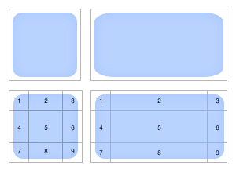

# UI Background

The following properties are used to set a background and border on a UI entity.

## Background

A `uiBackground` component gives color or a texture an entity's area. It uses the size and position defined by the entity's `uiTransform`.

The following fields can be configured, all of them are optional:

* `color`: The color to use on the entity, as a [Color4](../3d-essentials/color-types.md) value.


**💡 Tip**: Make an entity semi-transparent by setting the 4th value of the `Color4` to less than 1.


*   `texture`: The texture to display on the entity, this takes an object with various parameters about the texture. The same properties are available as in textures in [materials on 3D entities](../3d-essentials/materials.md#using-textures).

    * `src`: The path to the image file to use as a texture. (string)
    * `filterMode`: _(optional)_ Determines how pixels in the texture are stretched or compressed when rendered. . See [Texture Scaling](../3d-essentials/materials.md#texture-scaling). (FilterMode = 'point' | 'bi-linear' | 'tri-linear')
    * `wrapMode`: _(optional)_ Determines how a texture is tiled onto an entity. This takes a value from the `TextureWrapMode` enum. See \[Texture Wrapping]\(([See documentation](../)). (WrapMode = 'repeat' | 'clamp' | 'mirror' | 'mirror-once')

    > Tip: You can combine both `texture` and `color` properties on a single `uiBackground` component to produce a tinted texture.
* `textureMode`: Selects how you want the texture to adapt to the size of the entity that it's applied to. (TextureMode = 'nine-slices' | 'center' | 'stretch')enum, which supports the following vales:
  * `center`: The texture is not stretched, it's positioned centered on the entity and parts of it may be cropped depending on the entity's size.
  * `stretch`: The texture is stretched to match the entire surface of the entity.
  * `nine-slices`: Parts of the texture are stetched to match the entire surface of the entity, leaving margins unstretched. See [nine-slice textures](ui_background.md#nine-slice-textures).
* `avatarTexture`: Display an avatar profile thumbnail, based on an avatar ID. See \[Avatar Portraits]\(([See documentation](../)).
* `textureSlices`: Determine the margins to use when using the nine-slice texture mode, see [nine-slice textures](ui_background.md#nine-slice-textures). Set a number smaller than 1, as a fraction of the total width or height of the image.

Simple color:

_**ui.tsx file:**_

```tsx
import { ReactEcs, UiEntity } from '@dcl/sdk/react-ecs'
import { Color4 } from '@dcl/sdk/math'

export const uiMenu = () => (
  <UiEntity
    uiTransform={{
      width: 700,
      height: 400
    }}
    uiBackground={{
		color: Color4.create(0.5, 0.8, 0.1, 0.6)
	}}
  />
)
```

_**index.ts file:**_

```ts
import { ReactEcsRenderer } from '@dcl/sdk/react-ecs'
import { uiMenu } from './ui'

export function main() {
    ReactEcsRenderer.setUiRenderer(uiMenu, { virtualWidth: 1920, virtualHeight: 1080 })
}
```


**📔 Note**: All the following snippets in this page assume that you have a `.ts` similar to the above, running the `ReactEcsRenderer.setUiRenderer()` function.


Repeated texture pattern:

```ts
import { UiEntity, ReactEcs } from '@dcl/sdk/react-ecs'

export const uiMenu = () => (
  <UiEntity
    uiTransform={{
      width: 700,
      height: 400
    }}
    uiBackground={{
		textureMode: 'center'
		texture: {
			src: "images/brick-wall-texture.png",
			wrapMode: 'repeat'
		}
	}}
  />
)
```

## Borders

A few properties are used to set a border around a UI entity. These properties exist on the `uiTransform` component. They each allow you to set either a single value for all sides of the border, or different values for each side.

* `borderColor`: The color to use on the entity, as a [Color4](../3d-essentials/color-types.md) value.
* `borderWidth`: The width of the border, as a number in pixels. It also supports values in percentages, for example `borderWidth: '2%'` will set the border width to 2% of the entity's width.
* `borderRadius`: Use this property to give the corners of the entity a rounded border. It sets the radius of the corners in pixels.

```ts
import { UiEntity, ReactEcs } from '@dcl/sdk/react-ecs'
import { Color4 } from '@dcl/sdk/math'

export const uiMenu = () => (
  <UiEntity
    uiTransform={{
      width: 700,
      height: 400,
      borderColor: Color4.Red(),
      borderWidth: 4,
      borderRadius: 10
    }}
  />
)
```

`borderWidth`, `borderColor` and `borderRadius` can also be set with different values for each side of the entity.

```ts
import { UiEntity, ReactEcs } from '@dcl/sdk/react-ecs'
import { Color4 } from '@dcl/sdk/math'

export const uiMenu = () => (
  <UiEntity
    uiTransform={{
      width: 700,
      height: 400,
      borderColor: { top: Color4.White(), left: Color4.Red(), right: Color4.Blue(), bottom: Color4.Gray() },
      borderRadius: { topLeft: 20, topRight: 20, bottomLeft: 20, bottomRight:0 },
      borderWidth: { top: 3, left: 2, right: 3, bottom: 4 }
    }}
  />
)
```

## Opacity

Use the `opacity` property in the `Transform` of a `UiEntity` to add transparency to the entity and all of its children. The opacity property is a value from 0 to 1, where 0 is fully transparent and 1 fully opaque.

```ts
import { UiEntity, ReactEcs } from '@dcl/sdk/react-ecs'
import { Color4 } from '@dcl/sdk/math'

export const uiMenu = () => (
  <UiEntity
    uiTransform={{
      width: 700,
      height: 400,
      opacity: 0.7
    }}
    uiBackground={{ color: Color4.Green() }}
  >
    <UiEntity
        uiTransform={{
          width: 100,
          height: 30,
        }}
        uiText={{
          value: "This text is transparent too",
          fontSize: 40
        }}
      />
   </UiEntity>
)
```

The opacity value affects all children of a UiEntity, applying transparency to background colors, text colors, and background images. When both the parent and a child have opacity values, the child's final opacity is the product of its own value and the parent's.

```ts
import { UiEntity, ReactEcs } from '@dcl/sdk/react-ecs'
import { Color4 } from '@dcl/sdk/math'

export const uiMenu = () => (
  <UiEntity
    uiTransform={{
      width: 700,
      height: 400,
      opacity: 0.7
    }}
    uiBackground={{ color: Color4.Green() }}
  >
    <UiEntity
      uiTransform={{
        width: 100,
        height: 30,
        opacity: 0.7
      }}
      uiText={{
        value: "This text is even more transparent",
        fontSize: 40
      }}
    />
  </UiEntity>
)
```

## Nine-slice textures

You can use [9-slice scaling](https://en.wikipedia.org/wiki/9-slice_scaling) with your textures, to ensure that corners and margins don't get stretched unevenly.

With this popular technique, you slice an image into 9 segments, that will be stretched in different ways to preserve the proportions of the margins and corners. For example, use this to define rounded-corner backgrounds that easily adapt to any size. Consider the following image (borrowed from [Wikipedia](https://en.wikipedia.org/wiki/9-slice_scaling#/media/File:Traditional_scaling_vs_9-slice_scaling.svg)):



In this image we see the orginal texture (top-left), and the result of scaling it in a traditional way (top-right); notice how the corners get deformed. Below that, we see the texture segmented into 9 slices (bottom-left), and then the result of stretching the image according to the 9-slice method (bottom-right).

Here's how each segment is affected, using the above image as reference.

* Segment 5 is the only part of the image that is fully stretched on both x and y axis.
* Segments 1,3, 7, and 9 (the corneres) arent stetched at all.
* Segments 2 and 8 are only stetched horizontally
* Segments 4 and 6 are only stegched vertically.

To use nine-slice stretching on an entity, set the `textureMode` to `BackgroundTextureMode.NINE_SLICES`. You can optionally also set a width for the margin on each side in `textureSlices`.

```ts
import { UiEntity, ReactEcs } from '@dcl/sdk/react-ecs'

export const uiMenu = () => (
  <UiEntity
    uiTransform={{ width: 700, height: 400 }}
    uiBackground={{
      textureMode: 'nine-slices',
      texture: {
        src: 'images/rounded_alpha_square.png'
      },
      textureSlices: {
        top: 0.2,
        bottom: 0.2,
        left: 0.2,
        right: 0.2
      }
	}}
  />
)
```

## Texture UVs

Use the `uvs` property on a `uiBackground` component to display a specific region of a texture. This is useful for picking individual sprites from a sprite sheet, or for rotating an image.

The `uvs` field takes an array of 8 numbers, representing 4 pairs of UV coordinates for the four corners of the texture region. The order is: **bottom-left**, **top-left**, **top-right**, **bottom-right**. Each value ranges from 0 to 1, where `(0, 0)` is the bottom-left corner of the image and `(1, 1)` is the top-right.


**💡 Tip**: When using custom `uvs`, set `textureMode` to `'stretch'` so the selected region fills the entity's area.


### Sprites from a sprite sheet

To display a portion of a larger image (for example, one card from a sprite sheet that contains several), set the `uvs` to the coordinates of that region.

```ts
import { UiEntity, ReactEcs } from '@dcl/sdk/react-ecs'

// Display the left half of a texture (e.g. the first card in a 2-column sheet)
export const uiMenu = () => (
  <UiEntity
    uiTransform={{ width: 200, height: 300 }}
    uiBackground={{
      textureMode: 'stretch',
      texture: { src: 'images/card-atlas.png' },
      uvs: [
        // bottom-left, top-left, top-right, bottom-right
        0, 0,
        0, 1,
        0.5, 1,
        0.5, 0
      ]
    }}
  />
)
```

For a sprite sheet with a grid of frames (for example, a 4-column by 2-row sheet), calculate UVs based on the column and row of the frame you want:

```ts
import { UiEntity, ReactEcs } from '@dcl/sdk/react-ecs'

// Pick a single frame from a grid sprite sheet
function getFrameUVs(col: number, row: number, totalCols: number, totalRows: number): number[] {
  const stepU = 1 / totalCols
  const stepV = 1 / totalRows
  const left = col * stepU
  const right = (col + 1) * stepU
  const top = 1 - row * stepV
  const bottom = 1 - (row + 1) * stepV
  return [
    left, bottom,
    left, top,
    right, top,
    right, bottom
  ]
}

// Display column 2, row 0 of a 4x2 sprite sheet
export const uiMenu = () => (
  <UiEntity
    uiTransform={{ width: 128, height: 128 }}
    uiBackground={{
      textureMode: 'stretch',
      texture: { src: 'images/spritesheet.png' },
      uvs: getFrameUVs(2, 0, 4, 2)
    }}
  />
)
```

### Rotating an image with UVs

You can rotate a texture by applying a 2D rotation to the UV coordinates. This is useful for spinner or loading indicators without needing transform-based rotation.

```ts
import { UiEntity, ReactEcs } from '@dcl/sdk/react-ecs'
import { engine } from '@dcl/sdk/ecs'

// Rotate a 2D point around a center
function rotate2D(angle: number, x: number, y: number, cx: number, cy: number): number[] {
  const cos = Math.cos(angle)
  const sin = Math.sin(angle)
  return [
    cos * (x - cx) - sin * (y - cy) + cx,
    sin * (x - cx) + cos * (y - cy) + cy
  ]
}

// Build rotated UV coordinates
function rotateUVs(angle: number): number[] {
  const uv00 = rotate2D(angle, 0, 0, 0.5, 0.5)
  const uv01 = rotate2D(angle, 0, 1, 0.5, 0.5)
  const uv11 = rotate2D(angle, 1, 1, 0.5, 0.5)
  const uv10 = rotate2D(angle, 1, 0, 0.5, 0.5)
  return [uv00[0], uv00[1], uv01[0], uv01[1], uv11[0], uv11[1], uv10[0], uv10[1]]
}

let spinnerAngle = 0

// System that updates the angle each frame
engine.addSystem((dt: number) => {
  spinnerAngle += dt * 5
})

export const uiMenu = () => (
  <UiEntity
    uiTransform={{ width: 128, height: 128 }}
    uiBackground={{
      textureMode: 'stretch',
      texture: { src: 'images/spinner.png' },
      uvs: rotateUVs(spinnerAngle)
    }}
  />
)
```

The `rotateUVs` function rotates the four UV corners around the center point `(0.5, 0.5)` by the given angle in radians. Because this is called each frame by the React-like renderer, the spinner updates smoothly.


**💡 Tip**: See a full working example with sprites, animated sprite sheets, spinners, and more in the [UI Animations](https://github.com/decentraland/sdk7-goerli-plaza/tree/main/ui-animations) example scene.

