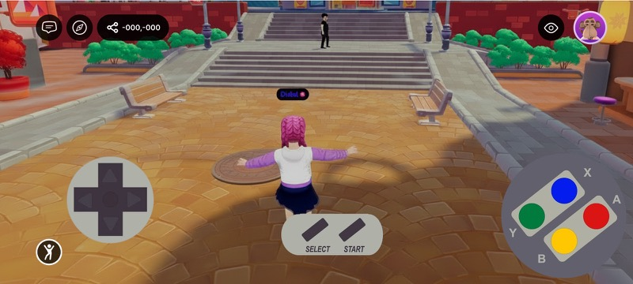

# UI Input Binding

`UiInputBinding` turns any UI element into a control button. Bind an element to one or more [`InputAction`](../interactivity/button-events/click-events.md#pointer-buttons)s, and while it's pressed — by touch or pointer — those actions are held down, driving both the local player's input (movement, jumping) and any scene [`InputAction`](../interactivity/button-events/click-events.md#pointer-buttons) listeners, exactly like the native on-screen buttons.

Use it to build your own touch controls. It's typically paired with [On-screen Controls](../interactivity/touch-screen-controls.md): hide the native buttons, then put your own in their place.

<figure><figcaption><p>A fully custom gamepad built from UI elements — each button is a UI entity bound to an input action</p></figcaption></figure>

## Bind an action to a UI element

Add a `uiInputBinding` prop to any element in your `.tsx` UI and list the actions to hold while it's pressed. The prop is available on every UI element ([`UiEntity`](onscreen-ui.md#ui-entities), [`Button`](onscreen-ui.md#ui-entities), [`Label`](onscreen-ui.md#ui-entities), …), just like `uiTransform` and `uiBackground`.

**A button that moves the player forward while held:**

```tsx
import { InputAction } from '@dcl/sdk/ecs'
import { Button } from '@dcl/sdk/react-ecs'

export const forwardButton = () => (
	<Button
		value="▲"
		uiTransform={{ width: 100, height: 100 }}
		uiInputBinding={{ actions: [InputAction.IA_FORWARD] }}
	/>
)
```

## Build a custom control cluster

Combine several bound elements to assemble a full control scheme.

**A movement button plus an action button that fires `IA_PRIMARY`:**

```tsx
import { InputAction } from '@dcl/sdk/ecs'
import { Button, UiEntity } from '@dcl/sdk/react-ecs'

export const customControls = () => (
	<UiEntity uiTransform={{ width: 240, height: 120 }}>
		<Button
			value="▲"
			uiTransform={{ width: 100, height: 100 }}
			uiInputBinding={{ actions: [InputAction.IA_FORWARD] }}
		/>
		<Button
			value="Use"
			uiTransform={{ width: 100, height: 100 }}
			uiInputBinding={{ actions: [InputAction.IA_PRIMARY] }}
		/>
	</UiEntity>
)
```

The bound actions behave just like the native buttons: `IA_FORWARD` / `IA_BACKWARD` / `IA_LEFT` / `IA_RIGHT` move the avatar, and any action can be read by your scene's [`InputAction`](../interactivity/button-events/click-events.md#pointer-buttons) listeners. Removing the prop (or the component) releases the binding.

## Properties

| Property | Type | Description |
| --- | --- | --- |
| `actions` | array of [`InputAction`](../interactivity/button-events/click-events.md#pointer-buttons) | The input actions held down while this element is pressed. See [Click events](../interactivity/button-events/click-events.md) for the full list of [`InputAction`](../interactivity/button-events/click-events.md#pointer-buttons) values. |


Pair this with [`TouchScreenControls`](../interactivity/touch-screen-controls.md) to hide the native controls and replace them with your own touch UI — the recommended way to ship a fully custom control scheme.


## Related

* [On-screen Controls](../interactivity/touch-screen-controls.md)
* [UI Button Events](ui_button_events.md)
* [Input on mobile](../../build-for-mobile/develop/input-on-mobile.md)
* [Click events](../interactivity/button-events/click-events.md)
