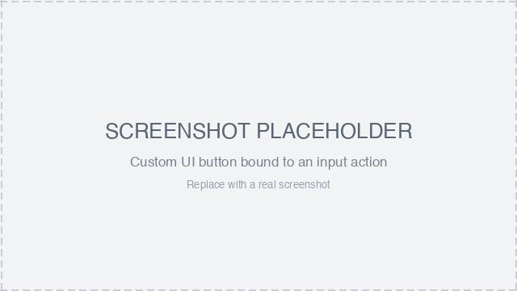

# UI Input Binding

The `UiInputBinding` component binds a UI entity to one or more `InputAction`s. While that element is pressed — by touch or pointer — the listed actions are held down, driving both the local player's input (movement, jumping) and any scene `InputAction` listeners, exactly like the native on-screen buttons.

This lets you build your own touch controls out of UI elements. It's typically combined with [On-screen Controls](../interactivity/touch-screen-controls.md): hide the native buttons, then provide your own.

<figure><figcaption><p>Custom UI button bound to an input action (placeholder)</p></figcaption></figure>

## Usage

Add a `uiInputBinding` prop to any UI element in your `.tsx` UI, listing the actions to hold down while the element is pressed:

```tsx
import { InputAction } from '@dcl/sdk/ecs'
import { Button } from '@dcl/sdk/react-ecs'

// A custom on-screen button that moves the player forward while held
export const forwardButton = () => (
	<Button
		value="▲"
		uiTransform={{ width: 100, height: 100 }}
		uiInputBinding={{ actions: [InputAction.IA_FORWARD] }}
	/>
)
```

The `uiInputBinding` prop is available on every UI element (`UiEntity`, `Button`, `Label`, etc.), just like `uiTransform` and `uiBackground`.

## Properties

* `actions` (_array of InputAction_) — the input actions held down while this element is pressed. See [Click events](../interactivity/button-events/click-events.md) for the full list of `InputAction` values.

## Example

Build a small custom control cluster — a movement button and an action button that fires `IA_PRIMARY`:

```tsx
import { InputAction } from '@dcl/sdk/ecs'
import { Button, UiEntity } from '@dcl/sdk/react-ecs'

export const customControls = () => (
	<UiEntity uiTransform={{ width: 240, height: 120 }}>
		<Button
			value="▲"
			uiTransform={{ width: 100, height: 100 }}
			uiInputBinding={{ actions: [InputAction.IA_FORWARD] }}
		/>
		<Button
			value="Use"
			uiTransform={{ width: 100, height: 100 }}
			uiInputBinding={{ actions: [InputAction.IA_PRIMARY] }}
		/>
	</UiEntity>
)
```

## Notes

* Removing the prop (or the component) releases the binding.
* Pair this with [`TouchScreenControls`](../interactivity/touch-screen-controls.md) to hide the native controls and replace them with your own touch UI.
* The bound actions behave just like the native buttons: `IA_FORWARD`/`IA_BACKWARD`/`IA_LEFT`/`IA_RIGHT` move the avatar, and any action can be read by your scene's `InputAction` listeners.

## Related

* [On-screen Controls](../interactivity/touch-screen-controls.md)
* [UI Button Events](ui_button_events.md)
* [Input on mobile](../building-for-mobile/input-on-mobile.md)
* [Click events](../interactivity/button-events/click-events.md)
