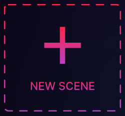
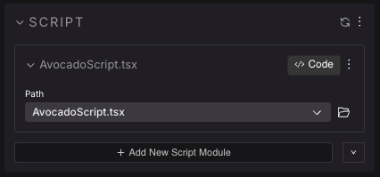
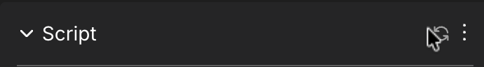

# SDK Quick Start

This tutorial walks you through creating your first scene, mixing the different tools you have available: the visual Scene Editor of the Creator Hub, hand-written code using the Decentraland SDK, and AI-assisted **vibe coding**. You'll use all three together, and learn when each one shines.

## Install the Creator Hub

The Creator Hub allows you to build, preview and deploy Decentraland scenes. Download the Creator Hub [here](https://decentraland.org/download/creator-hub).

To edit your scene's code, you also need a code editor. [Visual Studio Code](https://code.visualstudio.com/) and [Cursor](https://www.cursor.com/) are both great options, but any code editor works.

Read the [Installation guide](../../scene-editor/get-started/editor-installation.md) for more details.

## Create your first scene

1. Open the Creator Hub.
2. Select the **Scenes** tab, and click **New Scene**.

   

3. Pick a starting template. For this exercise, pick the **Empty Scene**.

This step may take a couple of minutes. It populates your folder with the default set of files for a basic scene. Once that's done, you'll see the empty grid of your scene.

## Add items from the asset packs

Explore the **Asset packs** on the bottom section of the Scene Editor, and drag a couple of items into your scene. Any items will do for now.


Already placed items can be clicked and dragged to reposition them. See [Scene editor essentials](../../scene-editor/get-started/scene-editor-essentials.md#position-items) for more details.


**💡 Tip**: Cover the entire scene with a ground item. Items of type **Ground** have a paint bucket icon on them. If you drag one of these into your scene, it covers all of your scene's ground with copies of this item.




## Run a preview

Click the **Preview** button on the top menu to load your scene inside Decentraland. You can now explore the scene as a Decentraland avatar.


You can keep the preview window open while you work: it updates every time you make a change. Read more in [preview a scene](preview-scene.md).

## Custom 3D assets

Download this 3D model of an avocado in _glb_ format from the following [link](https://github.com/decentraland-scenes/avocado/raw/main/avocado-glb.zip) and unzip it.


Drag the **avocado.glb** file from your file explorer onto the bottom panel of the Scene Editor (the same panel that holds the **Asset Packs** and **Local Assets** tabs) and click **Import**.


You can now find the **avocado.glb** model in the **Local Assets** tab, inside the **Scene** folder. Drag the file onto your scene, like any item from the Asset Packs.


## Edit the scene code

Click the **<> Code** button on the top menu to open your scene project in your code editor.



**📔 Note**: If nothing opens, make sure you have a code editor like [Visual Studio Code](https://code.visualstudio.com/) or [Cursor](https://www.cursor.com/) installed.


On the left margin of your code editor you can navigate the files and folder structure of your project. Open the `index.ts` file inside the `src` folder. Its content should look like this:

```ts
import {} from '@dcl/sdk/math'
import { engine } from '@dcl/sdk/ecs'

export function main() {}
```

Decentraland scenes are written in [TypeScript](https://www.typescriptlang.org/), using the Decentraland SDK: a library with everything you need to position 3D content, add interactivity, and control what happens in your scene.

This file defines a function called `main()`, which is the entry point to the scene: any code you put there runs when the scene first loads.

You already dragged one avocado into the scene visually. Now let's add a second one, this time by writing code. Replace the full contents of your `index.ts` file with the following:

```ts
import { Vector3 } from '@dcl/sdk/math'
import { engine, Transform, GltfContainer } from '@dcl/sdk/ecs'

export function main() {
	// create a fresh new Entity
	let avocado2 = engine.addEntity()

	// give it a Transform
	Transform.create(avocado2, {
		position: Vector3.create(8, 0, 8),
	})

	// give it a GLTF
	GltfContainer.create(avocado2, {
		src: 'assets/scene/avocado.glb',
	})
}
```

These lines create a new [entity](../architecture/entities-components.md), give it a [shape](../3d-essentials/shape-components.md) based on the 3D model you downloaded, and [set its position](../3d-essentials/entity-positioning.md) via the **Transform** component.

As a rule of thumb, the code you write in `index.ts` should all be inside `main()` (or in other functions that are referenced indirectly by main). See [Scene lifecycle](coding-scenes.md#scene-lifecycle) for more details.

Run the scene preview: you should now see two avocados, the one you added in the Scene Editor and the one you added via code.



**📔 Note**: The second avocado exists **only in your code**. It shows up when you run the scene, but the Scene Editor canvas and entity tree can't display entities created in `index.ts`. Don't be alarmed if you don't see it in the editor. This is a key thing to keep in mind when you mix visual editing with code.


Both avocados are built from the same pieces. Select the **first** avocado in the Scene Editor: the properties panel shows a **Transform** and a **GltfContainer** component with the same kinds of fields you just wrote in code. They're two views of the same thing.


## Add interactivity with a Script

Let's make an avocado respond to the player. We could do it by adding code into the `index.ts` we were already editing, but instead let's use the **Script component**: a way to attach code directly to an item in the Scene Editor. It keeps each item's behavior self-contained, and you can even reuse the same script on several items.

1. In the Scene Editor, select the first avocado (the one you dragged in; remember, the code-only avocado isn't visible here).
2. Click the **+** button at the top of the properties panel and select **Script** to add a Script component.
3. Click **+ Create New Script** and name it `AvocadoScript`.



4. Click the **<> Code** button on the Script component to open the new file in your code editor.

The script is a class with three main parts (comments trimmed for brevity):

```ts
import { engine, Entity } from '@dcl/sdk/ecs'
import {} from '@dcl/sdk/math'

export class AvocadoScript {
	constructor(
		public src: string, // DO NOT REMOVE
		public entity: Entity, // DO NOT REMOVE
		// Add your custom inputs below
	) {}

	start() {
		// Called once, when the scene loads
	}

	update(dt: number) {
		// Called on every frame
	}
}
```

- The **constructor** defines parameters that show up as editable fields on the Script component in the Creator Hub. Don't remove `src` or `entity`.
- **`start()`** runs **once**, when the scene loads. Use it for setup: creating components, registering click handlers, etc.
- **`update(dt)`** runs on **every frame** of the game, roughly 30 times per second. Use it for continuous behavior, like movement. `dt` tells you how many seconds passed since the last frame.

Inside the class, `this.entity` always refers to the entity that holds the Script component: in this case, your avocado. This is what makes scripts reusable: attach the same script to ten items, and each one acts on itself.

### Vibe code your first interaction

You can write the following code by hand, but this is a great moment to try **vibe coding**: describing what you want to an AI assistant, and letting it write the code. Most code editors have one built in, like Cursor's chat, GitHub Copilot in VS Code, or [Claude Code](https://claude.com/product/claude-code). You can also write prompts from outside your code editor, like with Claude Desktop or Claude Code in the command line.

Before your first prompt, install the Decentraland SDK skills, so the AI knows the SDK's patterns and makes far fewer mistakes:

```bash
npx skills add decentraland/sdk-skills
```

These skills are reference documents that the AI consults whenever it's unsure how to do something with the SDK, so it writes correct code instead of guessing. See [Vibe Coding with AI](vibe-coding.md) for setup options and prompting tips.

Now try a prompt like this:

> In AvocadoScript.ts, make the avocado log a message to the console when the player clicks on it.

You should end up with something like this (or paste it in yourself):

```ts
import { engine, Entity, pointerEventsSystem, InputAction } from '@dcl/sdk/ecs'
import {} from '@dcl/sdk/math'

export class AvocadoScript {
	constructor(
		public src: string,
		public entity: Entity,
	) {}

	start() {
		pointerEventsSystem.onPointerDown(
			{
				entity: this.entity,
				opts: { button: InputAction.IA_POINTER },
			},
			() => {
				console.log('CLICKED AVOCADO')
			}
		)
	}

	update(dt: number) {}
}
```

It added some click behavior inside the `start()` function. We only need to define the click behavior once, and it will react to each time the player clicks on the item. The `pointerEventsSystem.onPointerDown()` statement defines three things:

- What `entity` the click events work on: here `this.entity`, the avocado holding the script.
- An `opts` object: what button to use, and other optional arguments we're not using now.
- A function that runs every time the entity is clicked.

To see the logged message, run the preview and open the console by clicking the  icon on the top-right corner. You can also toggle it by pressing the **\`** key. Each time you click the avocado, you'll see a new line appear:



**📔 Note**: For an entity to be clickable, it must have a collider geometry. The model used here already includes one. See [Colliders](../3d-modeling/colliders.md) for workarounds for models that don't.


### Make the avocado vanish

Let's make the click do something more exciting now! Ask your AI assistant:

> When the avocado is clicked, make it disappear. I want it to disappear with a shrinking bouncy animation. Also I want the hint I see when pointing at the avocado to read "Collect".

You should end up with something like this:

```ts
import { engine, Entity, pointerEventsSystem, InputAction, Tween, EasingFunction } from '@dcl/sdk/ecs'
import { Vector3 } from '@dcl/sdk/math'

export class AvocadoScript {
	constructor(
		public src: string,
		public entity: Entity,
	) {}

	start() {
		pointerEventsSystem.onPointerDown(
			{
				entity: this.entity,
				opts: { button: InputAction.IA_POINTER, hoverText: 'Collect' },
			},
			() => {
				this.collect()
			}
		)
	}

	collect() {
		Tween.setScale(
			this.entity,
			Vector3.One(),
			Vector3.Zero(),
			500,
			EasingFunction.EF_EASEINBOUNCE
		)
	}

	update(dt: number) {}
}
```

Let's unpack what the AI did.

- To make the bouncy animation, it used a **Tween**. A tween describes a gradual transition of an entity's position, rotation or scale over time. Here `Tween.setScale()` shrinks the avocado from full size (`Vector3.One()`) to nothing (`Vector3.Zero()`) over 500 milliseconds, using a bouncy easing curve. Learn more about tweens in [move entities](../3d-essentials/move-entities.md).
- Instead of writing the tween directly inside the click function, it created a separate `collect()` method. This isn't required (if your AI put the tween inside the click function, that works too), but it's good practice: methods keep code readable and let you reuse the same logic from different places.
- To show the "Collect" hint on the avocado, it set that as the `hoverText` value.

Run the preview and click the avocado: it should vanish with style.


**📔 Note**: The avocado shrinks to a size of 0, but the entity still exists. Ideally you should delete the entity after the tween is over, to keep your scene lighter. See [On tween finished](../3d-essentials/move-entities.md#on-tween-finished).


### Run code every frame

So far all our code ran in `start()`. Let's use `update()` to make the avocado spin continuously. Replace the constructor and `update()` with:

```ts
	constructor(
		public src: string,
		public entity: Entity,
		public speed: number = 45,
	) {}

	update(dt: number) {
		const transform = Transform.getMutable(this.entity)
		transform.rotation = Quaternion.multiply(
			transform.rotation,
			Quaternion.fromAngleAxis(this.speed * dt, Vector3.Up())
		)
	}
```

You'll also need to add `Transform` and `Quaternion` to the imports at the top of the file, so they look like this:

```ts
import { engine, Entity, pointerEventsSystem, InputAction, Tween, EasingFunction, Transform } from '@dcl/sdk/ecs'
import { Vector3, Quaternion } from '@dcl/sdk/math'
```


**💡 Tip**: Instead of editing imports by hand, you can click on the errors marked by your code editor and let it auto-add them.


On every frame, this rotates the avocado a little further. Multiplying by `dt` makes the movement smooth and frame-rate independent: the avocado spins at 45 degrees per second, no matter how fast the player's machine runs.

Because `speed` is a constructor parameter, it also appears as a field on the Script component in the Creator Hub. Click the refresh icon on the top-right of the Script component to see it, then tweak the value without touching any code.



Each entity stores its own value for the **Speed** field, so several items can share the same script but behave differently. Try it out: copy the avocado with Ctrl + C and Ctrl + V, move the copy so the two don't overlap, and set a different speed on each. Each avocado now spins at its own rate.

Scripts can do a lot more, like exposing actions that other smart items can trigger. See [Script component](../../scene-editor/code/script-component.md) for the full picture.

## Reference an item from the Scene Editor

The Script component is the easiest way to give behavior to a single item, but there's an alternative: your code in `index.ts` can fetch any item you added visually, by name, using `engine.getEntityOrNullByName()`. This is handy when one piece of logic involves several items, or when you want everything in one place. Use the name that appears on the [entity tree](../../scene-editor/get-started/scene-editor-essentials.md#the-entity-tree).

In this example, we use an entity named **Yellow Crate**. You can use any item, just write its name exactly as it appears on the entity tree.


**💡 Tip**: You can rename entities by doing right-click and selecting **Rename** on the entity tree.


```ts
export function main() {
	// avocado2 code from before
	// (...)

	const crate = engine.getEntityOrNullByName('Yellow Crate')

	if (crate) {
		pointerEventsSystem.onPointerDown(
			{
				entity: crate,
				opts: { button: InputAction.IA_POINTER, hoverText: 'Open' },
			},
			function () {
				console.log('CLICKED CRATE')
			}
		)
	}
}
```

Here `engine.getEntityOrNullByName()` fetches a reference to the entity named _Yellow Crate_. The `if (crate)` check ensures the entity really exists in the scene; if there's no entity by that name, `crate` is `null`. See [Reference Items](../code/reference-items.md) for more info.


**💡 Tip**: All entities added via the Scene Editor are already loaded by the time `main()` runs, so it's safe to reference them there or on functions indirectly called by `main()`.


## More Tutorials

Read [Coding scenes](coding-scenes.md) for a high-level understanding of how Decentraland scenes function.

For examples built with SDK7, check out the [Examples page](https://studios.decentraland.org/resources?sdk_version=SDK7), which contains several small scenes.

See the **Development guide** section for more instructions about adding content to your scene.

## Engage with other developers

Visit the [Decentraland Discord](https://dcl.gg/discord) and the [Decentraland DAO Discord](https://discord.gg/bxHtcMxUs4) to join a lively discussion about what's possible and how in the Decentraland Discord's **Creators** section.

To debug any issues, check the [Troubleshooting](../debugging/troubleshooting.md) and [debug](../debugging/debug-in-preview.md) sections. An AI assistant with the [SDK skills](vibe-coding.md) installed is also a great debugging companion: paste the error message from the console, or describe what's not behaving as expected, and it can usually find the problem in your code. If you don't find a solution, you can post to the [SDK Support category](https://forum.decentraland.org/c/support-sdk/11) on the Decentraland Forum.

## 3D Art Assets

A good experience will have great 3D art to go with it. If you're keen on creating those 3D models yourself, see the [3D Modeling section](../../3d-modeling/3d-models.md). But if you prefer to focus on the coding or game design side of things, you don't need to create your own assets! See [Useful Resources](useful-resources.md) for asset libraries and AI tools you can use to source 3D models for your scene.

## Publish your scene

If you own a Decentraland NAME, an ETH ENS name, or LAND, or have permissions given by someone that does, you can upload your scene to Decentraland. See [publishing](../publishing/publishing.md).

## Other useful information

- [Vibe Coding with AI](vibe-coding.md)
- [Development workflow](dev-workflow.md)
- [Editing Scenes](../../scene-editor/get-started/about-editor.md)
- [Scene editor essentials](../../scene-editor/get-started/scene-editor-essentials.md)
- [Design constraints for games](../design-experience/design-games.md)
- [3D modeling](../../3d-modeling/3d-models.md)
- [Scene limitations](../optimizing/scene-limitations.md)
