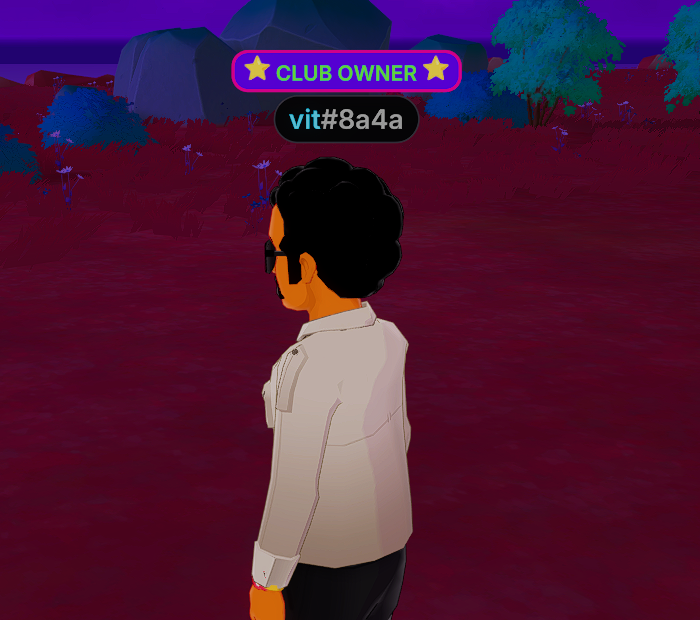

# Avatar Nametags

The `AvatarNametag` component adds a small plate above an avatar's regular nametag, showing text that your scene chooses. Use it to show a rank, a role, a team, or anything else your scene tracks about a player, like "VIP", "Team Red", or "Club Owner".

<figure><figcaption><p>A scene-provided plate above the player's regular nametag</p></figcaption></figure>

This page covers how to add a plate, style it, and keep it in step as players come and go.


**📔 Note**: `AvatarNametag` requires `@dcl/sdk` version 7.28.0 or newer.


## Add a plate to the player

The only required field is `label`, the text to show.

```ts
import { AvatarNametag, engine } from '@dcl/sdk/ecs'

// Show "Club Owner" above the current player's nametag
AvatarNametag.create(engine.PlayerEntity, {
	label: 'Club Owner',
})
```

The plate uses the client's own nametag colors by default, so it matches the rest of the interface without any extra work.


**💡 Tip**: You don't need to wait for the avatar to finish loading before writing the component. If the avatar is still loading, the plate is applied as soon as it's ready.


## Where the component works

`AvatarNametag` only does something on an entity that carries an avatar:

* `engine.PlayerEntity`, the player running the scene.
* Another player's entity, found through their [`PlayerIdentityData`](user-data.md) component.
* An [NPC avatar](npc-avatars.md), meaning any entity with an `AvatarShape` component.

On any other entity the component is ignored.


**📔 Note**: The plate is local to the client that draws it. It is never sent to other players. If you want everyone to see the same plates, every client must run the same logic, based on data all of them can read. See [Plates in multiplayer scenes](#plates-in-multiplayer-scenes).


## Change the colors

Three optional fields take a [Color3](../3d-essentials/color-types.md):

* `labelColor`: the text color. Defaults to the client's native nametag text color.
* `backgroundColor`: the plate's fill. Defaults to the client's native nametag background color.
* `borderColor`: the plate's outline. Defaults to `backgroundColor`, so there is no visible border unless you set it.

```ts
import { AvatarNametag, engine } from '@dcl/sdk/ecs'
import { Color3 } from '@dcl/sdk/math'

// A white label on a dark blue plate, with a light blue border
AvatarNametag.create(engine.PlayerEntity, {
	label: 'Student',
	labelColor: Color3.White(),
	backgroundColor: Color3.create(0.1, 0.2, 0.6),
	borderColor: Color3.create(0.78, 0.85, 1),
})
```

To go back to the native colors for a field, write the component again without that field. Use `createOrReplace` rather than `getMutable`, because replacing the whole component is what clears the fields you left out:

```ts
// Keep the label, drop the custom colors and return to the native look
AvatarNametag.createOrReplace(engine.PlayerEntity, { label: 'Student' })
```

## Remove a plate

Use `deleteFrom` to take the plate away. The avatar's regular nametag is not affected:

```ts
AvatarNametag.deleteFrom(engine.PlayerEntity)
```

## Label behavior

A few details are worth knowing before you pick your label text:

* **Long labels are truncated** with an ellipsis. Keep labels to a word or two.
* **An empty label** (`''`) draws the plate with no text in it.
* **Spaces are kept**, so a label made only of spaces widens a text-less plate. This is a way to size a plain colored plate.
* **To hide the word but keep its width**, set `labelColor` to the same value as `backgroundColor`.


**💡 Tip**: A plate doesn't need any text. To show a color-coded plate alone, for example to mark team membership, set `label` to a string of spaces and pick a `backgroundColor`. More spaces make a wider plate.

```ts
AvatarNametag.createOrReplace(engine.PlayerEntity, {
	label: '      ',
	backgroundColor: Color3.Red(),
})
```


## Tag players as they arrive

The simplest way to tag other players is to attach the component when they enter the scene, using the `onEnterScene` event. It hands you a fresh entity each time, so there is nothing to look up or cache:

```ts
import { onEnterScene } from '@dcl/sdk/players'
import { AvatarNametag } from '@dcl/sdk/ecs'

export function main() {
	onEnterScene((player) => {
		AvatarNametag.createOrReplace(player.entity, { label: 'VIP' })
	})
}
```

See [Get player data](user-data.md) for more on tracking players as they enter and leave.

## Tag every player in the scene

To show a plate over everyone at once, iterate over the entities that have a `PlayerIdentityData` component.

Collect the entities into an array **before** writing to them. Writing a component while still looping over `engine.getEntitiesWith()` can invalidate the query part-way through.

```ts
import { AvatarNametag, engine, Entity, PlayerIdentityData } from '@dcl/sdk/ecs'

const LABELS = ['Blue Team', 'Red Team']

function tagAllPlayers() {
	// 1. Collect first
	const players: { entity: Entity; address: string }[] = []
	for (const [entity, identity] of engine.getEntitiesWith(PlayerIdentityData)) {
		players.push({ entity, address: identity.address.toLowerCase() })
	}

	// Sorting by address makes every client reach the same result,
	// no matter what order the players joined in
	players.sort((a, b) => a.address.localeCompare(b.address))

	// 2. Then write, but only when the label actually changes
	players.forEach(({ entity }, index) => {
		const label = LABELS[index % LABELS.length]
		if (AvatarNametag.getOrNull(entity)?.label === label) return
		AvatarNametag.createOrReplace(entity, { label })
	})
}
```

Comparing against the current value before writing avoids needless component updates on every pass.

### Keep up with players joining and leaving

Player entity ids are **not stable across disconnects**. When a player leaves, their entity id is recycled and may be handed to the next player who joins, so a plate written to a stale entity ends up over the wrong avatar.

Two rules keep this correct:

* Resolve the entity anew right before **every** write, rather than caching the entity.
* Remove the component when a player leaves.

Re-running the tagging function on a timer catches players who join later and never holds on to stale entities. Once a second is frequent enough:

```ts
let timer = 0

engine.addSystem((dt: number) => {
	timer += dt
	if (timer < 1) return
	timer = 0
	tagAllPlayers()
})
```

## Plates in multiplayer scenes

Plates are local to each player's client. The plate is never sent to other players, each player's copy of the scene computes its own plates. If all players should see the same tags, the logic that assigns them must produce the same result on every client from data they all share. Sorting players by wallet address, as in the example above, is one way to do that. Otherwise, your scene needs to sync the assignments itself, see [Serverless multiplayer](../networking/serverless-multiplayer.md).

## Interaction with hidden nametags

An [`AvatarModifierArea`](player-avatar.md#hide-nametags) with the `AMT_HIDE_NAMETAGS` modifier hides these plates along with the regular nametags. The same applies to `AMT_HIDE_AVATARS`, which hides the whole avatar.

If you want an avatar to show **only** your plate and no name underneath it, set the `AvatarShape` component's `name` to an empty string. See [NPC Avatars](npc-avatars.md#add-a-label-above-the-name).

## Related pages

* [Player Avatar](player-avatar.md): move, hide, and modify the player's avatar.
* [NPC Avatars](npc-avatars.md): show avatars that aren't players.
* [Get player data](user-data.md): read data about the player and everyone else in the scene.
* [Color types](../3d-essentials/color-types.md): how to build `Color3` values.
