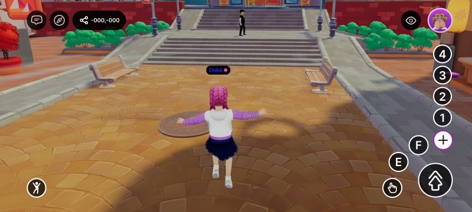
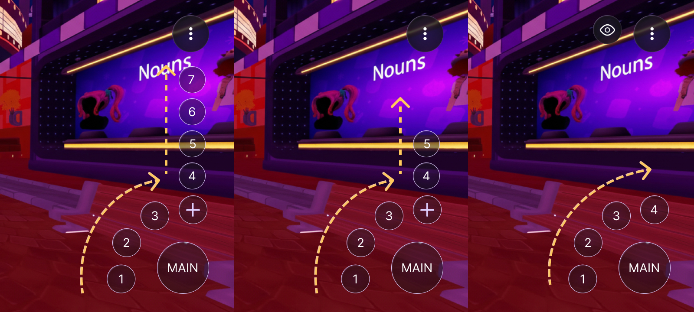
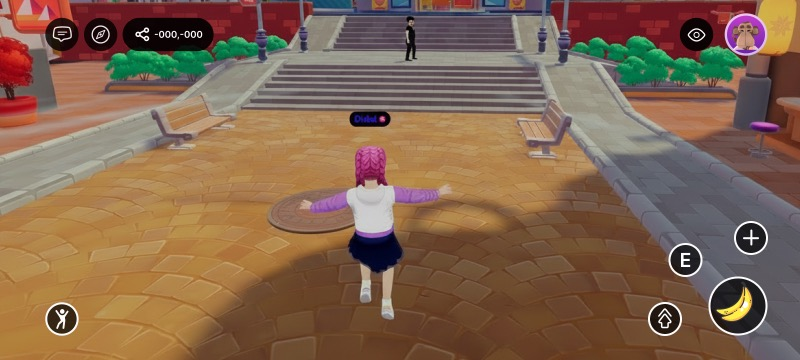

# On-screen Controls

On the mobile client, players interact with your scene through a set of native on-screen controls — a virtual joystick, a crosshair, and a gamepad of buttons. The `TouchScreenControls` component lets your scene reshape that HUD: declutter it, hide the joystick or crosshair, change what the large central button does, swap a button's glyph for your own icon, or hide buttons entirely and replace them with your own UI.

<figure><figcaption><p>The default on-screen controls, before any customization</p></figcaption></figure>


The component is applied automatically while the player is inside your scene and reverts to the defaults (nothing hidden, jump as the central button) the moment they leave — so scenes that don't use it are unaffected. It only affects platforms with native on-screen controls: it's a no-op on desktop and has no effect in VR.


## How the button layout works

The gamepad buttons form a single **priority stack**. The order is fixed:

1. `IA_JUMP`
2. `IA_POINTER`
3. `IA_PRIMARY` (E)
4. `IA_SECONDARY` (F)
5. `IA_ACTION_3` (1)
6. `IA_ACTION_4` (2)
7. `IA_ACTION_5` (3)
8. `IA_ACTION_6` (4)

The on-screen positions are fixed too. The **visible** buttons fill those positions from the top of the stack down — so what you change is *which* buttons are visible and *which one leads*, not their order.

| When you… | The controls… |
| --- | --- |
| **Hide a button** (any button, including jump) | Every lower-priority button moves up to fill the gap. Hide jump and `IA_POINTER` takes the central spot. |
| **Leave the stack alone** | The first button (`IA_JUMP`) is the large central button; the next buttons fill the surrounding slots. |
| **Set a main button** with `mainAction` | That action jumps to the front and becomes the central button; every other button keeps its normal order. |
| **Set a main button that is also hidden** | Hiding wins — the button stays hidden. |
| **Leave 5 or fewer buttons visible** | All of them show directly (the central button plus up to four around it); there is no "+" menu. |
| **Leave more than 5 buttons visible** | The "+" takes the last slot, so four show directly (the central button plus three) and the rest sit behind the "+" overflow toggle. |

<figure><figcaption><p>How the buttons reflow with the visible count. <strong>Left (7 buttons):</strong> the main button, an arc of 1–3, and the "+" holding the overflow (4–7) in a column that climbs upward. <strong>Center (5 buttons):</strong> the same arc, with a shorter overflow column (4–5) behind the "+". <strong>Right (4 buttons):</strong> all four show directly and the "+" disappears.</p></figcaption></figure>


This is also how you surface the `1`/`2`/`3`/`4` buttons, which are otherwise tucked behind the "+": hide enough higher-priority buttons to bring the visible count to five or fewer, and they show directly.


## Common tasks

`TouchScreenControls` ships a set of convenience helpers. Each one writes the component onto the scene's `RootEntity` (where the client reads it) and merges with the current value, so you can call them from anywhere.

**Change the main button** — make the large central button trigger a different action:

```ts
import { TouchScreenControls, InputAction } from '@dcl/sdk/ecs'

export function main() {
	TouchScreenControls.setMainAction(InputAction.IA_PRIMARY)
}
```

**Hide the joystick or crosshair** — remove the movement stick and/or the aiming reticle:

```ts
TouchScreenControls.hideJoystick()
TouchScreenControls.hideCrosshair()
```

**Hide specific buttons** — pass the actions you want gone (the rest cascade up):

```ts
TouchScreenControls.hide([InputAction.IA_SECONDARY, InputAction.IA_JUMP])
```

**Hide or show every button** — clear the HUD, or reset it:

```ts
TouchScreenControls.hideAll()
TouchScreenControls.showAll()
```

**Replace a button's icon** — for full control (custom icons, several changes at once), write the raw component on `engine.RootEntity`:

```ts
import { engine, TouchScreenControls, InputAction } from '@dcl/sdk/ecs'

export function main() {
	TouchScreenControls.createOrReplace(engine.RootEntity, {
		hideCrosshair: true,
		mainAction: InputAction.IA_PRIMARY,
		touchInputs: [
			{
				inputAction: InputAction.IA_PRIMARY,
				icon: { tex: { $case: 'texture', texture: { src: 'images/grab.png' } } },
			},
		],
	})
}
```

The helpers at a glance:

| Helper | What it does |
| --- | --- |
| `setMainAction(action)` | Sets which action the large central button triggers. |
| `hideJoystick()` | Hides the native virtual joystick. |
| `hideCrosshair()` | Hides the on-screen crosshair / reticle. |
| `hide(actions)` | Hides the given gamepad buttons (merged into the current config). |
| `hideAll()` | Hides every gamepad button. |
| `showAll()` | Shows every gamepad button (clears the hide list). |

## Properties

Write these directly when you use `createOrReplace`:

| Property | Type | Description |
| --- | --- | --- |
| `hideJoystick` | _boolean_ | Hides the native virtual movement joystick. |
| `hideCrosshair` | _boolean_ | Hides the on-screen crosshair / reticle. |
| `mainAction` | [_InputAction_](button-events/click-events.md#pointer-buttons) | Moves this action to the front of the stack, making it the large central button; the other buttons keep their order. Only gamepad actions are valid (see below). When unset, the first visible button (`IA_JUMP` by default) leads. See [How the button layout works](#how-the-button-layout-works). |
| `touchInputs` | _array_ | Per-button overrides. A button that isn't listed keeps its default (shown, with its default glyph). |

Each `touchInputs` entry has:

| Field | Type | Description |
| --- | --- | --- |
| `inputAction` | [_InputAction_](button-events/click-events.md#pointer-buttons) | Which on-screen button this entry configures. |
| `hide` | _boolean_ | Hides this button. Default is `false` (shown). Any button can be hidden, **including `IA_JUMP`** — the rest cascade up to fill its place. |
| `icon` | [_TextureUnion_](../2d-ui/ui_background.md#background) (optional) | Overrides the button glyph with a scene image. Use the `texture` variant with a content-mapped `src` (an image included in your scene) — `{ tex: { $case: 'texture', texture: { src: 'images/grab.png' } } }`. Only scene-content paths are supported (not external URLs, avatar or video textures). For the jump button this replaces all of its dynamic states (jump / double-jump / glide). If the path can't be resolved, the built-in glyph is used. |

## Which actions map to which buttons

The [`InputAction`](button-events/click-events.md#pointer-buttons) values here are the same ones used across [Input on mobile](../building-for-mobile/input-on-mobile.md) and [Click events](button-events/click-events.md). These are the actions that map to on-screen buttons:

| InputAction | On-screen button |
| --- | --- |
| `IA_JUMP` | The large central button (default) |
| `IA_POINTER` | The interaction button |
| `IA_PRIMARY` | The E button |
| `IA_SECONDARY` | The F button |
| `IA_ACTION_3` / `IA_ACTION_4` / `IA_ACTION_5` / `IA_ACTION_6` | The 1 / 2 / 3 / 4 buttons |


`IA_ANY` and `IA_MODIFIER` are meta values — they don't map to a button and can't be used here.


## Example

To hide the joystick and crosshair, remove the F button, and make the central button fire `IA_PRIMARY` with a custom icon shipped in your scene:

```ts
import { engine, TouchScreenControls, InputAction } from '@dcl/sdk/ecs'

export function main() {
	TouchScreenControls.createOrReplace(engine.RootEntity, {
		hideJoystick: true,
		hideCrosshair: true,
		mainAction: InputAction.IA_PRIMARY,
		touchInputs: [
			{ inputAction: InputAction.IA_SECONDARY, hide: true },
			{
				inputAction: InputAction.IA_PRIMARY,
				icon: { tex: { $case: 'texture', texture: { src: 'images/grab.png' } } },
			},
		],
	})
}
```

<figure><figcaption><p>The result: a central button re-iconed and re-mapped to the primary action</p></figcaption></figure>

To replace the native controls entirely, hide them here and build your own touch buttons with [UI Input Binding](../2d-ui/ui_input_binding.md).

## Related

* [UI Input Binding](../2d-ui/ui_input_binding.md)
* [Input on mobile](../building-for-mobile/input-on-mobile.md)
* [Click events](button-events/click-events.md)
* [Detect the platform from code](../building-for-mobile/detect-platform.md)
