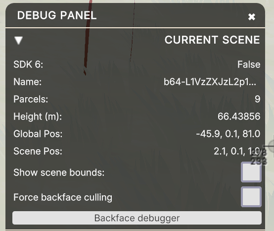
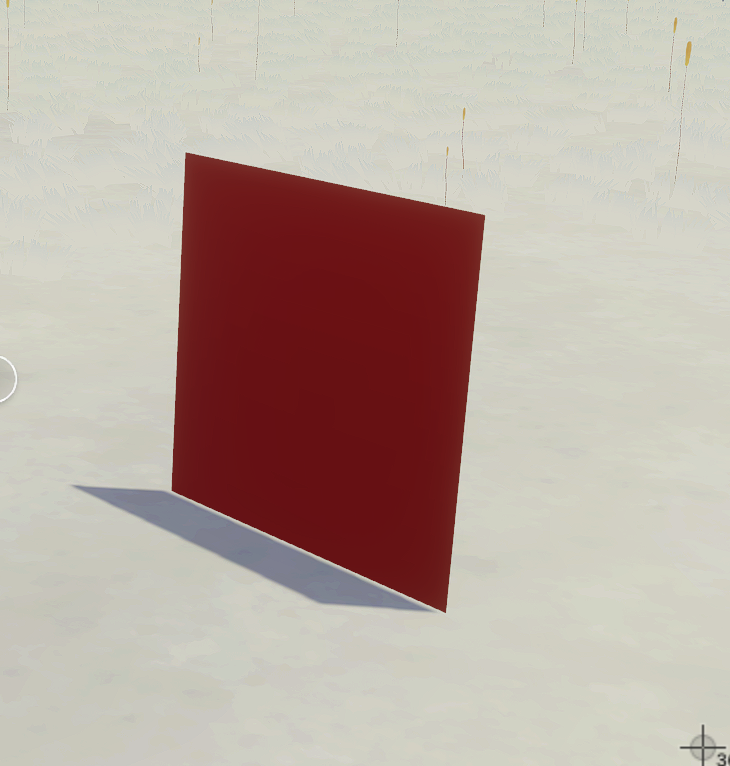
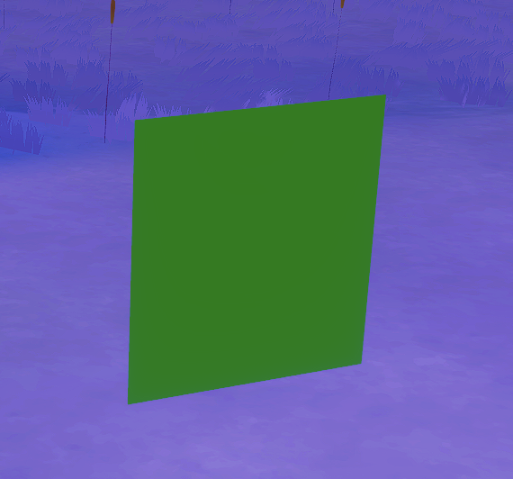
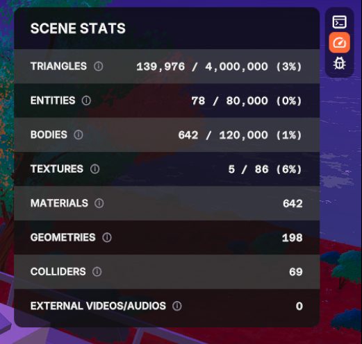

# Performance Optimization

There are several aspects you can optimize in your scenes to ensure the best possible experience for players who visit them. This document covers some best practices that can make a big difference in how fast your scene loads and how smoothly it runs for players that are on it or on neighboring scenes.

Keep in mind that many players may be visiting Decentraland using hardware that is not built for gaming, via the browser, or from the [mobile app](../../build-for-mobile/mobile-client/overview.md) on a phone — all of which limit how much processing power is available to your scene. The experience of visiting your scene should be smooth for everyone.



Check out [Useful Resources](../getting-started/useful-resources.md) for tools that can help, like the Decentraland Scene Optimizer, which extracts, deduplicates, and compresses textures from your scene's 3D models.


**📱 Mobile**: Mobile devices are usually the most resource-constrained client. If your scene targets mobile players, also see [Building for Mobile](../../build-for-mobile/mobile-client/overview.md) for mobile-specific guidance.


The Decentraland explorer enforces many optimizations at engine level. These optimizations make a big difference, but the challenge of rendering multiple user-generated experiences simultaneously in a browser is a big one. We need your help to make things run smoothly.

## Timing

### Video playing

Playing videos is one of the most expensive things for the engine to handle. If your scene includes videos, make sure that only _ONE_ VideoTexture is in use at a time. You can have dozens of planes sharing the same VideoTexture without significant impact on performance, but as soon as you add a second VideoTexture, its effects on framerate become very noticeable.

You should also avoid having videos playing in regions where they can't be seen. For example, if you have a screen indoors, toggle the video using a trigger area based on when the player walks in and out.


**💡 Tip**: A trick several scenes have used is to stream a single video with multiple regions that are mapped differently to different planes. Each video screen uses [UV mapping](../3d-essentials/materials.md#using-textures) to only show a distinct part of the VideoTexture. Thanks to this, it can appear that there are separate videos playing without the cost of multiple VideoTextures.



**💡 Tip**: When players are standing outside your scene, VideoTextures are not updated on every frame. This helps reduce the impact for surrounding scenes. It's nevertheless ideal only turn on the playing of any videos when players [step inside your scene](../interactivity/event-listeners.md#player-enters-or-leaves-scene) .


### Lazy loading

If your scene is large, or has indoor areas that are not always visible, you can choose to not load the entire set of entities from the very start. Instead, load the content by region as the player visits different parts of the scene. This can significantly reduce the load time of the scene, and also the amount of textures and 3D content that the engine needs to handle on every frame.

For example, the main building of a museum could load from the start, but the paintings on each floor only load for each player as they visit each floor.

See [this example scene](https://github.com/decentraland-scenes/lazy-loading) for how that might work.

For the best result in terms of avoiding hiccups, hide entities by switching their shape's `visible` property to false. With this approach, you add them to the engine when creating them, but you simply don't make their models visible.

An alternative is to not add the entities to the engine until needed. This may result in some hiccups when the entities appear for the first time, and they might also take a couple of seconds to become visible. The advantage of this approach is that it's a valid way to get around the [scene limitations](../optimizing/scene-limitations.md). Keep in mind that the scene limitations count is for the content that is being rendered in the scene at any given time, not for the total content that could be rendered. Loading and unloading parts of the scene should allow you to work around those limitations.


**📔 Note**: Entities that are not visible but are added to the engine do count towards the scene limitations.


You can also toggle animations on or off for entities that are far or occluded. For example, for an NPC that plays a very subtle idle animation, you could make it only play that animation when the player is at less than 20 meters away. Use a trigger area around the NPC and toggle its animations on or off accordingly.


**💡 Tip**: When an entity is far away and small enough, it's culled by the engine. This culling helps at a drawcall level, removing entities from the engine is always better. This culling also doesn't take occlusion by other entities into account, so entities that are not so small but hidden by a wall are still rendered.


### Async blocks

Blocks of [async code](../programming-patterns/async-functions.md) don't block the progress of everything else while they wait: the scene keeps running, and the async block resumes when its awaited response arrives. Note that scenes run on a single thread, so this isn't parallel processing, it just avoids stalling the scene while waiting for external responses.

Any processes that rely on responses from asynchronous services, such as `getPlayerData()` or `getRealm()` should always run in async blocks, as they otherwise block the rest of the scene's loading while waiting for a response. The same applies to any calls to third party servers.

Note that the scene will be considered fully loaded when everything that isn't async is done. Async processes might still be running when the player enters the scene. Avoid situations where an async process results in the loading of an entity that could potentially get the player stuck inside of its geometry.

### Rely on Events

Try to make the scene's logic rely on listening to [events](../interactivity/event-listeners.md) as much as possible, instead of running checks every frame.

The `update()` function in a [system](../architecture/systems.md) runs on every frame, 30 times per second (ideally). Avoid doing recurring checks if you can instead subscribe to an event.

For example, instead of constantly checking the player's wearables, you can subscribe to the `onProfileChanged` event, and check the player's wearables only when they've changed.

If you must use a system, avoid doing checks or adjustments on every single frame. You can include a timer as part of the update function and only run the check once per every full second, or whatever period makes sense.

## Optimize 3D models

There are several ways in which your 3D models can be optimized to be lighter.

When working with the [Creator Hub](../../scene-editor/get-started/editor-installation.md), you can see stats about the resources used by 3D models in your scene, and if they pass any of the [scene limitations](../optimizing/scene-limitations.md).


You can expand this menu to view details.


Here are some tips for improving on these metrics:

- When possible, share textures across 3D models. A good practice is to use a single texture as an atlas map, shared across all models in the scene. It's better to have 1 large shared texture of 1024x1024 pixels instead of several small ones.

  > Note: Avoid using the same image file for both the albedo texture and the normal map or the emissive map of a material. Use separate files, even if identical. Assigning a same image file to different types of texture properties may introduce unwanted visual artifacts when compressed to asset bundles.

- _.glb_ is a compressed format, it will always weigh less than a _.gltf_. On the other hand, with _.gltf_ it's easy to share texture images by exporting textures as a separate file. You can have the best of both worlds by using the [following pipeline](https://github.com/AnalyticalGraphicsInc/gltf-pipeline), that allows you to have _.glb_ models with external texture files.
- Avoid using blended transparencies. Blended transparencies have to bypass quite a few of the rendering optimizations. If possible, favor opaque or alpha tested geometry.
- Avoid skinned meshes. They can drag down the performance significantly.


**💡 Tip**: Read more on 3D model best practices in the \[3D Modeling Section]\(/creator/3d-modeling/3d-models


### Reusing the same model many times

Scenes are often full of repeated content: lamp posts along a street, chairs in a room, trees in a park. The best way to build these is the simplest one — **give each copy its own entity, and point them all at the same _.glb_ file.**

```ts
// GOOD: one file, many entities
for (const position of lampPostPositions) {
  const lampPost = engine.addEntity()
  Transform.create(lampPost, { position })
  GltfContainer.create(lampPost, { src: 'assets/scene/lampPost.glb' })
}
```

The engine recognizes that these entities share a source. The file is downloaded once, converted to asset bundle once, and its meshes and textures are held in memory once — the twentieth lamp post costs almost nothing beyond its own position in the world. This also works across scenes: if a neighboring scene uses the same file, it's already in memory. Exporting twenty near-identical _.glb_ files instead means twenty downloads and twenty copies in memory.

What this **doesn't** save is draw calls. Twenty lamp posts are twenty objects to draw, whether they come from twenty entities or from a single _.glb_ that contains twenty lamp posts modeled into it. The only way to reduce that count is to join the meshes in your modeling tool, which is a real trade-off — see [Instancing vs Duplicating vs Merging](../../3d-modeling/meshes.md#instancing-objects-vs-duplicating-objects) for when it's worth it.

A few related tips:

* **Group into clusters rather than one giant model.** If you have a lot of scattered props, a good middle ground is one _.glb_ per group — a block of a street, a room's worth of furniture — instead of either one model per prop or one model for the whole scene. You cut down the number of objects while keeping each cluster small enough for culling to still do something useful.
* **Spawning many copies at once?** Pre-load the model first with the [`AssetLoad` component](pre-load-resources.md). The copies are then created from a model that's already in memory, instead of each one waiting on the same download. Building each copy still takes work, so a large burst can cost you a frame either way — pre-loading removes the wait for the file, not the cost of creating the copies.
* **One very large model is harder on the engine than many small ones.** The engine spreads the work of building your scene across frames to avoid stutters, but it can't split up a single huge model — that lands in one frame. Many smaller pieces load in smoothly; one monolithic piece is more likely to cause a visible hiccup.
* **Repeating a model doesn't introduce new textures or geometry.** Twenty lamp posts built from one model share that model's meshes and textures rather than adding to the set — the twentieth costs nothing in texture memory. Materials are the exception: the engine creates a material instance per rendered object in order to apply your scene's boundary clipping, so the material count follows the number of objects you render, not the number of models you use. Those instances still share the same textures and shader variants, so they cost a little memory rather than frame time. What pushes a scene against the texture [limit](scene-limitations.md) is having many *different* models, each with its own bespoke set — so consolidating your scene around a smaller library of reused models helps there.

### Backface Culling

For performance optimization, Backface Culling will be set to **On** on **all** model's materials once rendered in the engine, independently of their settings.

If you expect to see the backface or insides of your models, duplicate the faces and invert the normals.

#### Troubleshooting

To verify if a scene has material Backface Culling issues, follow these steps:

1. Open up the `debug` panel in the scene.

- If the scene is published, type `/debug` command in the chat.
- If you are on Preview mode in the scene., click the Bug icon () located in the top-right corner of the screen.

2. The debug panel will appear in the bottom-right corner of the screen.

3. Under **Current Scene**, click the **Backface debugger** button.



4. Toggle **Force Backface Culling**: It shows the materials rendered with Backface Culling On. This is the actual rendering once the Optimization is in production. Toggle On & Off to spot materials that need fixing.

5. Toggle the **Backface debugger** to easily spot materials that have Backface Culling Off. It highlights:

- **Red**: Materials that don't have Backface Culling set to **On**.
- **Green**: Materials with Backface Culling **On**.

<p align="center">
  
  
  <br/>
  <em>Material with Backface Culling Off (left) vs. Backface Culling On (right)</em>
</p>

### Asset Bundle conversion

Every time you publish a scene, the Decentraland content servers compress every _.gltf_ and _.glb_ model in it to asset bundle format. This format is _significantly_ lighter, making scenes a lot faster to load and smoother to run. The conversion starts immediately after each deployment. It usually takes around 15 minutes, but plan for 30 to 60 minutes until the converted scene is reliably playable by everyone, as the conversion runs separately for each platform and may be queued behind other scenes. You can [check the conversion status](../../scene-editor/publish/publish-scene.md#check-the-conversion-status) of your scene directly.

You can also run this same conversion locally while developing your scene. This makes your preview smoother and lets you check for any issues with the compressed models before publishing. See [Preview with optimized assets](../getting-started/preview-scene.md#preview-with-optimized-assets).


**💡 Tip**: When planning an event in Decentraland, publish your final version at least 2 hours in advance, so that the models are all converted to asset bundles by then. If you don't want to spoil the surprise before the event, you can deploy a version of your scene that includes all the final 3D models in the project folder, but where these are not visible or where their size is set to 0.



**📔 Note**: If you make _any_ change to a 3D model file, even if just a name change, it will be considered a new file, and must be converted to asset bundle format again.


## Connectivity

If your scene connects to any 3rd party servers or uses the [messagebus](../networking/serverless-multiplayer.md#send-explicit-messagebus-messages) to send messages between players, there are also some things you might want to keep in mind.

- Your scene should only have one active WebSockets connection at a time.
- HTTP calls are funneled by the engine so that only one is handled at a time. Any additional requests are queued internally and must wait till other requests are completed. This queuing process is handled automatically, you don't need to do anything.
- When using the [messagebus](../networking/serverless-multiplayer.md#send-explicit-messagebus-messages) to send messages between players, be mindful that all messages are sent to all other players in the server island. Avoid situations where an incoming message directly results in sending another message, as the number of messages can quickly grow exponentially when there's a crowd in the scene.

## Scene UI

Scene UIs can become costly to render when they are made up of many individual elements. Keep in mind that each UI element requires a separate drawcall on the engine.


**💡 Tip**: Try to merge multiple elements into one single image. For example if you have a menu with multiple text elements, it's ideal to have the text from the tiles and any additional images baked into the background image. That saves the engine from doing one additional drawcall per frame for each text element.


Avoid making adjustments to the UI on every frame, those are especially costly and can end up getting queued. For example, if there's a health bar in your UI that should shrink over period of time, players would probably not notice a difference between if it updates at 10 FPS instead of at 30 FPS (on every frame). The system that updates this bar can use a brief timer that counts 100 milliseconds, and only affect the UI when this timer reaches 0.

Avoid having many hidden UI elements, these also have an effect on performance even if not being rendered. When possible, try to create UI components on demand.

## Landscape terrain in Worlds

Scenes published to a [Decentraland World](../../worlds/about.md) are surrounded by an auto-generated landscape of grassland, trees, and sea. Rendering this landscape consumes part of the player's rendering budget. If your scene doesn't need it, you can [disable the landscape terrain](../projects/scene-metadata.md#landscape-terrain) in your `scene.json` to free up those resources for your scene's own content.

## Monitor Performance

The best metric to know how well a scene is performing is the FPS (Frames Per Second). In preview, you can see the current scene FPS in the debug panel. You should aim to always have 30 FPS or more.

In the deployed scene, you can toggle the panel that shows these metrics by writing `/showfps` into the chat window.

### Scene Stats panel

When running a scene in preview on the desktop client, you can open a panel that shows live stats about the content in your scene. Click the stats icon in the top-right corner of the screen, next to the console and debug icons.



The panel counts the scene's triangles, entities, bodies, and textures against their limits, showing what percentage of each budget is in use. A value turns orange once it reaches 80% of its limit. It also shows plain counts of materials, geometries, colliders, and external videos or audios. Hover over the info icon next to each metric for an explanation of what it counts and why it matters.

The numbers update in real time as content loads and unloads, which makes the panel handy for checking how strategies like [lazy loading](performance-optimization.md#lazy-loading) affect what the engine is actually handling at any given moment. See [scene limitations](scene-limitations.md) for details on each limit. Keep in mind these are soft limits: exceeding one won't block your scene, but it can degrade performance for players.

### Messages between the scene and the engine

One of the main bottlenecks in a scene’s performance is usually the sending of messages between the scene’s code and the engine.

When you run a scene in preview, note that on the top-right corner it says “Y = Toggle Panel”. Hit Y on the keyboard to open a panel with some useful information that gets updated in real time.

As you interact with things that involve messages between the SDK and the engine, you’ll notice the ‘Processed Messages’ number grows. You should closely watch the ‘Pending on Queue’ number, it should always be 0 or close to 0. This tells you how many of these messages didn't get to be processed, and got pushed to a queue. If the ‘Pending on Queue’ count starts to grow, then you’ve entered the danger zone and should think about doing more optimizations to your scene.


**📔 Note**: Don’t keep the panel open while you’re not using it, since it has a negative impact on performance.


Keep in mind that the performance you experience in preview may differ from that in production:

- Surrounding neighboring scenes might have a negative impact
- The compression of the scenes' 3D models into asset bundles can have a positive impact
- Some players visiting your scene may be running on less powerful hardware

It's always a good practice to try deploying your scene first to a [Decentraland World](../publishing/publishing-options.md#decentraland-worlds) to do some more thorough testing.

Always ask players for feedback. Never take for granted that how you experience the scene is the same for everyone else.

## Optimize with AI

An AI agent can handle much of the measuring and fixing described on this page for you. Decentraland provides [AI skills](../getting-started/vibe-coding.md#install-skills-for-any-ai-agent) that teach coding agents (like Claude Code or Cursor) how to optimize scenes, and the desktop client includes an [MCP server](../getting-started/vibe-coding.md#let-the-ai-see-your-scene-in-world) that lets the agent inspect and measure your running scene directly.

With the `optimize-scene` and `unity-explorer-mcp` skills installed and the MCP server connected, an agent can:

- **Check the scene against its content budgets**: it reads the same live stats as the Scene Stats panel and compares them to the [scene limitations](scene-limitations.md), so it can tell you which budget is running tight.
- **Find the assets responsible**: it ranks the 3D models in your scene by how many triangles, materials, and draw calls each one contributes, including what's visible from a specific viewpoint, so it knows exactly which models to optimize first.
- **Measure the real frame rate**: it positions the player at any spot in the scene and samples the FPS a player actually experiences there, including momentary stutters.
- **Verify its own work**: after each change it can re-measure, so its recommendations and fixes are backed by real numbers instead of guesses.

This turns optimization into something you can simply ask for:

> "Check if my scene is within limits, find whatever is dragging the frame rate down near the spawn point, fix it, and show me before and after numbers."

### Combine with the Blender MCP server

The Decentraland tools tell the agent which models are the heaviest, but they don't edit the models themselves. To go further, you can try combining them with the [Blender MCP server](https://www.blender.org/lab/mcp-server/), which gives the agent access to Blender's editing tools. This allows the agent to open a heavy model in Blender, reduce its triangle count, merge its materials, or shrink its textures, and export the result back into the scene as a `.glb` file, where it can then re-measure the frame rate in-world.

Keep in mind that automated mesh edits can visibly change how a model looks, so always review the results and keep backups of your original files.
