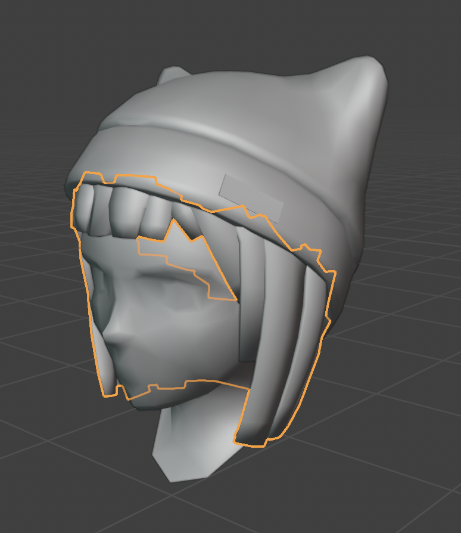
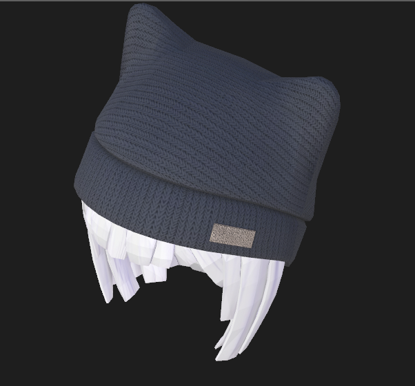

# Blender for Beginners: Making your first Decentraland Wearable

This series of tutorials will guide you through the complete process of creating and publishing a wearable, from start to finish. The tool you will be using is Blender, and no prior experience is required.

KJ Walker will take you on this adventure, going from Blender Essentials to advanced concepts in an interactive yet profound way. You can find more information about her and Low Poly Models [here](https://www.lowpolymodelsworld.com/)

The series are divided into 6 different Parts. This page will continue to be updated as each part of the series is uploaded.

## Index

* [Part 1: Making your first Hat](#part-1)
* [Part 2: ](#part-2)

## Part 1: Making your first Hat



In this first video, we’ll start from square one. You’ll learn what Blender is, how to download it, and how to confidently navigate the interface using a provided project file. By the end of this lesson, you’ll be comfortable moving around Blender and making simple edits to your first 3D object.

Key concepts featured in this video: 

* Navigate the Blender interface
* Move, scale, and rotate objects
* Apply simple materials and change colors
* Export and import files

### Blender files you'll Need

* [Download Blender and GLB files (Wearable Hat ZIP)](https://github.com/decentraland/docs/raw/refs/heads/main/resources/BlenderForBeginnersPart1.zip
)

## Part 1: Making your first Hat



In this first video, we’ll start from square one. You’ll learn what Blender is, how to download it, and how to confidently navigate the interface using a provided project file. By the end of this lesson, you’ll be comfortable moving around Blender and making simple edits to your first 3D object.

Key concepts featured in this video: 

* Navigate the Blender interface
* Move, scale, and rotate objects
* Apply simple materials and change colors
* Export and import files

### Blender files you'll Need

* [Download Blender and GLB files (Wearable Hat ZIP)](https://github.com/decentraland/docs/raw/refs/heads/main/resources/BlenderForBeginnersPart1.zip
)

## Part 2: Making your first Hat



### Blender files you'll Need

* [Download Blender and GLB files (Wearable Hat Number 2 ZIP)](https://github.com/decentraland/docs/raw/refs/heads/main/resources/BlenderForBeginnersPart2.zip
)

