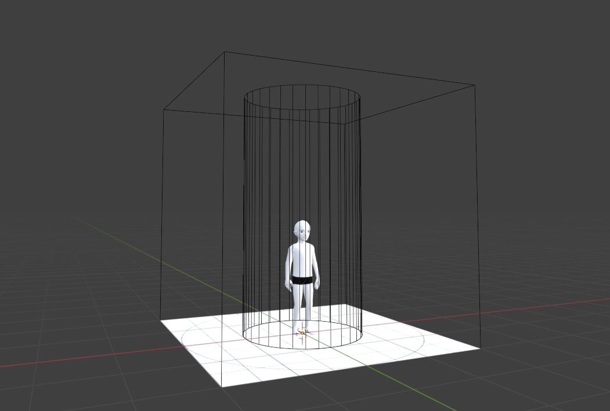
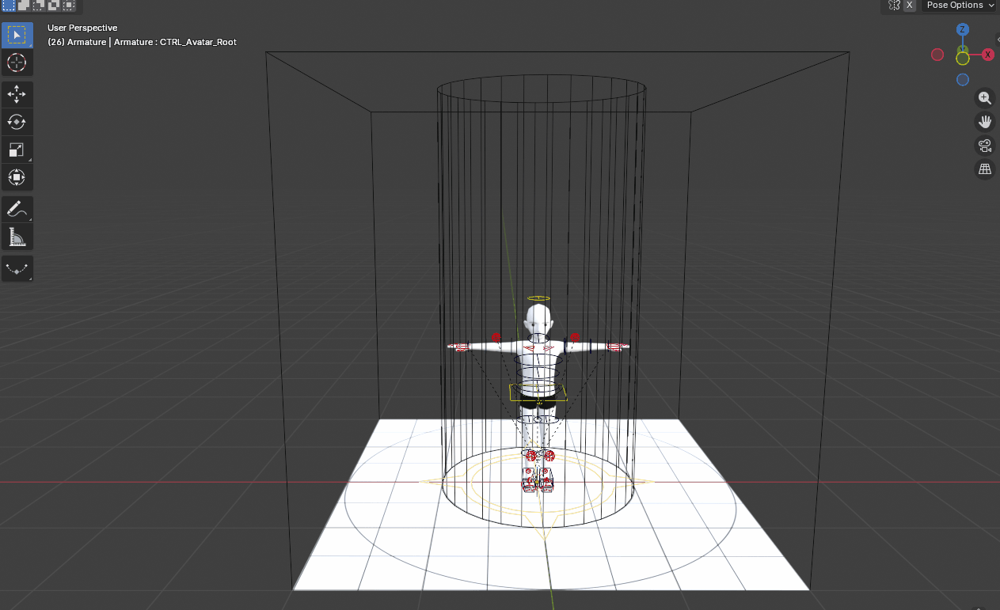
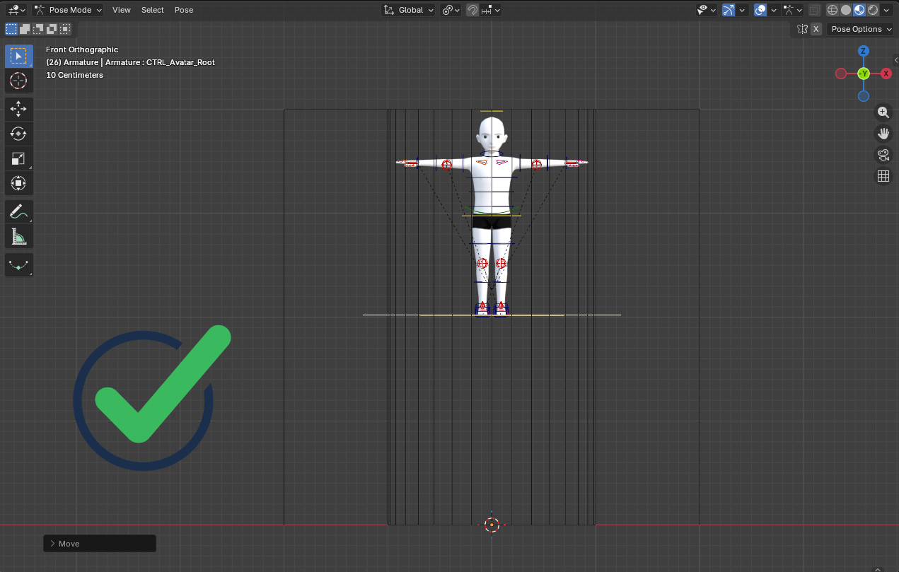
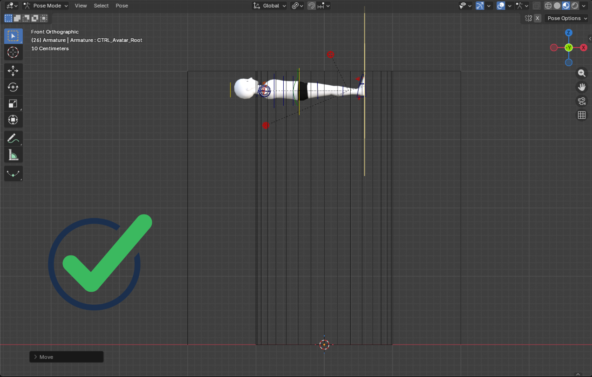
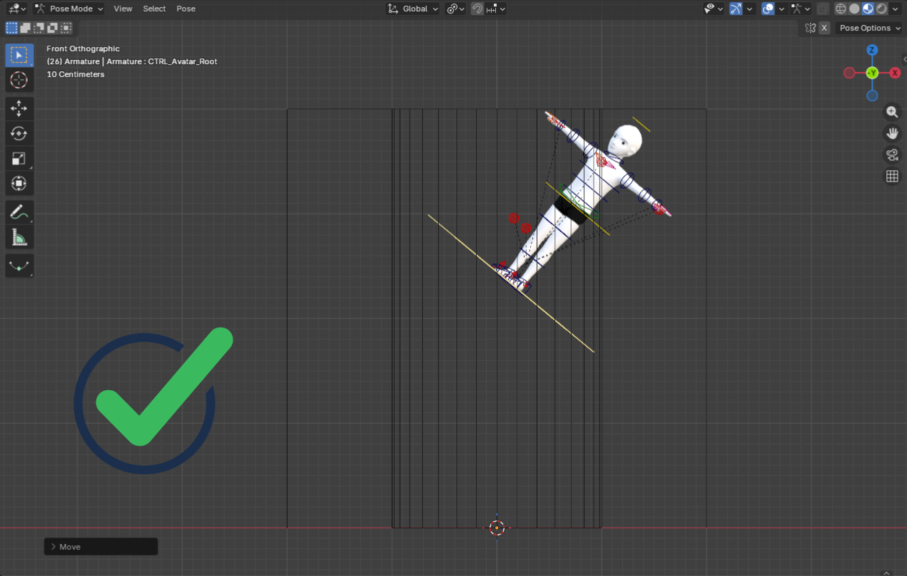
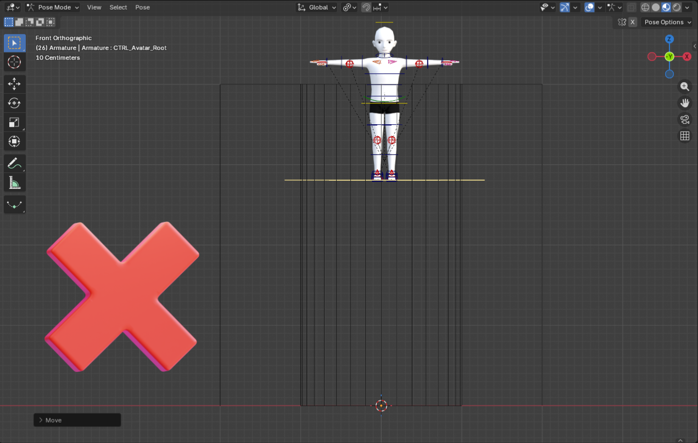
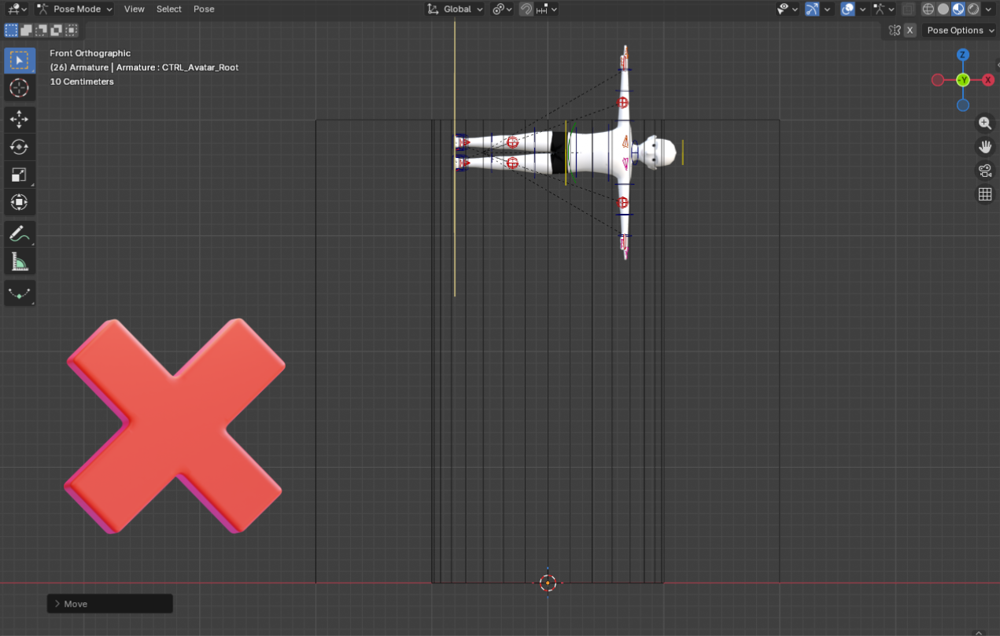
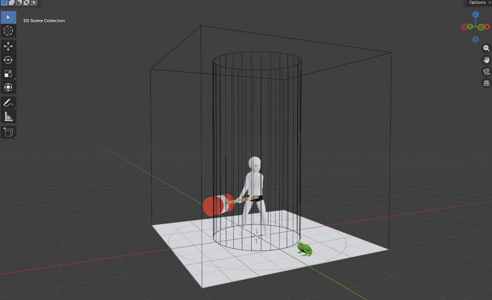
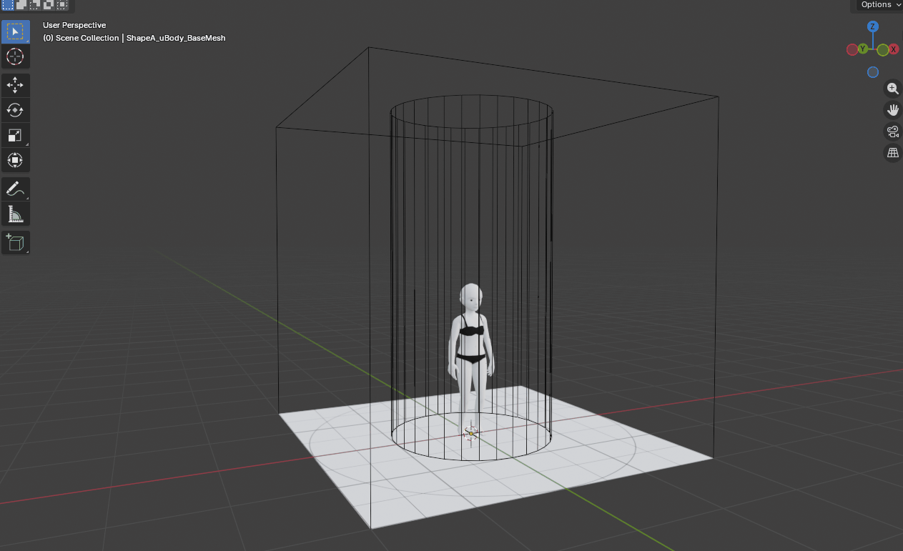
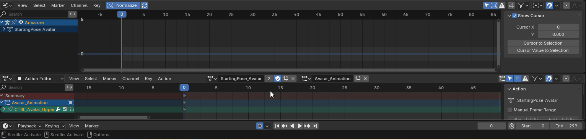

# Creating Emotes

This documentation will cover the file specifications, the basics of animation in Blender, the proper way to export an Emote, and how to import one into the Builder.


**💡 Tip**: Install the [Decentraland Tools Blender plugin](https://extensions.blender.org/add-ons/decentraland-tools/). It includes several handy functions to help you edit and export 3D models, wearables, and emotes.


#### Animation Specs Chart

| Frame Rate             | 30 fps                           |
| ---------------------- | -------------------------------- |
| Max Length             | 10 seconds (300 frames)          |
| Animations per File    | 1                                |
| Export Format          | .glb                             |
| Sampling Rate          | 1 by default (2 or 3 if needed)  |
| Max File Size          | 1 MB                             |
| Max Animation Distance | 1 meter (front/back, left/right) |
| Max Animation Height   | 4 meter                          |

You can find a more detailed explanation of the animation specifications [**below**](creating-emotes.md#the-animation-specifications).

### **Resources**

This documentation explains the set up for Rig 1.0, its controls, and features.

[Decentraland Blender Rig](https://github.com/decentraland/docs/blob/main/creator/images/emotes/Avatar_File.blend)


If you're using Maya you can download this [Maya Rig](https://github.com/decentraland/docs/blob/main/images/emotes/DCL_Maya_Rig.ma) and [picker](https://github.com/decentraland/docs/blob/main/images/emotes/emoteAvatar.pkr) provided by [SparkleStudios](https://www.sparkles.studio/) ❤️.


## **Before Starting**

### **Frame Rate**

Before getting started, it’s important to check the frame rate. Decentraland’s animations must have a frame rate of 30 fps. The rig file provided probably has that set up, but since Blender’s default value is 24 fps, it is best to double check before starting (a wrong frame rate will affect the speed of the animation). That option can be found in Output Properties (the printer icon) under Format, as shown below:

Make sure the framerate is set to 30 fps before starting.

### **Pose Mode**

In Blender, a rig can be viewed in three different modes: Object Mode, Edit Mode, and Pose Mode. Animations can only be done in Pose Mode (in that mode, controls have colors). With the rig selected, you’ll find that option in a dropdown menu, at the top right.

Changing to Pose Mode.

### **Interface for Animations**

In the rig file, other than the two windows for the viewport (front and side view), there are three more at the bottom: a _**Graph Editor**_, _**a Dope Sheet**_, and a _**Timeline**_.

* _**Graph Editor**_: In this editor, it is possible to edit the animation curves of each transform property of the selected controls. Those curves show how the interpolation is being calculated and they can be edited to achieve the wanted effect in the animation. Both in here and in the dope sheet the _**Only Show Selected**_ tool is toggled, which means it’ll only include channels related to the selected control. This can be turned on and off by simply clicking on the arrow icon.
* _**Dope Sheet**_: Here you can edit the keyframes. This is also where you can create new animations or go through the multiple ones created. Keep in mind that in order to have access to the animation, the _**Action Editor**_ must be selected. This option is right next to the _Dope Sheet_ icon, in a dropdown menu.
* _**Timeline**_: This is where the timeline and playback controls are found. In here, the _**Auto Keying**_ is on, which means that every time a control is manipulated it automatically creates a keyframe. You can always disable that function by clicking on the dot next to the playback controls.

With this workspace, you have everything needed to start animating!

.png>)

These are the bottom windows. The top one is in the _**Graph Editor,**_ the middle one in the _**Dope Sheet,**_ and the bottom one is the _**Timeline.**_ The top red arrow shows the _**Only Show Selected**_ tool and the bottom one shows the _**Auto Keying**_.


**💡 Hint!**

Since Blender is highly customizable, this is also a good time to set up the layout that best suits you, adding, adjusting, or removing windows. Each animator has their own preferences, so feel free to edit the layout however you want!


## Getting Started

#### **Starting Pose**

In the rig file provided, there’s already an action, the _**Starting\_Pose**_. Considering that all avatar actions start from the idle pose, **we really encourage starting your animation from that pose and also using it again in the last frame**. This will make for a better transition from Idle to Emote and a more fluid animation.


**💡 Hint!**

If you want to do a loop animation, you don’t have to start the animation from the Starting Pose. Feel free to use the pose that makes more sense in your animation!\*\*


**Animation Area**

In the provided avatar file, you will find a collection called _**Animation\_Area\_Reference**_. It consists of three objects that will visually help setting the animation limits: _**Animation\_Area\_Reference**_, _**Ground\_Reference**_ and _**Root\_Animation\_Area**_.

* Animation\_Area\_Reference is a 4x4 cube, which is the bounding box. Avatar mesh and props should stay within this area through the whole animation. Props can be moved around freely as long as they stay within the cube area.
* Ground\_Reference is a plane provided to help checking if there’s ground penetration during the animation. It also contains important info: the smaller circle, which has a diameter of 2 meters, defines the area where the avatar root can be moved. That means that, while on the ground, the avatar can only move 1 meter in each direction: front, back, left and right.
* Root\_Animation\_Area is a cylinder that defines the area where you can move the avatar root/center of gravity (CTRL\_Avatar\_UpperBody or Avatar\_Hips). The cylinder is 4 meters high, which means the root can go all the way up as long as no mesh is outside of the bounding box. Avatar legs, arms and other body parts can be outside of the cylinder, as long as they are never outside of the Animation\_Area\_Reference.

To summarize, avatar can move right, left, front amd back and long as the root stays within the cylinder, which means 1 meter in any of the four directions.

As for the height, it can go all the way up (max 4 meters) as long as the avatar stays within the bounding box. Below are some cases on avatar height done right (whole body within bounding box) and some done wrong (mesh outside of bounding box).

|  |  |
| --------------------------------------------- | --------------------------------------------- |

|  |  |
| --------------------------------------------- | --------------------------------------------- |

Here are some examples of emotes that are within the animation area boundaries.

|  |  |
| ------------------------------------------- | ------------------------------------------- |


**💡 Attention!**

Watch out for these boundaries because crossing them might cause gameplay issues.


## **Creating an Animation**

The blend file has an animation clip ready to be edited: _StartingPose\_Avatar_. You can duplicate and rename that animation clip as you see fit. There’s no need to create one from scratch!

On the _Browse Action_ section, simply click on _**Create A New Action**_ button to duplicate the current animation. To rename the clip, just click on the text and type something else.

Belnder 4.4 introduced _Slotted Actions_, the icon to the right of the _Browse Action_ section from previous versions. There’s no need to mess with that if you’re creating an emote with no prop, so you can just leave it as it is. If you’re animating the avatar, make sure the slotted action is Avatar\_Animation.

.gif>)

Create a new animation by duplicating the existing one or by clicking on _**Unlink Action**_ and then _**New**_.

### **Browsing and Deleting Animations**

In Blender, you can have multiple animation tracks in the same file. It is possible to browse them by clicking on the Browse Action dropdown menu. All animation with and F (Fake User) will be saved. To delete an animation, press Shift on the keyboard and click on the X. After doing that, the animation will show a 0 next to it, which means that it will be deleted the next time you close Blender or re-open the file.

.gif>)

Browsing animations: The ones with an F will be saved, and the ones with 0 will be deleted.

Another way of deleting animations without having to reload Blender is by changing the Display Mode from View Layer to Blender File. Expand Actions and delete any unwanted animation by right clicking on them and selecting Delete.

.gif>)

You can delete animations directly from Blender File under Display Mode in the outliner.


**💡 Hint!**

Do not always edit the same animation track. Before making major changes, just duplicate the animation. That way you have a back up version in case you regret deleting or changing something. This is also a nice way to keep track of the progress made so far!


Duplicating animation clips.

### **Naming**

**An animation’s name should start with a capital letter and if the name is more than one word long, the words should be separated by \_.** Do not use spaces or special characters. Here are some examples of naming:

* Snowfall
* Rainbow\_Dance
* Throw\_Money
* Talk\_To\_Hand

### **Emote Overrides**

Emote overrides happen when deform bones don’t have a keyframe set in one of the parameters. Without a keyframe, that bone won’t have the information of where it should be, how much it has been rotated and scaled, leaving that channel open. The consequence is that if you play an emote in world and then trigger yours while the previous one was still playing, the information of location, rotation and scale will be overridden by the previous emote, which will cause a combination of them both. Unless this is done in purpose, it will affect your animation, sometimes with a fun result, but others with completely messed up the emote. Below is an example of an emote override.

.gif>)

To avoid that, select all layers with bones in them (which can be found in _**Object Data Properties**_ > _**Skeleton**_ > _**Layers**_). Then, in _**Pose Mode**_, leave the timeline cursor in the first frame of your animation and, with your mouse in _**Viewport Display**_, press _**A**_ to select everything. In the _**Graph Editor**_, click twice on the _**Eye**_ icon next to the armature channel to make all channels visible. With all bones selected, press _**I**_ to set a keyframe. Do the same for the last frame.

**Make sure to select the deform bones, this is especially important!** The deform bones can be found in the last bottom layer and are shown as green bones in the _**Viewport**_.

.gif>) Setting keyframes on all bones in the first and last frames prevents emote overrides.

## **The Animation Specifications**

### **The Animation Length**

The max length of an animation is **10 seconds** or **300 frames**. Remember to keyframe every control’s properties on the first and last frames.


⚠️ Channels with visibility turned off in the Graph Editor won’t be keyframed, deleted, or even shown in the Action Editor. Unless it was intentionally done that way, pay extra attention to the visibility.


.gif>)

Make channels visible before keyframing!

### **Number of Animations**

If it is a standard emote (with no prop), the exported file can only have one animation. For emotes 2.0 you can have one clip for the avatar and one clip for the prop. If animations were duplicated during the process, make sure you delete all of them before exporting. Keep only the final version. Sequence emotes that need many animations to work (action start, action loop, and action end) are not supported right now.

### **Format**

Animations should be exported as .**GLB**. The file can only contain the deforming skeleton and the animation. **Mesh, controls, and any other object should not be exported**. More details on how to export can be found [**below**](creating-emotes.md#exporting).

### **Sampling**

Since constraints can’t be exported, the only way to export the animation clip is by baking it, which means that all the deforming bones’ positions, rotation, and scale will be keyframed in every single frame of the animation. If the clip is too long, like up to 300 frames, it’ll have 300 keyframes after exporting and the more keyframes it has, the heavier the file gets.

Sampling is a good way to optimize the animation. The sampling rate will define how often a keyframe will be baked in the animation. For example, if the sampling rate is set to 2, that means a keyframe will be created at every two frames. A sampling rate of 3 will bake a keyframe every three frames and so on. The higher the sampling rate, the lighter the file.

The drawback, however, is that the animation will start getting less and less fluid since it loses some important keyframes (they are distributed through the animation in an uneven way). It’s also important to notice that **sampling is NOT dividing the number of the animation’s frames by the sampling rate**.

Usually, a **sampling rate of 2 or 3** will do the trick. Those numbers can optimize the animation without compromising the quality.


**💡 Hint!**

If the number of frames of the animation can be divided by the sampling rate, that’s a good thing! It means that the final frame will be baked, preserving the transition from end to start of the animation.


### **File Size**

The max file size is **3 MB**. If the file is over that after exporting, try checking if the mesh wasn’t exported by accident or if the animation isn’t over 10 seconds. If it is still over 3 MB, try experimenting with the Sampling Rate, as higher values will improve the optimization.

If the emote contains any additional 3D models, the textures in these models can't exceed a size of 1024 pixels.

## **Exporting**

Since we only want the armature and the animation to be exported, turn off the mesh visibility and any object other than the armature before exporting, as shown below:

.gif>)

Turn off the mesh visibility before exporting!

To export, go to _File_ > _Export_ > _glTF2.0 (.glb, .gltf)_

.gif>)

For the export settings, expand Include and in Limit to toggle Visible Objects. Then, expand the Data tab, expand Armature and enable Export Deformation Bones Only.

| .png>) | .gif>) |
| ---------------------------------------------------- | -------------------------------------------------------- |

If you need to sample the animation, expand the Animation tab, expand Sampling Animations and choose the number of samples wanted.

| .png>) | .gif>) |
| -------------------------------------------------- | ------------------------------------------------------ |

That’s it for exporting the animation!

## References

If you’re still not sure where to start or need some reference or inspiration, here are some animation clips to help you with that. These can be some nice studying material!

[Idle.glb](https://raw.githubusercontent.com/decentraland/documentation-creators/main/images/emotes/idle.glb)

[Jump.glb](https://raw.githubusercontent.com/decentraland/documentation-creators/main/images/emotes/jump.glb)

[Walk.glb](https://raw.githubusercontent.com/decentraland/documentation-creators/main/images/emotes/walk.glb)

[Run.glb](https://raw.githubusercontent.com/decentraland/documentation-creators/main/images/emotes/run.glb)

[Pose\_Jump.glb](https://raw.githubusercontent.com/decentraland/documentation-creators/main/images/emotes/pose_jump.glb)

[Pose\_Spin.glb](https://raw.githubusercontent.com/decentraland/documentation-creators/main/images/emotes/pose_spin.glb)

[Spotlight.glb](https://raw.githubusercontent.com/decentraland/documentation-creators/main/images/emotes/spotlight.glb)

[Fashionista.glb](https://raw.githubusercontent.com/decentraland/documentation-creators/main/images/emotes/fashionista.glb)

[Chic.glb](https://raw.githubusercontent.com/decentraland/documentation-creators/main/images/emotes/chic.glb)

[Flag\_Emote.glb](https://github.com/decentraland/docs/blob/main/images/emotes/Flag_Emote.glb)

[Flag\_Emote.blend](https://github.com/decentraland/docs/blob/main/images/emotes/Flag_Emote_Final.blend)
