# Spring Bones

<video src="../../images/spring-bones/00_spring-bones-demo.mp4" autoplay muted loop></video>

### What are Spring Bones?

Spring bones (also known as jiggle bones or physics bones) are extra bones added to a wearable that move dynamically in response to avatar movement and gravity, rather than being driven by animation clips. They bring life to elements like hair, earrings, capes, belts, ponytails, and other hanging accessories by making them sway, bounce, and settle naturally as the avatar walks, runs, or turns.

Spring bones are **not** part of the base avatar armature. They are additional bones that you add to the avatar's base skeleton in Blender (or any 3D software), and their physics behavior is configured in the Builder after uploading.

This implementation follows the [VRM Spring Bone standard](https://vrm.dev/en/vrm1/springbone/), a widely adopted convention for avatar physics in formats like VRM and MMD.


### How Spring Bones Work

A **spring chain** is a sequence of bones that simulates physics together and it must have at least two bones: the actual spring bone and an end bone. A single spring bone on its own won't produce any movement — the simulation needs the spring bone head to drive the physics and the head of the end bone will define the geometric endpoint. Longer chains (3+ bones) will have smoother, more natural movement, ideal for longers hairs hair or capes.

1. **Spring bone parent** — The first bone in the chain. It owns the physics configuration (stiffness, gravity, drag, etc.). Identified by having `springbone` anywhere in the bone name (case-insensitive).

2. **Child spring bone** — It is the child of the previous bone on the hierarchy. It inherits its parent's physics parameters and form the chain.

3. **Spring bone end** — The last bone in the chain. It defines the geometric endpoint of the chain but is not affected by simulation and it doesn't deform any meshes.

The chain, or hierarchy, for spring bones should be **linear**, which means that each bone can only have one child. Bones with two or more children may have an unexpected behaviour.

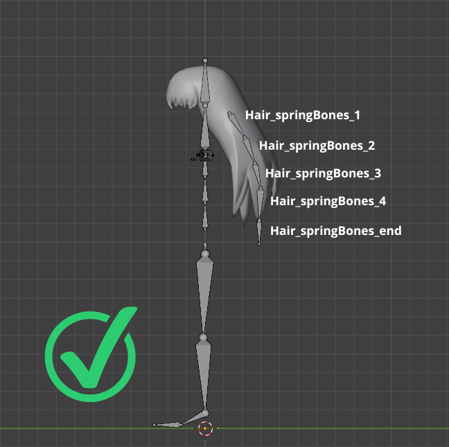

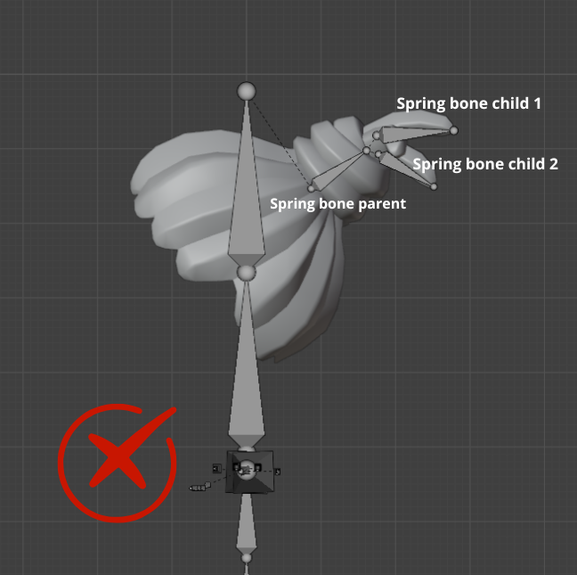

### The Hierarchy

For spring bones to work nicely, they have to be parented to one of the avatar's original bones. For hairs and earrings, for example, the bone on top of the hierarchy should be parented to **_Avatar_Head_**. For scarves, parenting the chain to the **_Avatar_Neck_** is a nice idea. For skirts, maybe **_Avatar_Hips_** or **_Avatar_LeftUpLeg/Avatar_RightUpLeg_** could do the trick.

It's important to notice how the structure of this hierarchy works.

- Hair_springBone_1 (spring bone parent): this is the bone on top of the chain, it has physics configuration
- Hair_springBone_2 (child spring bone): this is the child of the previous bone in the hierarchy and inherits the configuration.
- Hair_springBone_end (spring bone end): it's the last bone of the chain and serves and endpoint only.

### Naming Convention

All spring bones **must** contain the substring `springbone` (case-insensitive) in their name. The substring can appear at any position:

- SpringBone_hair_left
- hair_springbone_l
- springbone_earring.R

To keep your workflow organized, it's suggested to use this format: **BodyPart/WearableName_springBone**

Examples: Hair_springBone_1, Earring_springBone.L etc… Feel free to use to format that best suits you, as long as it's following Blender's (or your prefered software) naming convention for left and right.

 Attention!

Spring bones won't work without `springbone` in the bone's name. It has to be used, even for the end bone. 

### Limits

<-- TODO: replace N and M with final values when defined -->

Each wearable has the following spring bone limits:

- Maximum **N** spring chains per wearable
- Maximum **M** total spring bones (sum of all bones across all chains)
- Maximum chain depth of **N** bones

## Creating Spring Bones in Blender

Spring bones are additional bones that you create in Blender for the base avatar armature. The physics parameters are configured later in the Builder — you only need to set up the bone hierarchy in now.

To create a new bone, select the avatar Armature and, in **Edit Mode**, make sure you have the cursor where you want the bone to be created and press **Shift+A**. Another way to do it would be by duplicating an existing bone by pressing **Shift+D**. Once you have the first bone of the chain, press **E** to extrude it and create the rest of the chain.

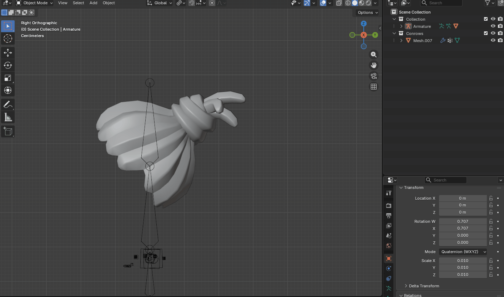

It's important to notice that a spring chain doesn't have to be connected to the skeleton parent, so you can just place it anywhere on the mesh. However, the spring chain **has** to be connected, you can't offset any of the spring bones.

Once you create the bones, rename them following the naming convention mentioned above and make sure to parent the chain to the proper bone. Dotted lines will show the parent of the chain. If there's none, it means that the chain has no parent. In **Edit Mode**, select the child first, then select the parent and press **Ctrl+P** > **Keep Offset**.

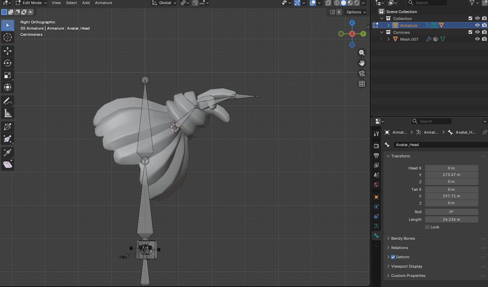

To rename a bone, select it in Edit Mode or Pose Mode, got to the Bone Properties tab and rename it according to the naming convention. Do this for all the bones in the chain.

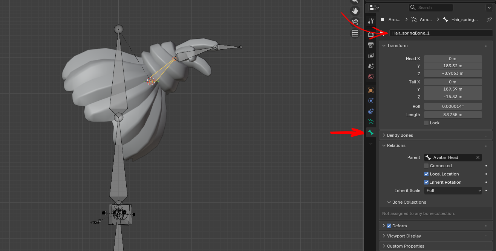

 Tip!

To make sure the bone is properly placed, select the mesh in **Object Mode** and, in **Edit Mode**, select the vertices in the area that you want to place the bone (it can be a loop or a group of vertices) > press **Shift+S** > **Cursor to Selected.**

Go back to **Object Mode**, select the armature > go to **Edit Mode** > select the desired bone > **Shift+S** > **Selection to cursor**. 


### Skinning the Mesh

Skinning is the process of binding the mesh to the armature, so that they move together. For this, we define how much influence (weight) each bone will have on the vertices. The more weight, the more the bone will deform the mesh. To do that, go to **Object Mode**, select the mesh first, press **Shift** and select the armature, press **Ctrl+P**. There are two ways of doing this, either select **With Empty Groups** or **With Automatic Weights**.

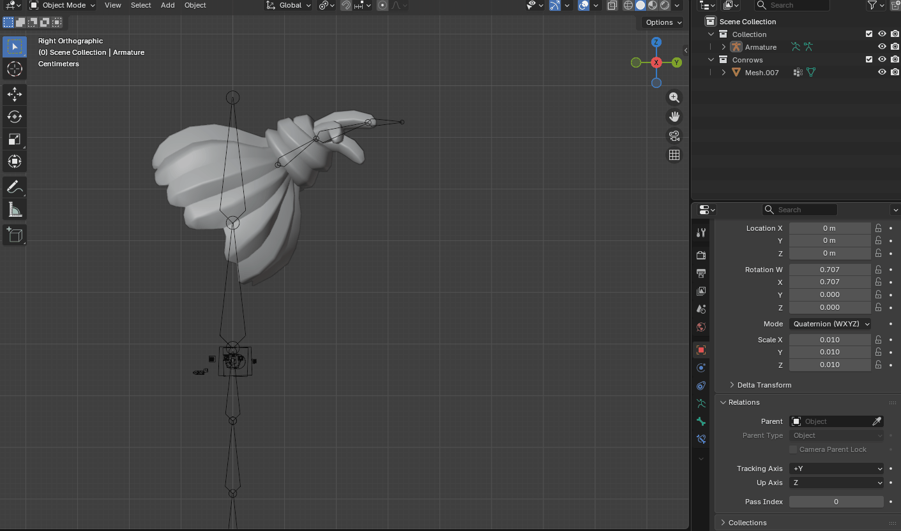

#### With Automatic Weights

As the name says, with this method, Blender will try to set the skin weights automatically by creating vertex groups for each bone in the armature and giving each of them automatic weights. It might work in some cases, but it might also require some adjustments. You can check the groups created by clicking on the **Data** tab.

If you know for sure that you won't need certain bones to affect the mesh, you can just click on the **lock icon** to lock the groups you want, click on the dropdown menu and **Delete All Unlocked Groups** to remove them from the object. For example, if you're working on a hair, having groups for feet and hands makes no sense. In that case, delete everything that's not the head or the spring bones, like in the example below. Also make sure to delete the group for the end bone of the spring chain.

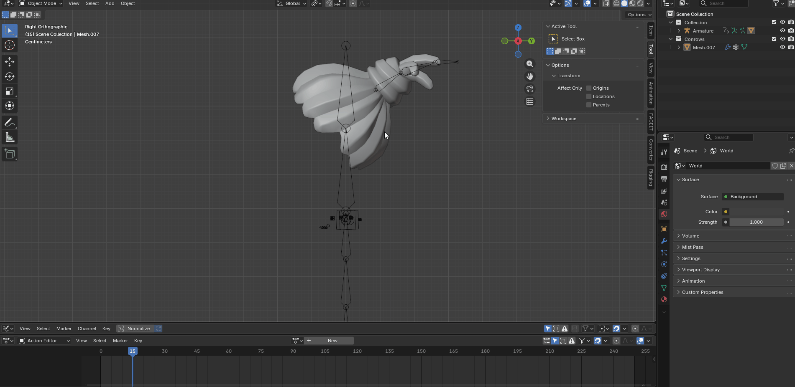

#### With Empty Groups

In this method, Blender will create all vertex groups for each bone in the armature, but they will have a weight of zero by default. You will have to manually assign the weights in Edit Mode or paint them in Weight Paint mode. This gives you more control over what's being affected by each group and can be extra helpful for hard surfaces or object that need to be completely assigned to a certain group. In any case, once you've assigned the weights, they will need to be tested in Pose Mode and then tweaked in Weight Paint.

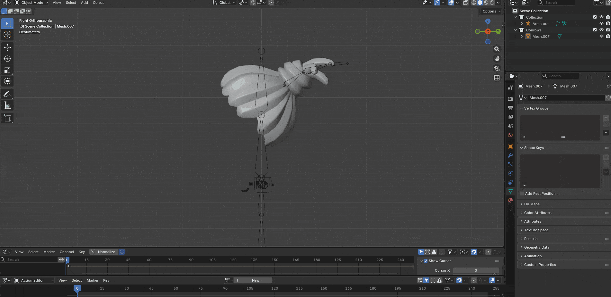

#### Painting Weights

To test the skinned mesh, select the armature and go to **Pose Mode**, set a key frame, then rotate the bones to create another pose and set another keyframe. That way you can check how the mesh is deforming with movement. Once you have the poses set, go back to **Object Mode**, select the mesh and go to **Weight Paint**.

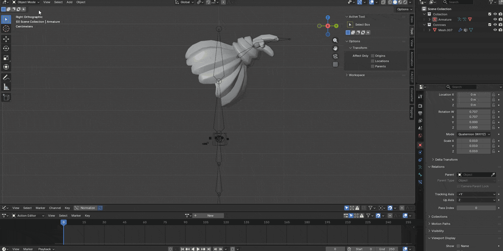

In **Weight Paint**, in the Tools tab you will find different brushes to tweak the skin weights. Select the Vertex Group you want to edit (if they are locked, just unlock them so you can edit edit the influence) and use the brush to add or remove influence. Black means zero influence, while red means that that group completely influences the mesh. Enabling the wireframe on **Overlays** will make it easier to see what you are painting.

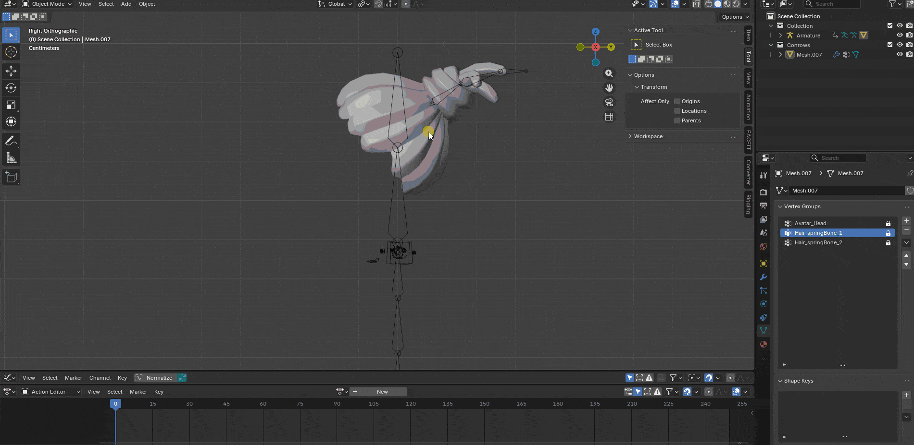

Use the add, subtract or smooth brushes to get the desired result. Test different extreme poses too to see how the mesh is deforming and if there are no vertex left without weights. If you're happy with the result, it's time to export it!

### Exporting

Before exporting, make sure to delete any animation clip created when testing the poses. Go to Pose Mode, select all the bones by pressing **A** and press **Ctrl+R**, then **Ctrl+S** and finally **Ctrl+G** to delete any transforms on your armature. Then go back to object mode, change the Display Mode from View Layer to Blender File, expand Actions and right click and delete the animation file.

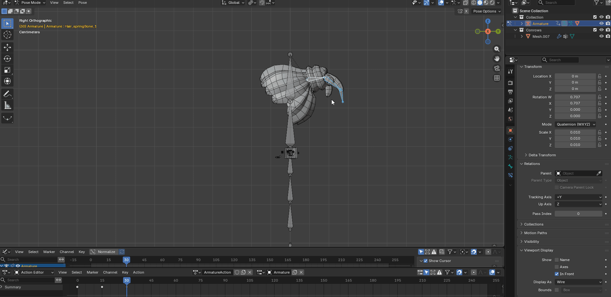

If you have any other objects in your scene, like avatar mesh, turn the visibility off by clicking on the eye icon in the Outliner. Then, go to **File** > **Export** > **gltf 2.0 (.glb, .gltf)**. For the export settings, expand Include and in **Limit to** toggle **Visible Objects**. Click on Export and you're ready to upload your file to the Builder!

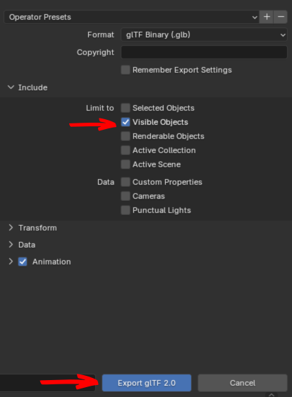

## Configuring Spring Bones in the Builder

After uploading a wearable that contains `springbone`-named bones, the Builder automatically detects them and shows the **Spring Bones** configuration panel.

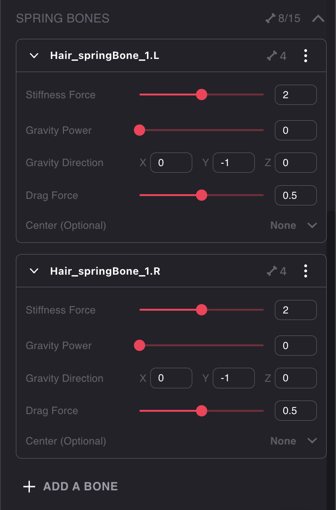

From this panel you can configure the physics parameters for each spring root bone. The avatar preview in the Builder will immediately reflect your changes, so you can fine-tune the behavior in real time.

 You cannot add new spring bones from the Builder. The bones must already exist in the uploaded `.glb` file with the correct naming convention. The Builder only lets you configure the physics parameters for detected spring bones. 

### Parameter Reference

#### Stiffness Force

|             |        |
| ----------- | ------ |
| **Range**   | 0 to 4 |
| **Default** | `2.0`  |

Controls how strongly the bone tries to return to its rest pose. This is the restoring force — think of it as the "firmness" of the spring.

- **0**: The bone won't return to rest at all — it will just hang limply under gravity.
- **Low values** (e.g., 0–1): The bone is loose and saggy, swinging freely. Good for long flowing hair or lightweight hanging accessories.
- **High values** (e.g., 3–4): The bone is stiff, staying close to its original position and snapping back quickly. Good for short hair or rigid accessories.

#### Gravity Power

|             |        |
| ----------- | ------ |
| **Range**   | 0 to 2 |
| **Default** | `0`    |

Controls the magnitude of the gravity force pulling on the bone each frame.

- **0**: No gravity effect — the bone is only affected by movement inertia and stiffness.
- **Low values** (e.g., 0.3–0.8): Subtle gravity pull, good for most accessories.
- **High values** (e.g., 1.5–2.0): Strong gravity pull, causing the bone to droop heavily.

#### Gravity Direction

|             |                                |
| ----------- | ------------------------------ |
| **Format**  | X, Y, Z vector                 |
| **Default** | `X: 0, Y: -1, Z: 0` (downward) |

Sets the direction of the gravity force in world space. By default, gravity pulls downward (Y = -1), simulating natural gravity.

| X   | Y   | Z   | Effect                                |
| --- | --- | --- | ------------------------------------- |
| 0   | -1  | 0   | Downward (natural gravity, default)   |
| 0   | 1   | 0   | Upward (floating/supernatural effect) |
| 1   | 0   | 0   | Leftward                              |
| -1  | 0   | 0   | Rightward                             |
| 0   | 0   | 1   | Forward                               |
| 0   | 0   | -1  | Backward                              |

You can combine axes (e.g., `X: 0.5, Y: -0.5, Z: 0`) for diagonal directions. This is useful for simulating wind-like effects or creating a floating appearance for supernatural characters.

#### Drag Force

|             |       |
| ----------- | ----- |
| **Range**   | 0 – 1 |
| **Default** | `0.5` |

Controls how quickly the bone loses momentum and settles down. Think of it as air resistance or damping.

- **Low values** (e.g., 0–0.2): The bone swings freely for a long time before settling, like a pendulum with little friction.
- **High values** (e.g., 0.7–1.0): The bone settles almost instantly after movement, giving a heavy or dampened feel.
- **1**: The bone barely moves at all — maximum deceleration.

#### Center (Optional)

|             |                      |
| ----------- | -------------------- |
| **Format**  | Bone name (dropdown) |
| **Default** | None                 |

An optional reference bone used to calculate the spring bone's movement relative to a point on the avatar, instead of relative to world space. This prevents the spring chain from swaying excessively when the avatar moves around (walking, running).

**Without a center bone**, springs calculate inertia in world space — every step the avatar takes causes the bones to react as if the whole world moved, resulting in exaggerated swinging during locomotion.

**With a center bone**, the simulation uses that bone's space as the reference frame, so only the avatar's _local_ movements (head turning, body bending) trigger the spring reaction.

Choose the center bone based on where the wearable is located on the body:

| Wearable location                     | Recommended center bone |
| ------------------------------------- | ----------------------- |
| Head (hair, earrings, tiaras)         | `Avatar_Head`           |
| Upper body (capes, necklaces)         | `Avatar_Spine`          |
| Lower body (belts, skirt accessories) | `Avatar_Hips`           |



The center bone **must not** be part of any spring chain. It should be a bone from the base avatar armature. 

## Common Use Cases & Recommended Values

These are suggested starting points. Adjust to taste using the Builder's real-time preview.

| Use case | Stiffness | Gravity Power | Gravity Dir | Drag | Center | Notes |
| --- | --- | --- | --- | --- | --- | --- |
| Long hair / ponytail | 1.0 – 2.0 | 0.3 – 0.8 | 0, -1, 0 | 0.3 – 0.5 | `Avatar_Head` | More bones in the chain = smoother movement |
| Short hair | 3.0 – 4.0 | 0 – 0.3 | 0, -1, 0 | 0.4 – 0.6 | `Avatar_Head` | Higher stiffness keeps hair close to the head |
| Earrings | 0.5 – 1.5 | 0.5 – 1.0 | 0, -1, 0 | 0.4 – 0.6 | `Avatar_Head` | Short chain (2–3 bones), lower stiffness for dangling |
| Cape / cloak | 1.0 – 2.0 | 0.5 – 1.0 | 0, -1, 0 | 0.3 – 0.5 | `Avatar_Spine` | Multiple parallel chains for width |
| Belt / hanging ornament | 1.5 – 2.5 | 0.3 – 0.8 | 0, -1, 0 | 0.5 – 0.7 | `Avatar_Hips` | Higher drag for heavier items |
| Floating / ghost effect | 1.0 – 2.0 | 0.5 – 1.0 | 0, 1, 0 | 0.3 – 0.5 | `Avatar_Spine` | Upward gravity for supernatural look |

## Limitations

Keep the following limitations in mind when working with spring bones:

- **No colliders**: Spring bones do not collide with the avatar's body or other bones. Chains may clip through the body mesh in extreme poses. Future versions may add collider support.
- **No cross-wearable interactions**: Each wearable's spring chains are independent. Chains from different wearables don't affect each other.
- **No global wind**: There is no scene-level wind force. You can approximate a wind effect per-wearable by adjusting the `gravityDir` to a diagonal direction.
- **Performance on remote avatars**: Spring bone simulation is disabled for avatars that are far from the local player to save performance. Nearby avatars will display spring bone physics normally.
- **Alternative clients compatibility**: Wearables with spring bones are backward-compatible with alternative clients and older Explorer versions, but the spring bone elements will remain static. In some cases, there may be minor visual issues.

## Technical Reference

Spring bone parameters are stored inside the `.glb` file using a glTF vendor extension called `DCL_spring_bone_joint`. When you configure parameters in the Builder, they are written directly into this extension in the file.

You don't need to interact with this format directly — the Builder handles reading and writing it. This section is provided for reference.

### glTF Extension Structure

```json
{
  "asset": {"version": "2.0"},
  "extensionsUsed": ["DCL_spring_bone_joint"],
  "nodes": [
    {"name": "Avatar_Head", "children": [1, 2]},
    {
      "name": "SpringBone_earring_r",
      "children": [3],
      "extensions": {
        "DCL_spring_bone_joint": {
          "version": 1,
          "stiffness": 0.5,
          "gravityPower": 1.0,
          "gravityDir": [0, -1, 0],
          "drag": 0.6,
          "isRoot": true,
          "center": "Avatar_Hips"
        }
      }
    },
    {
      "name": "SpringBone_hair_left",
      "children": [4],
      "extensions": {
        "DCL_spring_bone_joint": {
          "version": 1,
          "stiffness": 2.0,
          "gravityPower": 0.8,
          "gravityDir": [0, -1, 0],
          "drag": 0.4,
          "isRoot": true,
          "center": "Avatar_Head"
        }
      }
    },
    {"name": "springbone_earring_r_tip"},
    {"name": "SpringBone_hair_left_tip"}
  ]
}
```

### Extension Parameters

| Parameter | Type | Default | Description |
| --- | --- | --- | --- |
| `version` | integer | required (`1`) | Schema version for forward compatibility. |
| `stiffness` | float | `2.0` | Restoring force toward rest pose. |
| `gravityPower` | float | `0.0` | Magnitude of gravity force. |
| `gravityDir` | vec3 | `[0, -1, 0]` | Direction of gravity in world space. |
| `drag` | float | `0.5` | Damping / deceleration factor. |
| `isRoot` | boolean | `true` | Whether this node is the root of a spring chain. |
| `center` | string | none | Name of a reference bone for relative inertia calculation. |
