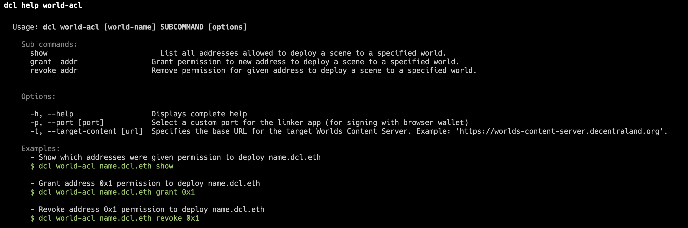

# Worlds

Decentraland Worlds are your own personal 3D space in the Decentraland ecosystem, separate from Genesis City's map of LAND parcels. A World can be kept private or shared with anyone with just a link. Able to host up to 100 concurrent users, you can use your World to host events, display your work, or as a blank canvas where you can unleash your creativity and experiment.

## What are Worlds?

Worlds are personal 3D spaces located beyond the boundaries of Genesis City. Worlds can serve various purposes, such as:

* Hosting events
* Unleashing your creativity
* Building new experiences
* Hosting a portfolio of scenes
* Testing scenes before deploying them to Genesis City

## Getting Started

To get your own Decentraland World, you need a [Decentraland NAME](https://builder.decentraland.org/names) (costs 100 MANA) or an [ENS domain](https://ens.domains). These NAMEs are then used by the Decentraland Explorer to load the associated World.

## Access Control Lists (ACL)

When a team (more than one person) is contributing to the development of a scene, it may be beneficial to have each contributor have the ability to publish the scene under a single NAME. As stated above, the NAME owner is the only one allowed to run such deployment.

The concept of Access Control List (or ACL for short) was introduced to address this. The idea is that the owner of the NAME can grant other wallets permission to publish a scene under their NAME. This way the whole team (or a group of selected members) can be added to the world ACL and those will be able to publish the scene.

This ACL is stored in the World Content Server where the world is deployed. It is not stored on the blockchain. This makes it much more flexible, giving more granular control. For example, if you want to deploy a scene under the same NAME in two different World Content Server hosting providers, then you can have different sets of permissions in each server. Also, there are no transaction fees involved in maintaining the ACL (granting or revoking permissions).

A command has been added to the Decentraland CLI that allows you to show the current ACL stored in the Worlds Content Server for a given NAME, and it also allows granting access to more wallets or revoking access to wallets that are already in the ACL.

To grant permission for publishing a scene to another wallet:

* Make sure to have the latest version of Decentraland CLI (v3.20.0 or later).
* Make sure you own the NAME for which you want to manage the ACL.
* Use command `dcl world-acl NAME.dcl.eth grant 0x1..` where `0x1...` is the address of user receiving the permission.

By default, `world-acl` will act on `worlds-content-server.decentraland.org`. If you are using a different hosting provider, make sure to add `--target-content https://your-hosting.com` to each of the subcommands (`show`, `grant` and `revoke`).

## Learn More

* [Worlds as a project type](../sdk7/projects/kinds-of-project.md#publish-to-worlds) - Learn about size limits and how Worlds differ from LAND scenes
* [Publishing options](../sdk7/publishing/publishing-options.md#decentraland-worlds) - How to obtain a NAME or ENS domain
* [Publishing to Worlds](../sdk7/publishing/publishing.md#publishing-to-worlds) - Step-by-step publishing instructions
* [World configuration](../sdk7/projects/scene-metadata.md#world-configuration) - Configure skybox, communication settings, and more
* [Managing Worlds](../scene-editor/get-started/manage-scenes.md#managing-worlds) - Visualize storage space and manage deployments
* [World FAQs](../scene-editor/faq/README.md#worlds) - Common questions about Worlds
