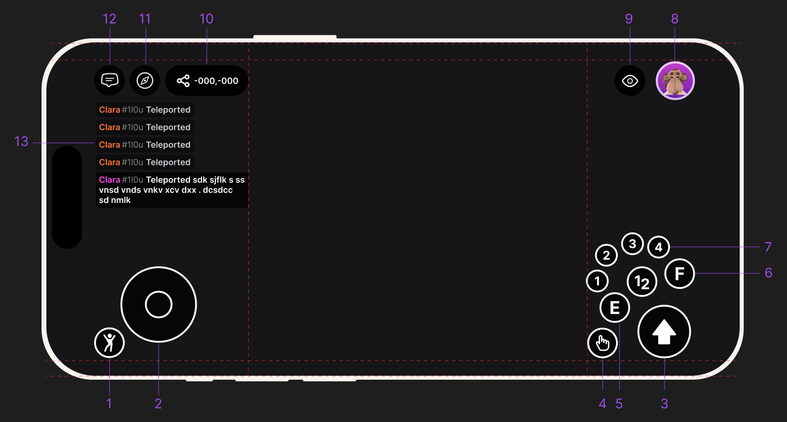

# Mobile Controls

The Decentraland mobile app replaces the keyboard and mouse with on-screen touch controls. Everything you can do on desktop is also possible on mobile, with a different layout designed for one-handed touch use.

<figure><figcaption>
The Decentraland mobile app in-world HUD, with each touch control labeled.
</figcaption></figure>

## Movement

* **On-screen joystick** (left side of the screen) — drag to walk and run in any direction. The further you push the joystick, the faster you move.
* **Camera drag** (anywhere on the right side of the screen) — drag to look around. This rotates your view without moving your avatar.

## Interaction

* **Interaction button** (bottom right) — tap to interact with whatever you're aiming at. This is the equivalent of a pointer click on desktop.
* **Tap on objects** — many things in the world can be tapped directly. If a creator has set up an entity to respond to taps, you'll trigger it the same way you would click on desktop.

## Chat

* **Chat icon** (left side) — tap to open chat. Use it to talk to people nearby or to friends in private messages.

## Profile, search, and emotes

* **Profile** (top right) — open your profile, manage your avatar, and access account settings.
* **Search** (left side) — find scenes, worlds, events, and other players.
* **Emotes** (left side) — trigger emotes to express yourself in front of other players.

## Camera

* **Camera controls** (top right) — switch between first-person and third-person views, and access camera-related options.

## Tips

* You can chat with anyone nearby, even if they're on desktop or web. Everyone shares the same world.
* Long-press on the joystick to keep walking without holding the screen with your thumb (depending on app version).
* If a scene's UI ever feels cramped, the creator may not have updated it for mobile yet — give it a moment, look for an alternate view, or report it from the in-app support menu.

## Related

* [Getting started on mobile](getting-started.md)
* [Troubleshooting](troubleshooting.md)
* [Shortcuts & Chat Commands](../decentraland-in-world/shortcuts-and-chat-commands.md) (desktop reference)
